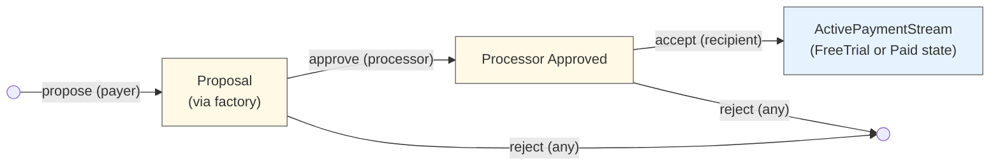
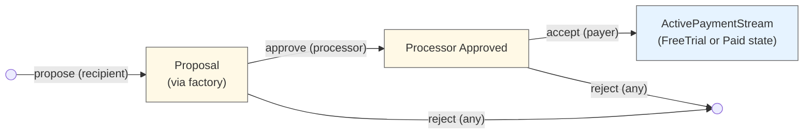
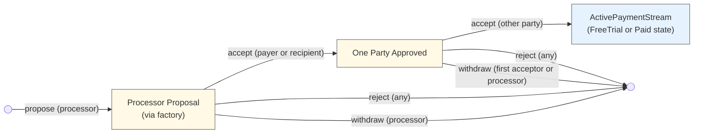
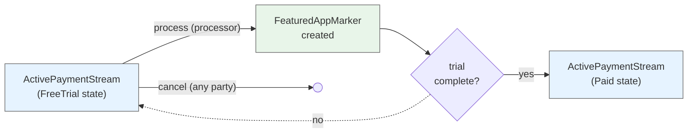
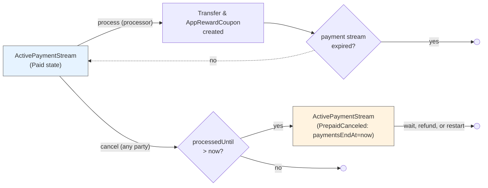

# Canton Payment Streams

A general-purpose DAML package for recurring payment streams using Splice Amulet.

## Overview

Three-party payment stream system with flexible payment processing:

- **Payer**: Pays for the payment stream (funds are automatically withdrawn each period)
- **Recipient**: Receives payment stream payments
- **Processor**: Executes transfers each period, optionally for a fee

**Key Features:**

- Daily billing rates in Amulet or USD
- Free trials that convert to paid payment streams
- Pay-as-you-go (no lockup)
- Prepay buffer prevents service interruption (refundable)

## Payment Stream Terms

When a payer and recipient agree to a payment stream, they commit to a set of terms defined in the
`PaymentStream` data type:

**Payment Terms:**

- **`recipientPaymentPerDay`**: The daily rate the payer pays to the recipient (in Amulet or USD)
  - Can be increased by the payer and decreased by the recipient
- **`processorPaymentPerDay`**: The daily rate the payer pays to the processor for handling payments
  (in Amulet or USD)
  - Can be increased by the payer and decreased by the processor

Pro-rated billing ensures payers only pay for the exact time period used

**Service Continuity:**

- **`prepayWindow`**: How far ahead payments can advance beyond the current time (e.g., 7 days)
  - Provides a buffer period for payers to top up their balance before service interruption
  - Larger windows provide more service stability; smaller windows reduce capital requirements
  - Zero prepay window means payments only advance up to recent history instead of prepaying for
    future usage, so services must honor a grace period before terminating
    - Similarly, small prepay windows (less than or equal to the processor's period) will result in
      `paidUntil` often being in the recent past rather than the future
  - Can be increased by the payer and decreased by the recipient

**Duration:**

- **`paymentsEndAt`**: When payments end (can be far in the future for ongoing payment streams)
  - Can only be changed by the payer (to any time)
- **Free trial**: Optional trial period (specified at proposal creation) where no payment is
  required
  - Specified using `PaymentStreamExpiration` which can be either:
    - **`AbsoluteExpiration Time`**: Expires at a specific timestamp
    - **`RelativeExpiration RelTime`**: Expires at a duration from payment stream creation time
      (e.g., 30 days from when accepted)
  - Relative expirations allow proposals to remain outstanding without eating into the trial
    duration
  - Managed by `FreeTrialPaymentStream` template with `trialEndsAt` field (always resolved to
    absolute time)
  - Can be extended by the recipient or reduced by the payer
  - Recipients can convert a paid payment stream back to a free trial anytime
  - Automatically converts to `PaidPaymentStream` when trial ends

**Other:**

- **`description`**: Optional human-readable description of the payment stream purpose (e.g.,
  "Premium membership", "Premium tier - app_id:123")
  - Changes require both payer and recipient approval via description update proposal contracts
- **`metadata`**: Structured key-value pairs for additional payment stream information
  - Stored as `TextMap Text` for type-safe, queryable metadata
  - Changes require processor approval first, then acceptance by the other party (payer or
    recipient)
  - Common use: Reference RewardShare contract IDs for off-chain reward distribution

**Key Principles:**

- Terms are agreed upon during the proposal/acceptance flow
- Any party can cancel at any time
- Terms can only be changed by the party negatively impacted (e.g., payer increases payments,
  recipient decreases their payment)
- On-chain proposals exist for changes requiring both parties' approval (e.g., reason updates)

## Architecture

**Three-Party Flow:** Can be initiated by payer, recipient, or processor:

- **Payer-initiated:** Payer proposes terms → Processor approves → Recipient accepts
- **Recipient-initiated:** Recipient proposes terms → Processor approves → Payer accepts
- **Processor-initiated:** Processor proposes terms → Either party accepts first → Other party
  accepts

**Billing Model:** Configured as a rate per day but charged pro-rated for any processing period
used:

```
amountForPeriod = (amountPerDay × periodDuration) / 1 day
```

It's pay-as-you-go where transfer fees are paid by the recipient and processor, not the payer. This
means consistent and predictable costs for end-users regardless of the processing period used.

**Processor Payments:** The processor can use any period length, so long as it does not exceed the
prepay window (when the window is 0, payments may only advance up until `now`).

- **Standard mode** (`processorPaymentPerDay > 0`): Processor and recipient each receive a separate
  payment and AppRewardCoupon (issued to their respective providers)
- **Zero-fee mode** (`processorPaymentPerDay = 0`): Recipient receives normal payment and
  AppRewardCoupon. Processor receives a FeaturedAppActivityMarker (no payment) to offset traffic
  costs.

**Prepay Window:** Controls how far ahead `processedUntil` can extend beyond current time:

- **Large window (e.g., 7 days):** Creates buffer before service interruption; `processedUntil`
  stays ahead of now
- **Zero window:** Payments only cover past usage (`processedUntil ≤ now`); recipient manages grace
  period
- **Small window (≤ processing period):** `processedUntil` may trail current time since processing
  must wait until period elapses
- **Limits:** `processedUntil` capped at `min(now + prepayWindow, paymentsEndAt)`

## Escrow Mechanism (LockedAmulet)

Payment Streams use a **LockedAmulet** for payment escrow:

**At PaymentStream Creation:**

- When the final approval creates an `ActivePaymentStream`, the payer provides:
  - Amulet inputs
  - Amount to lock in escrow
- These are combined into a single `LockedAmulet` with:
  - **Lock holders:** recipient and processor
  - **Lock expiry:** 365 days (to discourage expiry - this is a recovery mechanism only)
  - **Context:** "PaymentStream escrow"
  - **Fee model:** `receiverFeeRatio = 1.0` - payer pays fees from inputs (predictable costs)
- Any remaining balance from inputs is returned as change to the payer

**Cost Predictability:** All escrow operations use `receiverFeeRatio = 1.0`, meaning:

- Transfer fees are paid from the payer's input amulets
- The locked amount is exactly what the payer specified
- The payer knows upfront the total cost (amount + fees)
- No surprises from fees being deducted from the locked balance

**During Payment Processing:**

- Payments unlock the `LockedAmulet`, make the payment, and re-lock the remaining balance
- This ensures the recipient and processor maintain control over the escrowed funds

**Fund Management:**

- **Add funds:** `ActivePaymentStream_AddFunds` - Anyone can add amulets to gift/top-up a payment
  stream (requires all party approvals to unlock/relock); excess returned as change to funder. Note:
  payer can withdraw these funds at any time.
- **Withdraw funds:** `ActivePaymentStream_WithdrawFunds` - Payer can withdraw excess funds while
  keeping a specified amount locked; remainder returned as change
- **Replace lock:** `ActivePaymentStream_ReplaceLockedAmulet` - Recovery mechanism if lock expires;
  specify amount to lock

**At PaymentStream Termination:**

- **Refund:** Recipient provides their own amulets for the refund; the locked balance is returned to
  payer
- **Cancel (immediate):** Locked amulet is unlocked and returned to payer
- **Cancel (with prepaid period):** Locked amulet stays for remaining payments, then returned when
  archived
- **Archive:** Locked amulet is unlocked and returned to payer

This architecture ensures:

1. Payments can be processed without payer interaction
2. Recipient and processor maintain control as lock holders
3. Payer retains ownership and can manage the locked balance
4. Payer has predictable costs (fees paid from inputs, not from locked amount)
5. Funds are returned when the payment stream ends

## Contract Templates

The payment stream system uses separate templates for each lifecycle state:

**Proposal Flow:**

- `PaymentStreamFactory` - Creates proposals with processor/DSO context
- `PayerPaymentStreamProposal` - Payer initiates, awaits processor approval
- `RecipientPaymentStreamProposal` - Recipient initiates, awaits processor approval
- `ProcessorPaymentStreamProposal` - Processor initiates, awaits acceptance from both parties
- `ProcessorApprovedPaymentStreamProposal` - Awaits recipient acceptance (after processor approval
  of payer proposal)
- `ProcessorApprovedRecipientInitiatedPaymentStreamProposal` - Awaits payer acceptance (after
  processor approval of recipient proposal)
- `OnePartyApprovedProcessorPaymentStreamProposal` - Awaits second party acceptance (after one party
  accepted processor proposal)

**Active Payment Streams:**

- `ActivePaymentStream` - Unified payment stream template with implicit state based on timestamps:
  - FreeTrial: `trialEndsAt` is Some and >= now (no payments, creates activity markers)
  - PrepaidCanceled: `paymentsEndAt` <= now and `processedUntil` >= now (can be restarted)
  - Paid: All other cases (active paid payment stream)
  - Should be archived: `paymentsEndAt` < now AND `processedUntil` < now

**Configuration Updates:**

- `ActivePaymentStream_ProposeChanges` - Unified change system:
  - Determines impacted parties based on proposed changes
  - If only proposer is impacted: applies changes directly
  - If others are impacted: creates `PaymentStreamChangeProposal` for approval
- `PaymentStreamChangeProposal` - Multi-party approval contract for changes:
  - Tracks approvals from impacted parties
  - Once approved, validates and applies changes to active payment stream
  - Validates original state matches (allows `processedUntil` to change during approval)

## Flow Diagrams

**Lifecycle Overview:**

1. **Proposal:** Payer, recipient, or processor proposes terms via `PaymentStreamFactory`
2. **Approval/Acceptance:**
   - **Payer/Recipient-initiated:** Processor validates and approves, then the other party accepts
   - **Processor-initiated:** Either party accepts first, then the other party accepts
3. **Active PaymentStream:** Creates `ActivePaymentStream` with `trialEndsAt` set if free trial,
   None otherwise
4. **Processing:**
   - Free trial: Processor advances `processedUntil` and creates activity markers (no payments)
   - Paid: Processor executes transfers from payer to recipient and processor (with app rewards)
5. **Lifecycle:** Continues until expiration or cancellation by any party
6. **Transitions:**
   - Trial converts to paid when `trialEndsAt` reached
   - Paid payment stream can convert back to trial
   - Canceled payment streams can be restarted with all parties' approval

**Cancellation:** Any party can cancel anytime. Canceling sets `paymentsEndAt` to now. If
`processedUntil > now`, the payment stream enters PrepaidCanceled state (and can optionally be
restarted with all parties' approval).

## Contract Lifecycle Diagrams

### Payer-Initiated Flow



### Recipient-Initiated Flow



### Processor-Initiated Flow



### Free Trial Lifecycle



### Paid PaymentStream Lifecycle



## Usage Example

```haskell
-- 1. Create proposal (payer initiates)
proposalCid <- submit payer do
  exerciseCmd factoryCid PaymentStreamFactory_CreatePayerProposal with
    config = PaymentStream with
      payer, recipient
      recipientPaymentPerDay = AmuletAmount 10.0
    processorPaymentPerDay = AmuletAmount 1.0
    prepayWindow = days 7
    paymentsEndAt = farFutureTime
    description = Some "Premium membership"
      metadata = TM.empty  -- Can add RewardShare references later
    -- Flexible free trial expiration (resolved when payment stream is created)
    freeTrialExpiration = Some (RelativeExpiration (days 30))  -- 30 days from acceptance
    -- Alternative: freeTrialExpiration = Some (AbsoluteExpiration trialEndTime)

-- 2. Processor approves
approvedCid <- submit processor do
  exerciseCmd proposalCid PayerPaymentStreamProposal_ProcessorApprove

-- 3. Recipient accepts (providing their provider)
acceptResult <- submit recipient do
  exerciseCmd approvedCid ProcessorApprovedPaymentStreamProposal_RecipientAccept with
    recipientProvider = recipient

-- Result is ActivePaymentStream (in FreeTrial state for this example)
let activePaymentStreamCid = acceptResult

-- 4. Process trial period (creates activity markers, no payments)
activePaymentStreamCid <- submit processor do
  exerciseCmd activePaymentStreamCid ActivePaymentStream_ProcessFreeTrial with
    processingPeriod = days 1
    processorProvider = processor
    recipientFeaturedAppRight = Some recipientFARCid
    processorFeaturedAppRight = Some processorFARCid

-- When trial ends, payment stream automatically transitions to Paid state

-- 5. Process payments periodically (after trial ends)
-- Standard mode with processor fees:
-- Note: PaymentContext no longer requires amuletInputs since the ActivePaymentStream stores a LockedAmulet
paymentResult <- submit processor do
  exerciseCmd activePaymentStreamCid ActivePaymentStream_ProcessPayment with
    processingPeriod = days 1
    paymentCtx = PaymentContext with
      amuletRulesCid, openMiningRoundCid
    processorProvider = processor
    recipientFeaturedAppRight = Some recipientFARCid
    processorFeaturedAppRight = Some processorFARCid
    processorActivityMarkerFAR = None  -- Only used in zero-fee mode

-- 6. (Optional) Add RewardShare references via metadata update
-- Recipient creates a metadata change proposal
metadataProposalCid <- submit recipient do
  createCmd MetadataChangeProposal with
    payer, recipient, processor
    proposer = recipient
    newMetadata = TM.fromList
      [ ("recipient_reward_agreement_cid", recipientRewardAgreementCid)
      , ("processor_reward_agreement_cid", processorRewardAgreementCid)
      ]
    proposalExpiresAt = futureTime

-- Processor approves the metadata change
approvedMetadataProposalCid <- submit processor do
  exerciseCmd metadataProposalCid MetadataChangeProposal_ProcessorApprove

-- Payer accepts the metadata change (requires both processor and payer authority)
updatedActivePaymentStreamCid <- submit processor, payer do
  exerciseCmd approvedMetadataProposalCid ProcessorApprovedMetadataChangeProposal_Accept with
    activePaymentStreamCid
    accepter = payer

```

## Appendix

### Cancellation with Prepaid Time

When any party cancels an `ActivePaymentStream` with `processedUntil > now`, they can either:

- **Honor prepaid period**: Sets `paymentsEndAt` to now (by passing
  `disregardAvailablePaidPeriod = False`), transitioning to PrepaidCanceled state
- **Immediately archive** (payer only): Payer can pass `disregardAvailablePaidPeriod = True` to
  forgo the prepaid period and archive immediately

If the payment stream transitions to PrepaidCanceled state, the recipient has several options:

**Option 1: Honor Prepaid Period**

- Payer retains access until `processedUntil`
- Any party archives once `processedUntil` passes using
  `ActivePaymentStream_ArchiveInactivePaymentStream`
- Common for content services (e.g., streaming platforms)

**Option 2: Refund and Archive Immediately**

- Recipient calls `ActivePaymentStream_RecipientRefundAndArchive`
- Refund: `(processedUntil - now) × (recipientPaymentPerDay + processorPaymentPerDay)`
- Contract archives after refund transfer
- Common for usage-based services (e.g., insurance, utilities)

**Option 3: Restart the PaymentStream (New)**

- All three parties can use `ActivePaymentStream_RestartAsFreeTrial` or
  `ActivePaymentStream_RestartAsPaid`
- Preserves the prepaid period
- Useful for resolving cancellation disputes or re-engaging customers

The choice depends on the recipient's business model and customer relationship.

### Tradeoff: LockedAmulets

**Decision:** This implementation uses **pay-as-you-go with optional prepayment**—funds are pulled
from the payer's account during each payment processing cycle, with the `prepayWindow` parameter
controlling how far ahead payments can advance.

**The prepayWindow provides security without LockedAmulets:**

The `prepayWindow` parameter allows processing to advance up to a specified duration ahead of the
current time (e.g., 7 days, 1 hour). This creates a prepaid buffer that effectively accomplishes the
security that using `LockedAmulet` would offer, without the complexity:

- **With prepayWindow > 0**: Processing advances ahead of current time, giving recipients revenue
  certainty
- **With prepayWindow = 0**: Processing only advances up to current time, covering past usage with
  no prepayment

**Why not use LockedAmulets?**

We don't need full `LockedAmulet` security because that would only guarantee payment stream funds
can always be refunded on cancellation. However, the current implementation makes refunds
discretionary—the recipient chooses whether to refund prepaid amounts. Since refunds aren't
guaranteed, there's no need to lock funds.

**Pros:**

- Easy to start—no large upfront deposit or locked funds required
- Flexible security—`prepayWindow` can be adjusted by payer (increase) or recipient (decrease)
- Simple for payers—just maintain account balance
- Recipients get configurable revenue certainty via prepayWindow
- Natural expiration—payment streams lapse if funds run out
- No complex refund guarantees to manage

**Cons:**

- Payments can still fail if insufficient funds
- Refunds after cancellation are discretionary, not automatic
- Payers might unintentionally let payment streams lapse

**Recommendation:** Use a reasonable `prepayWindow` (e.g., 7 days, 12 hours) to balance payer
capital requirements with recipient revenue certainty. Recipients should notify payers when payments
fail and design systems to handle payment failures gracefully.

#### Canton Network Polling Alignment

**Benefit:** This pay-as-you-go approach is particularly well-suited for Canton Network's frequent
polling mechanism.

With each process transaction, we're securing additional funds and advancing the `processedUntil`
timestamp. This transactional approach makes sense because:

- **Incremental fund capture**: Each polling cycle can capture newly available funds from the
  payer's account, minimizing their initial obligation.

The transactional approach trades some efficiency for better UX and works naturally with Canton's
polling-based processing model.

#### Open Question: Should Prepaid Window Use LockedAmulets?

**Context:** Currently, the prepaid window amount is paid from the payer's regular account balance
during each processing cycle. This provides flexibility but no guarantees.

**Alternative Approach:** Lock the prepaid window amount (e.g.,
`prepayWindow × (recipientPaymentPerDay + processorPaymentPerDay)`) in a `LockedAmulet` at payment
stream start or when the prepaid buffer needs replenishment.

**Potential Benefits:**

1. **Guaranteed Refunds on Cancellation:**
   - Locked funds could be automatically returned to the payer after cancellation
   - Provides stronger consumer protection
   - Could be an opt-in feature in payment stream terms
   - Removes recipient discretion from refund decisions

2. **Guaranteed Service Payment on Delinquency:**
   - If payer runs out of regular funds, service continues for the prepaid period
   - After non-payment threshold (e.g., 2 weeks), payment stream auto-closes and locked funds
     transfer to recipient
   - Provides revenue certainty for recipients
   - Creates clear delinquency handling

**Tradeoffs:**

- **Pro:** Stronger guarantees for both parties (refunds for payers, payment for recipients)
- **Pro:** Could reduce disputes and simplify cancellation logic
- **Pro:** Aligns prepaid window concept with actual pre-locked funds
- **Con:** Requires larger upfront deposit from payers
- **Con:** Adds complexity to payment stream initialization and replenishment
- **Con:** May reduce payer conversion rates due to higher barrier to entry
- **Con:** LockedAmulet contracts add overhead to the system

**Questions to Resolve:**

- Should this be the default behavior, or an optional feature controlled by payment stream terms?
- How should locked funds be replenished when they run low?
- Should both refund and payment guarantees be paired, or offered independently?
- Does the guaranteed refund model conflict with business models that rely on prepaid non-refundable
  revenue?

### Unified Change System

The payment stream system uses a unified change system that intelligently determines which parties
need to approve based on the proposed changes:

#### How It Works

1. **Propose Changes**: Any party calls `ActivePaymentStream_ProposeChanges` with desired changes
2. **Determine Impact**: System analyzes which parties are impacted by the changes
3. **Apply or Create Proposal**:
   - If only proposer is impacted (or no one): Apply changes immediately
   - If others are impacted: Create `PaymentStreamChangeProposal` for approval

#### Example: Recipient Increases Payment

```daml
-- Recipient proposes payment increase (impacts payer who pays more)
result <- submit recipient do
  exerciseCmd activePaymentStreamCid ActivePaymentStream_ProposeChanges with
    proposer = recipient
    payment streamChanges = PaymentStreamChanges with
      recipientPaymentPerDay = Some (USDAmount 15.0)
      -- All other fields None (no change)
      recipientProvider = None
      processorPaymentPerDay = None
      expiresAt = None
      prepayWindow = None
      trialEndsAt = None
      description = None
      metadata = None

-- Result is Right proposalCid (payer approval needed)
let Right proposalCid = result

-- Payer approves
proposalCid <- submit payer do
  exerciseCmd proposalCid PaymentStreamChangeProposal_Approve with actor = payer

-- Apply changes (both parties are controllers since both approved)
updatedPaymentStreamCid <- submit payer, recipient do
  exerciseCmd proposalCid PaymentStreamChangeProposal_Apply with
    activePaymentStreamCid
```

#### Example: Payer Increases Prepay Window

```daml
-- Payer increases prepay window (only impacts themselves)
result <- submit payer do
  exerciseCmd activePaymentStreamCid ActivePaymentStream_ProposeChanges with
    proposer = payer
    payment streamChanges = PaymentStreamChanges with
      prepayWindow = Some (days 30)
      recipientProvider = None
      recipientPaymentPerDay = None
      processorPaymentPerDay = None
      paymentsEndAt = None
      trialEndsAt = None
      description = None
      metadata = None

-- Result is Left updatedCid (applied immediately, only payer impacted)
let Left updatedActivePaymentStreamCid = result
```

#### Impact Rules

The system determines impacted parties using these rules:

**Recipient Provider**: Recipient only  
**Recipient Payment**: Payer (increase) or Recipient (decrease)  
**Processor Payment**: Payer (increase) or Processor (decrease)  
**Payments End**: Payer (commitment change)  
**Prepay Window**: Payer (increase) or Recipient (decrease)  
**Trial**: Both Payer and Recipient  
**Description**: Both Payer and Recipient  
**Metadata**: All three parties

#### Benefits

- **Intelligent**: Only requires approvals when necessary
- **Flexible**: Handles all change scenarios with one system
- **Safe**: Validates original state before applying (allows `processedUntil` to change)
- **Clear**: Explicit impact rules make behavior predictable
- **Audit trail**: All multi-party changes recorded on-chain with signatures

### Flexible Free Trial Expiration

The payment stream system supports flexible free trial expiration through the
`PaymentStreamExpiration` type, which can be either absolute or relative to payment stream creation:

**Absolute Expiration (`AbsoluteExpiration Time`):**

- Expires at a specific timestamp
- Example: `AbsoluteExpiration (time (date 2025 Dec 31) 23 59 59)`
- Use when you want the trial to end at a fixed date regardless of when it's accepted

**Relative Expiration (`RelativeExpiration RelTime`):**

- Expires at a duration from payment stream creation time
- Example: `RelativeExpiration (days 30)` gives a full 30-day trial from acceptance
- **Key benefit**: Proposals can remain outstanding without eating into the trial duration
- Use for consistent trial experiences where users get the full duration from signup

**How it works:**

1. Proposal is created with `freeTrialExpiration: Optional PaymentStreamExpiration`
2. When the proposal is accepted, the expiration is resolved to an absolute `Time` using the current
   ledger time
3. The resulting `FreeTrialPaymentStream` always has a concrete `trialEndsAt: Time` field

**Example scenario:**

- Day 0: Recipient proposes payment stream with `RelativeExpiration (days 30)`
- Day 7: Payer accepts → trial ends at Day 37 (full 30-day trial preserved)
- vs. `AbsoluteExpiration (now + 30 days)` → trial would end at Day 30 (only 23 days remain)

This ensures payers always receive the full trial period, improving fairness and user experience.

### Metadata Field: RewardShare References

The `metadata` field provides a flexible mechanism to attach structured information to payment
streams. A primary use case is referencing **RewardShare contracts** for off-chain reward
distribution.

#### Why Use Metadata for RewardShares?

App reward distribution often cannot be handled entirely on-chain. The payment stream metadata
creates an **on-chain audit trail** showing:

1. Parties explicitly agreed to reference specific RewardShare contracts
2. The processor validated and approved the references
3. A clear record exists if the references are updated later
4. Contract IDs reference the full reward share details stored on-chain

**It's up to the app to honor these reward shares.** The on-chain contracts provide proof of the
distribution terms, but enforcement depends on the app's implementation.

#### Reward Share Patterns

Each `RewardShare` can specify one or more recipients who receive percentage shares of rewards.
Anyone can create a RewardShare to define distribution terms (e.g., 10% to partner, 2% to
affiliate).

```haskell
-- **Single RewardShare:**
-- Reference one RewardShare that defines how rewards should be distributed:

metadata = TM.fromList
  [ ("reward_share_cid", "00c5d2ba04dc1ee5b12ef0c495f50e5dbf03bd3a0c98f3e2aa1234567890abcd")
  ]

-- **Multiple RewardShares:**
-- Reference multiple RewardShares (e.g., separate shares for different reward types):

metadata = TM.fromList
  [ ("payment stream_reward_share_cid", "00c5d2ba04dc1ee5b12ef0c495f50e5dbf03bd3a0c98f3e2aa1234567890abcd")
  , ("referral_reward_share_cid", "008f1ca97e23b8d4f5e9a1234567890abcd3ef0c495f50e5dbf03bd3a0c98f3e2")
  ]

-- **No RewardShares:**
-- No reward distribution references:

metadata = TM.empty

-- Note: Other metadata may also be included with any of the above examples for other purposes.

```

#### Additional Metadata Uses

Beyond RewardShare references, metadata can store:

- External payment stream IDs
- Service tier identifiers
- Feature flags or entitlements
- Billing cycle preferences
- Custom business logic references

Example:

```haskell
metadata = TM.fromList
  [ ("recipient_reward_agreement_cid", "00c5d2ba04dc1ee5b12ef0c495f50e5dbf03bd3a0c98f3e2aa1234567890abcd")
  , ("external_payment stream_id", "stripe_sub_1234567890")
  , ("service_tier", "premium_plus")
  , ("feature_flags", "early_access,beta_features")
  ]
```

#### Metadata Constraints

The metadata field has validation rules to prevent abuse:

- Maximum 100 key-value pairs per payment stream
- Keys: Non-empty, max 256 characters
- Values: Max 4096 characters
- Changes require processor approval + other party acceptance

These constraints balance flexibility with performance and ensure metadata remains manageable.
