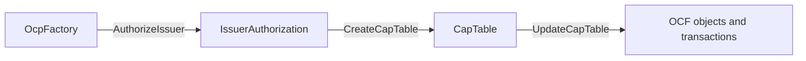

# Open Cap Table Protocol DAML

This repository implements the
[Open Cap Format (OCF)](https://github.com/Open-Cap-Table-Coalition/Open-Cap-Format-OCF) as DAML
contracts for Canton. It also publishes generated JavaScript bindings and the built OpenCapTable DAR
as
[`@fairmint/open-captable-protocol-daml-js`](https://www.npmjs.com/package/@fairmint/open-captable-protocol-daml-js).

## Install and use the package

```bash
npm install @fairmint/open-captable-protocol-daml-js
```

The browser-safe root entry point exports the generated OpenCapTable namespace, bundled DAML/Splice
dependencies, and the three entry-point template IDs:

```ts
import { Fairmint, OCP_TEMPLATES } from '@fairmint/open-captable-protocol-daml-js';

const { OpenCapTable } = Fairmint;
const capTableTemplateId = OCP_TEMPLATES.capTable;
```

The package also exposes stable subpaths for deployment metadata and the DAR:

```ts
import factoryIds from '@fairmint/open-captable-protocol-daml-js/ocp-factory-contract-id.json';
import {
  getOpenCapTableDarPath,
  resolveOpenCapTableDarPath,
} from '@fairmint/open-captable-protocol-daml-js/openCapTableDarPath';
```

The DAR itself is exported at `@fairmint/open-captable-protocol-daml-js/opencaptable.dar`. Check
[`package.json`](./package.json) for the complete export map and
[`scripts/test-imports.ts`](https://github.com/Fairmint/open-captable-protocol-daml/blob/main/scripts/test-imports.ts)
for the executable package-surface contract. `resolveOpenCapTableDarPath` checks
`OPEN_CAP_TABLE_DAR_PATH`, then the packaged DAR, then optional local-checkout paths; see its
[`source and options`](https://github.com/Fairmint/open-captable-protocol-daml/blob/main/scripts/npm-published-lib/openCapTableDarPath.ts)
for exact resolution behavior.

## Contract model



`OcpFactory` lets the system operator authorize an issuer. The issuer consumes that authorization to
create its `Issuer` object and stateful `CapTable`. `CapTable` is then the aggregate authority: it
holds OCF-object contract IDs in maps and applies ordered creates, edits, and deletes atomically.
Issuer and system-operator roles remain distinct throughout the flow.

Read
[Contract architecture](https://github.com/Fairmint/open-captable-protocol-daml/blob/main/docs/architecture.md)
for the lifecycle, generated aggregate, and links to the implementing DAML modules.

## Documentation

- [Contract architecture](https://github.com/Fairmint/open-captable-protocol-daml/blob/main/docs/architecture.md)
- [OCF validation model](https://github.com/Fairmint/open-captable-protocol-daml/blob/main/docs/validation.md)
- [Development, testing, and releases](https://github.com/Fairmint/open-captable-protocol-daml/blob/main/docs/development-and-releases.md)

These documents explain the stable model and link into the source for details. The active package's
[`daml.yaml`](https://github.com/Fairmint/open-captable-protocol-daml/blob/main/OpenCapTable-v34/daml.yaml),
[`multi-package.yaml`](https://github.com/Fairmint/open-captable-protocol-daml/blob/main/multi-package.yaml),
[`package.json`](./package.json), and
[`scripts/`](https://github.com/Fairmint/open-captable-protocol-daml/tree/main/scripts) remain the
source of truth for current versions, dependencies, and automation.

## Build and validate

```bash
git submodule update --init --recursive
npm install
scripts/install-dpm-sdks.sh
npm run build
npm test
```

When generated bindings or the published npm surface are affected, also run:

```bash
npm run codegen
npm run verify-package
```

See
[Development, testing, and releases](https://github.com/Fairmint/open-captable-protocol-daml/blob/main/docs/development-and-releases.md)
for the generated-file boundary and specialized checks.
