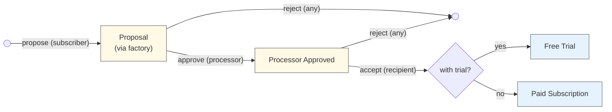
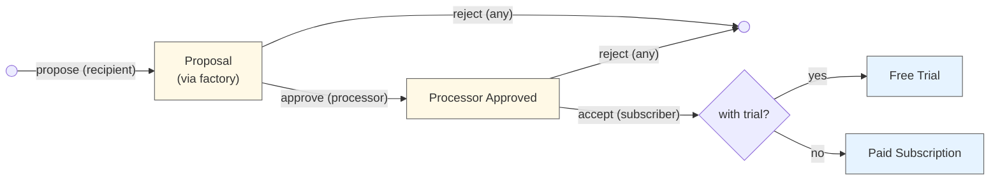
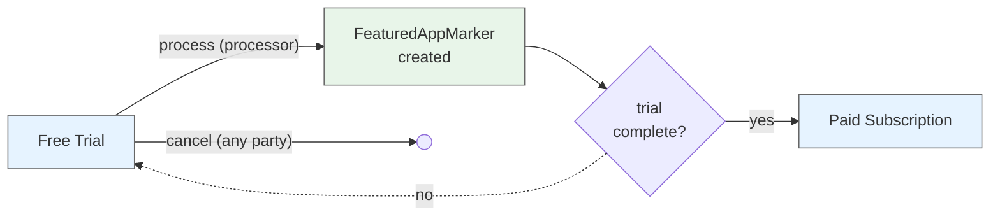
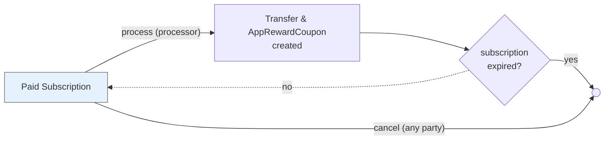

# Subscriptions

A general-purpose DAML package for recurring payment subscriptions using Splice Amulet.

## Overview

Three-party subscription system with flexible payment processing:
- **Subscriber**: Pays for the subscription (funds are automatically withdrawn each period)
- **Recipient**: Receives subscription payments
- **Processor**: Executes transfers each period, optionally for a fee

**Key Features:**
- Daily billing rates in Amulet or USD
- Free trials that convert to paid subscriptions
- Pay-as-you-go (no lockup)
- Prepay buffer prevents service interruption (refundable)

## Subscription Terms

When a subscriber and recipient agree to a subscription, they commit to a set of terms defined in the `SubscriptionConfig`:

**Payment Terms:**
- **`recipientPaymentPerDay`**: The daily rate the subscriber pays to the recipient (in Amulet or USD)
  - Can be increased by the subscriber and decreased by the recipient
- **`processorPaymentPerDay`**: The daily rate the subscriber pays to the processor for handling payments (in Amulet or USD)
  - Can be increased by the subscriber and decreased by the processor

Pro-rated billing ensures subscribers only pay for the exact time period used

**Service Continuity:**
- **`prepayWindow`**: How far ahead payments can advance beyond the current time (e.g., 7 days)
  - Provides a buffer period for subscribers to top up their balance before service interruption
  - Larger windows provide more service stability; smaller windows reduce capital requirements
  - Zero prepay window means payments only advance up to recent history instead of prepaying for future usage, so services must honor a grace period before terminating
    - Similarly, small prepay windows (less than or equal to the processor's period) will result in `paidUntil` often being in the recent past rather than the future
  - Can be increased by the subscriber and decreased by the recipient

**Duration:**
- **`expiresAt`**: When the paid subscription terminates (can be far in the future for ongoing subscriptions)
  - Can only be changed by the subscriber (to any time)
  - Can be set to the free trial end time for an opt-in paid subscriptions after the trial ends
- **`freeTrialEndsAt`**: Optional trial period where no payment is required
  - Can be extended by the recipient or reduced by the subscriber.
  - Recipients can start a new period trial anytime.

**Other:**
- **`reason`**: Optional human-readable description of what the subscription is for. Can include both a user-friendly description and an app-specific identifier (e.g., "Premium membership", "Premium tier access - app_id:123"). The app ID allows systems to connect subscriptions programmatically.
  - Changes require approval from both subscriber and recipient (via propose/accept pattern)

**Key Principles:**
- Terms are agreed upon during the proposal/acceptance flow
- Any party can cancel at any time
- Terms are only changable by the party that is negatively impacted by the change, e.g. increasing payments may only be done by the subscriber. New contracts may be introduced to enable on-chain proposals (see appendix).

## Architecture

**Three-Party Flow:** Either subscriber-initiated or recipient-initiated:
- **Subscriber-initiated:** Subscriber proposes terms → Processor approves → Recipient accepts
- **Recipient-initiated:** Recipient proposes terms → Processor approves → Subscriber accepts

**Billing Model:** Configured as a rate per day but charged pro-rated for any processing period used:
```
amountForPeriod = (amountPerDay × periodDuration) / 1 day
```

It's pay-as-you-go where transfer fees are paid by the recipient and processor, not the subscriber. This means consistent and predictable costs for end-users regardless of the processing period used.

**Processor Payments:**
The processor can use any period length, so long as it does not exceed the prepay window (when the window is 0, payments may only advance up until `now`).

- **Processor Fees** (`processorPaymentPerDay > 0`): The processor receives a separate payment and a (featured) AppRewardCoupon issued to their provider. Recipient receives payment and a (featured) AppRewardCoupon issued to their provider.
- **Zero-fee mode** (`processorPaymentPerDay = 0`): The processor receives a (featured) AppRewardCoupon for the recipient payment by speciying their provider (no separate processor payment). The `recipientFeaturedAppRight` must be None in this mode to avoid confusion since they cannot receive rewards. Some compensation is necessary to offset the processor's traffic costs.

**Prepay Window:** Determines how far ahead payments can extend `paidUntil` beyond the current time, providing zero-downtime insurance:
- **Purpose:** Gives subscribers a buffer period to top up their balance before service actually lapses, ensuring continuous service
- **Alternative (0 prepay window):** Payments only advance to `<= now`, and recipients set their own tolerance buffer before canceling service for non-payment
    - **Small prepay windows:** When the prepay window is less than or equal to the processor's period, the subscription's `paidUntil` will often be in the recent past instead of always being in the future (as one might expect with larger prepay windows). This is because processing can only occur after `paidUntil` has passed, and the small prepay window limits how far forward each payment advances.
- **Cancellation with prepaid time:** When canceling a subscription with remaining prepaid time, recipients can either (1) refund the overpayment, or (2) allow service to continue until the end of the paid period
- **Limits:** `paidUntil` is always capped to the earliest of: `(now + prepayWindow)` or `expiresAt`

## Flow Diagrams

**Process Overview:**

1. Subscription terms are proposed by the subscriber or recipient
2. The processor approves the terms (confirming things like our fee is sufficient)
3. The other party accepts to activate the subscription
4. If in a free trial, process & create a FeaturedAppActivityMarker. Loop each period until the trial ends.
5. Use subscriber funds to pay the recipient and processor (w/ app rewards). Loop each period until the subscription expires.

**Note:** Any of the 3 parties can cancel at any time.

## Contract Lifecycle Diagrams

### Subscriber-Initiated Flow



### Recipient-Initiated Flow



### Free Trial Lifecycle



### Paid Subscription Lifecycle



## Usage Example

```daml
-- 1. Create proposal (subscriber initiates)
proposalCid <- submit subscriber do
  exerciseCmd factoryCid SubscriptionFactory_CreateSubscriberProposal with
    config = SubscriptionConfig with
      subscriber, recipient
      recipientPaymentPerDay = AmuletAmount 10.0
      processorPaymentPerDay = AmuletAmount 1.0
      prepayWindow = days 7
      expiresAt = farFutureTime
      freeTrialEndsAt = Some trialEndTime
      reason = Some "Premium membership"

-- 2. Processor approves
approvedCid <- submit processor do
  exerciseCmd proposalCid SubscriptionProposal_ProcessorApprove

-- 3. Recipient accepts (providing their provider)
subscriptionCid <- submit recipient do
  exerciseCmd approvedCid ProcessorApprovedSubscriptionProposal_RecipientAccept with
    recipientProvider = recipient

-- 4. Process payments periodically (standard mode - both parties get AppRewardCoupons)
result <- submit processor do
  exerciseCmd subscriptionCid Subscription_ProcessPayment with
    processingPeriod = days 1
    paymentCtx = PaymentContext with
      amuletInputs = subscriberAmuletCids
      amuletRulesCid, openMiningRoundCid
    processorProvider = processor  -- Processor passes their own provider
    recipientFeaturedAppRight = Some recipientFARCid
    processorFeaturedAppRight = Some processorFARCid
```

## Appendix

### Cancellation with Prepaid Time

When any party cancels a subscription that has prepaid time remaining (`paidUntil > now`), a `PrepaidCanceledSubscription` contract is created. The recipient then has two options:

#### Option 1: Let Prepaid Period Expire
- Subscription remains in `PrepaidCanceledSubscription` state until `paidUntil` has passed
- Subscriber keeps access for the time they've already paid for
- Any party can archive the contract once `paidUntil` is reached

#### Option 2: Issue Refund and Archive Immediately
- Recipient can call `PrepaidCanceledSubscription_RecipientRefundAndArchive`
- Recipient provides Amulet inputs to refund the unused prepaid amount
- Refund amount calculated as: `(paidUntil - now) × recipientPaymentPerDay`
- Subscription is archived immediately after refund transfer
- Provides good subscriber experience and maintains trust

Both options are supported since it depends on the recipient's business model. e.g. Netflix would prefer option 1 but may use option 2 in response to a customer call while State Farm would use option 2 to refund partial payments.

### Tradeoff: LockedAmulets

**Decision:** This implementation uses **pay-as-you-go with optional prepayment**—funds are pulled from the subscriber's account during each payment processing cycle, with the `prepayWindow` parameter controlling how far ahead payments can advance.

**The prepayWindow provides security without LockedAmulets:**

The `prepayWindow` parameter allows payments to advance up to a specified duration ahead of the current time (e.g., 7 days, 1 hour). This creates a prepaid buffer that effectively accomplishes the security that using `LockedAmulet` would offer, without the complexity:

- **With prepayWindow > 0**: Payments advance ahead of current time, giving recipients revenue certainty
- **With prepayWindow = 0**: Payments only advance up to current time, covering past usage with no prepayment

**Why not use LockedAmulets?**

We don't need full `LockedAmulet` security because that would only guarantee that subscription funds can always be refunded on cancellation. However, the current implementation makes refunds discretionary—the recipient can choose whether to refund prepaid amounts after cancellation. Since refunds are a choice (not guaranteed), there's no need to locking funds.

**Pros:**
- Easy to start—no large upfront deposit or locked funds required
- Flexible security—`prepayWindow` can be adjusted by subscriber (increase) or recipient (decrease)
- Simple for subscribers—just maintain account balance
- Recipients get configurable revenue certainty via prepayWindow
- Natural expiration—subscriptions lapse if funds run out
- No complex refund guarantees to manage

**Cons:**
- Payments can still fail if insufficient funds
- Refunds after cancellation are discretionary, not automatic
- Subscribers might unintentionally let subscriptions lapse

**Recommendation:** Use a reasonable `prepayWindow` (e.g., 7 days, 12 hours) to balance subscriber capital requirements with recipient revenue certainty. Recipients should notify subscribers when payments fail and design systems to handle payment failures gracefully.

#### Canton Network Polling Alignment

**Benefit:** This pay-as-you-go approach is particularly well-suited for Canton Network's frequent polling mechanism.

With each process transaction, we're securing additional funds and advancing the `paidUntil` timestamp. This transactional approach makes sense because:
- **Incremental fund capture**: Each polling cycle can capture newly available funds from the subscriber's account, minimizing their initial obligation.

The transactional approach trades some efficiency for better UX and works naturally with Canton's polling-based processing model.

### Future Improvements

#### Change Proposal Contracts

**Current State:** Subscription changes can only be initiated by the party with authorization for that change:
- Subscriber can increase payments (both recipient and processor)
- Recipient can decrease their own payment amount
- Processor can decrease their own payment amount
- Subscriber can set any future expiration date

**Limitation:** If the recipient wants to increase their payment (e.g., price increase), they must communicate this off-chain and wait for the subscriber to take action.

**Future Enhancement:** Introduce change proposal contracts that allow one party to propose a change and the other party to accept or reject it on-chain.

**Example Flow:**
```daml
-- Recipient proposes payment increase
proposalCid <- submit recipient do
  createCmd SubscriptionChangeProposal with
    subscriptionCid = activeSubscriptionCid
    proposer = recipient
    newRecipientPaymentPerDay = AmuletAmount 15.0  -- up from 10.0
    reason = Some "Annual price adjustment"

-- Subscriber reviews and accepts
updatedSubscriptionCid <- submit subscriber do
  exerciseCmd proposalCid SubscriptionChangeProposal_SubscriberAccept

-- Or subscriber rejects
() <- submit subscriber do
  exerciseCmd proposalCid SubscriptionChangeProposal_SubscriberReject
```

**Benefits:**
- Provides on-chain record of change requests and responses
- Enables async negotiation without real-time communication
- Creates audit trail of price changes and other modifications
- Allows parties to communicate intent clearly through contract state
- Supports workflows where one party proposes and another approves

**Implementation Considerations:**
- Each change type (payment increase, expiration extension, etc.) may need its own proposal contract
- Proposals should have expiration times to prevent stale proposals
- Need to handle the case where the underlying subscription is modified or canceled while proposal is pending
- Consider allowing counter-proposals for negotiation scenarios
- These could be created in a separate package (or remain in this same package)
