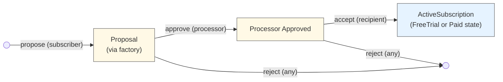
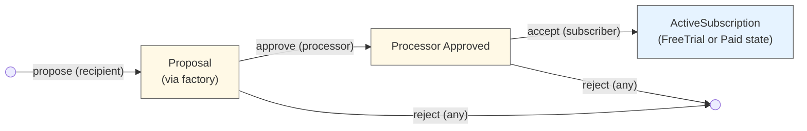
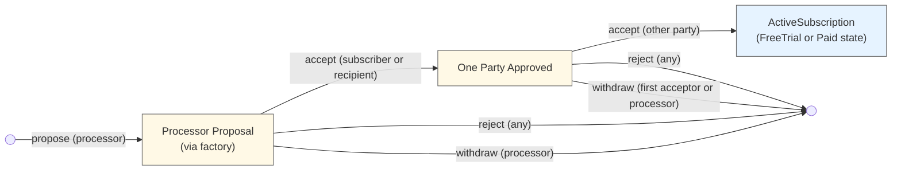
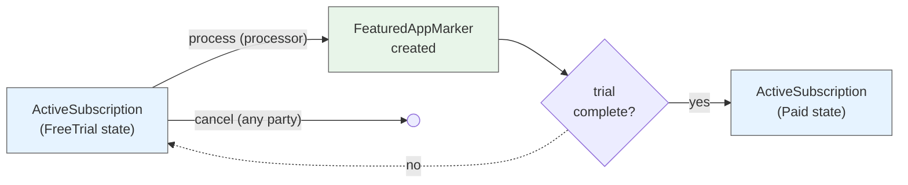
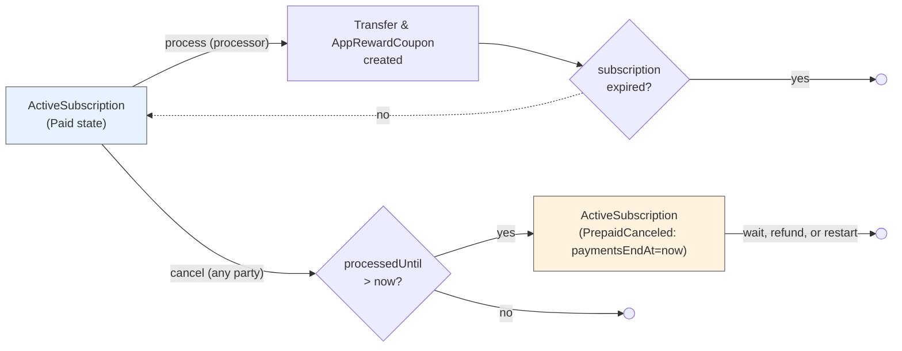

# Subscriptions

A general-purpose DAML package for recurring payment subscriptions using Splice Amulet.

## Overview

Three-party subscription system with flexible payment processing:
- **Subscriber**: Pays for the subscription (funds are automatically withdrawn each period)
- **Recipient**: Receives subscription payments
- **Processor**: Executes transfers each period, optionally for a fee

**Key Features:**
- Daily billing rates in Amulet or USD
- Free trials that convert to paid subscriptions
- Pay-as-you-go (no lockup)
- Prepay buffer prevents service interruption (refundable)

## Subscription Terms

When a subscriber and recipient agree to a subscription, they commit to a set of terms defined in the `Subscription` data type:

**Payment Terms:**
- **`recipientPaymentPerDay`**: The daily rate the subscriber pays to the recipient (in Amulet or USD)
  - Can be increased by the subscriber and decreased by the recipient
- **`processorPaymentPerDay`**: The daily rate the subscriber pays to the processor for handling payments (in Amulet or USD)
  - Can be increased by the subscriber and decreased by the processor

Pro-rated billing ensures subscribers only pay for the exact time period used

**Service Continuity:**
- **`prepayWindow`**: How far ahead payments can advance beyond the current time (e.g., 7 days)
  - Provides a buffer period for subscribers to top up their balance before service interruption
  - Larger windows provide more service stability; smaller windows reduce capital requirements
  - Zero prepay window means payments only advance up to recent history instead of prepaying for future usage, so services must honor a grace period before terminating
    - Similarly, small prepay windows (less than or equal to the processor's period) will result in `paidUntil` often being in the recent past rather than the future
  - Can be increased by the subscriber and decreased by the recipient

**Duration:**
- **`paymentsEndAt`**: When payments end (can be far in the future for ongoing subscriptions)
  - Can only be changed by the subscriber (to any time)
- **Free trial**: Optional trial period (specified at proposal creation) where no payment is required
  - Specified using `SubscriptionExpiration` which can be either:
    - **`AbsoluteExpiration Time`**: Expires at a specific timestamp
    - **`RelativeExpiration RelTime`**: Expires at a duration from subscription creation time (e.g., 30 days from when accepted)
  - Relative expirations allow proposals to remain outstanding without eating into the trial duration
  - Managed by `FreeTrialSubscription` template with `trialEndsAt` field (always resolved to absolute time)
  - Can be extended by the recipient or reduced by the subscriber
  - Recipients can convert a paid subscription back to a free trial anytime
  - Automatically converts to `PaidSubscription` when trial ends

**Other:**
- **`description`**: Optional human-readable description of the subscription purpose (e.g., "Premium membership", "Premium tier - app_id:123")
  - Changes require both subscriber and recipient approval via description update proposal contracts
- **`metadata`**: Structured key-value pairs for additional subscription information
  - Stored as `TextMap Text` for type-safe, queryable metadata
  - Changes require processor approval first, then acceptance by the other party (subscriber or recipient)
  - Common use: Reference RewardShare contract IDs for off-chain reward distribution

**Key Principles:**
- Terms are agreed upon during the proposal/acceptance flow
- Any party can cancel at any time
- Terms can only be changed by the party negatively impacted (e.g., subscriber increases payments, recipient decreases their payment)
- On-chain proposals exist for changes requiring both parties' approval (e.g., reason updates)

## Architecture

**Three-Party Flow:** Can be initiated by subscriber, recipient, or processor:
- **Subscriber-initiated:** Subscriber proposes terms → Processor approves → Recipient accepts
- **Recipient-initiated:** Recipient proposes terms → Processor approves → Subscriber accepts
- **Processor-initiated:** Processor proposes terms → Either party accepts first → Other party accepts

**Billing Model:** Configured as a rate per day but charged pro-rated for any processing period used:
```
amountForPeriod = (amountPerDay × periodDuration) / 1 day
```

It's pay-as-you-go where transfer fees are paid by the recipient and processor, not the subscriber. This means consistent and predictable costs for end-users regardless of the processing period used.

**Processor Payments:**
The processor can use any period length, so long as it does not exceed the prepay window (when the window is 0, payments may only advance up until `now`).

- **Standard mode** (`processorPaymentPerDay > 0`): Processor and recipient each receive a separate payment and AppRewardCoupon (issued to their respective providers)
- **Zero-fee mode** (`processorPaymentPerDay = 0`): Recipient receives normal payment and AppRewardCoupon. Processor receives a FeaturedAppActivityMarker (no payment) to offset traffic costs.

**Prepay Window:** Controls how far ahead `processedUntil` can extend beyond current time:
- **Large window (e.g., 7 days):** Creates buffer before service interruption; `processedUntil` stays ahead of now
- **Zero window:** Payments only cover past usage (`processedUntil ≤ now`); recipient manages grace period
- **Small window (≤ processing period):** `processedUntil` may trail current time since processing must wait until period elapses
- **Limits:** `processedUntil` capped at `min(now + prepayWindow, paymentsEndAt)`

## Contract Templates

The subscription system uses separate templates for each lifecycle state:

**Proposal Flow:**
- `SubscriptionFactory` - Creates proposals with processor/DSO context
- `SubscriberSubscriptionProposal` - Subscriber initiates, awaits processor approval
- `RecipientSubscriptionProposal` - Recipient initiates, awaits processor approval
- `ProcessorSubscriptionProposal` - Processor initiates, awaits acceptance from both parties
- `ProcessorApprovedSubscriptionProposal` - Awaits recipient acceptance (after processor approval of subscriber proposal)
- `ProcessorApprovedRecipientInitiatedSubscriptionProposal` - Awaits subscriber acceptance (after processor approval of recipient proposal)
- `OnePartyApprovedProcessorSubscriptionProposal` - Awaits second party acceptance (after one party accepted processor proposal)

**Active Subscriptions:**
- `ActiveSubscription` - Unified subscription template with implicit state based on timestamps:
  - FreeTrial: `trialEndsAt` is Some and >= now (no payments, creates activity markers)
  - PrepaidCanceled: `paymentsEndAt` <= now and `processedUntil` >= now (can be restarted)
  - Paid: All other cases (active paid subscription)
  - Should be archived: `paymentsEndAt` < now AND `processedUntil` < now

**Configuration Updates:**
- `ActiveSubscription_ProposeChanges` - Unified change system:
  - Determines impacted parties based on proposed changes
  - If only proposer is impacted: applies changes directly
  - If others are impacted: creates `SubscriptionChangeProposal` for approval
- `SubscriptionChangeProposal` - Multi-party approval contract for changes:
  - Tracks approvals from impacted parties
  - Once approved, validates and applies changes to active subscription
  - Validates original state matches (allows `processedUntil` to change during approval)

## Flow Diagrams

**Lifecycle Overview:**

1. **Proposal:** Subscriber, recipient, or processor proposes terms via `SubscriptionFactory`
2. **Approval/Acceptance:**
   - **Subscriber/Recipient-initiated:** Processor validates and approves, then the other party accepts
   - **Processor-initiated:** Either party accepts first, then the other party accepts
3. **Active Subscription:** Creates `ActiveSubscription` with `trialEndsAt` set if free trial, None otherwise
4. **Processing:**
   - Free trial: Processor advances `processedUntil` and creates activity markers (no payments)
   - Paid: Processor executes transfers from subscriber to recipient and processor (with app rewards)
5. **Lifecycle:** Continues until expiration or cancellation by any party
6. **Transitions:** 
   - Trial converts to paid when `trialEndsAt` reached
   - Paid subscription can convert back to trial
   - Canceled subscriptions can be restarted with all parties' approval

**Cancellation:** Any party can cancel anytime. Canceling sets `paymentsEndAt` to now. If `processedUntil > now`, the subscription enters PrepaidCanceled state (and can optionally be restarted with all parties' approval).

## Contract Lifecycle Diagrams

### Subscriber-Initiated Flow



### Recipient-Initiated Flow



### Processor-Initiated Flow



### Free Trial Lifecycle



### Paid Subscription Lifecycle



## Usage Example

```haskell
-- 1. Create proposal (subscriber initiates)
proposalCid <- submit subscriber do
  exerciseCmd factoryCid SubscriptionFactory_CreateSubscriberProposal with
    config = Subscription with
      subscriber, recipient
      recipientPaymentPerDay = AmuletAmount 10.0
    processorPaymentPerDay = AmuletAmount 1.0
    prepayWindow = days 7
    paymentsEndAt = farFutureTime
    description = Some "Premium membership"
      metadata = TM.empty  -- Can add RewardShare references later
    -- Flexible free trial expiration (resolved when subscription is created)
    freeTrialExpiration = Some (RelativeExpiration (days 30))  -- 30 days from acceptance
    -- Alternative: freeTrialExpiration = Some (AbsoluteExpiration trialEndTime)

-- 2. Processor approves
approvedCid <- submit processor do
  exerciseCmd proposalCid SubscriberSubscriptionProposal_ProcessorApprove

-- 3. Recipient accepts (providing their provider)
acceptResult <- submit recipient do
  exerciseCmd approvedCid ProcessorApprovedSubscriptionProposal_RecipientAccept with
    recipientProvider = recipient

-- Result is ActiveSubscription (in FreeTrial state for this example)
let activeSubscriptionCid = acceptResult

-- 4. Process trial period (creates activity markers, no payments)
activeSubscriptionCid <- submit processor do
  exerciseCmd activeSubscriptionCid ActiveSubscription_ProcessFreeTrial with
    processingPeriod = days 1
    processorProvider = processor
    recipientFeaturedAppRight = Some recipientFARCid
    processorFeaturedAppRight = Some processorFARCid

-- When trial ends, subscription automatically transitions to Paid state

-- 5. Process payments periodically (after trial ends)
-- Standard mode with processor fees:
paymentResult <- submit processor do
  exerciseCmd activeSubscriptionCid ActiveSubscription_ProcessPayment with
    processingPeriod = days 1
    paymentCtx = PaymentContext with
      amuletInputs = subscriberAmuletCids
      amuletRulesCid, openMiningRoundCid
    processorProvider = processor
    recipientFeaturedAppRight = Some recipientFARCid
    processorFeaturedAppRight = Some processorFARCid
    processorActivityMarkerFAR = None  -- Only used in zero-fee mode

-- 6. (Optional) Add RewardShare references via metadata update
-- Recipient creates a metadata change proposal
metadataProposalCid <- submit recipient do
  createCmd MetadataChangeProposal with
    subscriber, recipient, processor
    proposer = recipient
    newMetadata = TM.fromList
      [ ("recipient_reward_agreement_cid", recipientRewardAgreementCid)
      , ("processor_reward_agreement_cid", processorRewardAgreementCid)
      ]
    proposalExpiresAt = futureTime

-- Processor approves the metadata change
approvedMetadataProposalCid <- submit processor do
  exerciseCmd metadataProposalCid MetadataChangeProposal_ProcessorApprove

-- Subscriber accepts the metadata change (requires both processor and subscriber authority)
updatedActiveSubscriptionCid <- submit processor, subscriber do
  exerciseCmd approvedMetadataProposalCid ProcessorApprovedMetadataChangeProposal_Accept with
    activeSubscriptionCid
    accepter = subscriber

```

## Appendix

### Cancellation with Prepaid Time

When any party cancels an `ActiveSubscription` with `processedUntil > now`, they can either:
- **Honor prepaid period**: Sets `paymentsEndAt` to now (by passing `disregardAvailablePaidPeriod = False`), transitioning to PrepaidCanceled state
- **Immediately archive** (subscriber only): Subscriber can pass `disregardAvailablePaidPeriod = True` to forgo the prepaid period and archive immediately

If the subscription transitions to PrepaidCanceled state, the recipient has several options:

**Option 1: Honor Prepaid Period**
- Subscriber retains access until `processedUntil`
- Any party archives once `processedUntil` passes using `ActiveSubscription_ArchiveInactiveSubscription`
- Common for content services (e.g., streaming platforms)

**Option 2: Refund and Archive Immediately**  
- Recipient calls `ActiveSubscription_RecipientRefundAndArchive`
- Refund: `(processedUntil - now) × (recipientPaymentPerDay + processorPaymentPerDay)`
- Contract archives after refund transfer
- Common for usage-based services (e.g., insurance, utilities)

**Option 3: Restart the Subscription (New)**
- All three parties can use `ActiveSubscription_RestartAsFreeTrial` or `ActiveSubscription_RestartAsPaid`
- Preserves the prepaid period
- Useful for resolving cancellation disputes or re-engaging customers

The choice depends on the recipient's business model and customer relationship.

### Tradeoff: LockedAmulets

**Decision:** This implementation uses **pay-as-you-go with optional prepayment**—funds are pulled from the subscriber's account during each payment processing cycle, with the `prepayWindow` parameter controlling how far ahead payments can advance.

**The prepayWindow provides security without LockedAmulets:**

The `prepayWindow` parameter allows processing to advance up to a specified duration ahead of the current time (e.g., 7 days, 1 hour). This creates a prepaid buffer that effectively accomplishes the security that using `LockedAmulet` would offer, without the complexity:

- **With prepayWindow > 0**: Processing advances ahead of current time, giving recipients revenue certainty
- **With prepayWindow = 0**: Processing only advances up to current time, covering past usage with no prepayment

**Why not use LockedAmulets?**

We don't need full `LockedAmulet` security because that would only guarantee subscription funds can always be refunded on cancellation. However, the current implementation makes refunds discretionary—the recipient chooses whether to refund prepaid amounts. Since refunds aren't guaranteed, there's no need to lock funds.

**Pros:**
- Easy to start—no large upfront deposit or locked funds required
- Flexible security—`prepayWindow` can be adjusted by subscriber (increase) or recipient (decrease)
- Simple for subscribers—just maintain account balance
- Recipients get configurable revenue certainty via prepayWindow
- Natural expiration—subscriptions lapse if funds run out
- No complex refund guarantees to manage

**Cons:**
- Payments can still fail if insufficient funds
- Refunds after cancellation are discretionary, not automatic
- Subscribers might unintentionally let subscriptions lapse

**Recommendation:** Use a reasonable `prepayWindow` (e.g., 7 days, 12 hours) to balance subscriber capital requirements with recipient revenue certainty. Recipients should notify subscribers when payments fail and design systems to handle payment failures gracefully.

#### Canton Network Polling Alignment

**Benefit:** This pay-as-you-go approach is particularly well-suited for Canton Network's frequent polling mechanism.

With each process transaction, we're securing additional funds and advancing the `processedUntil` timestamp. This transactional approach makes sense because:
- **Incremental fund capture**: Each polling cycle can capture newly available funds from the subscriber's account, minimizing their initial obligation.

The transactional approach trades some efficiency for better UX and works naturally with Canton's polling-based processing model.

#### Open Question: Should Prepaid Window Use LockedAmulets?

**Context:** Currently, the prepaid window amount is paid from the subscriber's regular account balance during each processing cycle. This provides flexibility but no guarantees.

**Alternative Approach:** Lock the prepaid window amount (e.g., `prepayWindow × (recipientPaymentPerDay + processorPaymentPerDay)`) in a `LockedAmulet` at subscription start or when the prepaid buffer needs replenishment.

**Potential Benefits:**

1. **Guaranteed Refunds on Cancellation:**
   - Locked funds could be automatically returned to the subscriber after cancellation
   - Provides stronger consumer protection
   - Could be an opt-in feature in subscription terms
   - Removes recipient discretion from refund decisions

2. **Guaranteed Service Payment on Delinquency:**
   - If subscriber runs out of regular funds, service continues for the prepaid period
   - After non-payment threshold (e.g., 2 weeks), subscription auto-closes and locked funds transfer to recipient
   - Provides revenue certainty for recipients
   - Creates clear delinquency handling

**Tradeoffs:**

- **Pro:** Stronger guarantees for both parties (refunds for subscribers, payment for recipients)
- **Pro:** Could reduce disputes and simplify cancellation logic
- **Pro:** Aligns prepaid window concept with actual pre-locked funds
- **Con:** Requires larger upfront deposit from subscribers
- **Con:** Adds complexity to subscription initialization and replenishment
- **Con:** May reduce subscriber conversion rates due to higher barrier to entry
- **Con:** LockedAmulet contracts add overhead to the system

**Questions to Resolve:**

- Should this be the default behavior, or an optional feature controlled by subscription terms?
- How should locked funds be replenished when they run low?
- Should both refund and payment guarantees be paired, or offered independently?
- Does the guaranteed refund model conflict with business models that rely on prepaid non-refundable revenue?

### Unified Change System

The subscription system uses a unified change system that intelligently determines which parties need to approve based on the proposed changes:

#### How It Works

1. **Propose Changes**: Any party calls `ActiveSubscription_ProposeChanges` with desired changes
2. **Determine Impact**: System analyzes which parties are impacted by the changes
3. **Apply or Create Proposal**:
   - If only proposer is impacted (or no one): Apply changes immediately
   - If others are impacted: Create `SubscriptionChangeProposal` for approval

#### Example: Recipient Increases Payment

```daml
-- Recipient proposes payment increase (impacts subscriber who pays more)
result <- submit recipient do
  exerciseCmd activeSubscriptionCid ActiveSubscription_ProposeChanges with
    proposer = recipient
    changes = SubscriptionChanges with
      recipientPaymentPerDay = Some (USDAmount 15.0)
      -- All other fields None (no change)
      recipientProvider = None
      processorPaymentPerDay = None
      expiresAt = None
      prepayWindow = None
      trialEndsAt = None
      description = None
      metadata = None

-- Result is Right proposalCid (subscriber approval needed)
let Right proposalCid = result

-- Subscriber approves
proposalCid <- submit subscriber do
  exerciseCmd proposalCid SubscriptionChangeProposal_Approve with actor = subscriber

-- Apply changes (both parties are controllers since both approved)
updatedSubscriptionCid <- submit subscriber, recipient do
  exerciseCmd proposalCid SubscriptionChangeProposal_Apply with
    activeSubscriptionCid
```

#### Example: Subscriber Increases Prepay Window

```daml
-- Subscriber increases prepay window (only impacts themselves)
result <- submit subscriber do
  exerciseCmd activeSubscriptionCid ActiveSubscription_ProposeChanges with
    proposer = subscriber
    changes = SubscriptionChanges with
      prepayWindow = Some (Some (days 30))
      recipientProvider = None
      recipientPaymentPerDay = None
      processorPaymentPerDay = None
      paymentsEndAt = None
      trialEndsAt = None
      description = None
      metadata = None

-- Result is Left updatedCid (applied immediately, only subscriber impacted)
let Left updatedActiveSubscriptionCid = result
```

#### Impact Rules

The system determines impacted parties using these rules:

**Recipient Provider**: Recipient only  
**Recipient Payment**: Subscriber (increase) or Recipient (decrease)  
**Processor Payment**: Subscriber (increase) or Processor (decrease)  
**Payments End**: Subscriber (commitment change)  
**Prepay Window**: Subscriber (increase) or Recipient (decrease)  
**Trial**: Both Subscriber and Recipient  
**Description**: Both Subscriber and Recipient  
**Metadata**: All three parties

#### Benefits

- **Intelligent**: Only requires approvals when necessary
- **Flexible**: Handles all change scenarios with one system
- **Safe**: Validates original state before applying (allows `processedUntil` to change)
- **Clear**: Explicit impact rules make behavior predictable
- **Audit trail**: All multi-party changes recorded on-chain with signatures

### Flexible Free Trial Expiration

The subscription system supports flexible free trial expiration through the `SubscriptionExpiration` type, which can be either absolute or relative to subscription creation:

**Absolute Expiration (`AbsoluteExpiration Time`):**
- Expires at a specific timestamp
- Example: `AbsoluteExpiration (time (date 2025 Dec 31) 23 59 59)`
- Use when you want the trial to end at a fixed date regardless of when it's accepted

**Relative Expiration (`RelativeExpiration RelTime`):**
- Expires at a duration from subscription creation time
- Example: `RelativeExpiration (days 30)` gives a full 30-day trial from acceptance
- **Key benefit**: Proposals can remain outstanding without eating into the trial duration
- Use for consistent trial experiences where users get the full duration from signup

**How it works:**
1. Proposal is created with `freeTrialExpiration: Optional SubscriptionExpiration`
2. When the proposal is accepted, the expiration is resolved to an absolute `Time` using the current ledger time
3. The resulting `FreeTrialSubscription` always has a concrete `trialEndsAt: Time` field

**Example scenario:**
- Day 0: Recipient proposes subscription with `RelativeExpiration (days 30)`
- Day 7: Subscriber accepts → trial ends at Day 37 (full 30-day trial preserved)
- vs. `AbsoluteExpiration (now + 30 days)` → trial would end at Day 30 (only 23 days remain)

This ensures subscribers always receive the full trial period, improving fairness and user experience.

### Metadata Field: RewardShare References

The `metadata` field provides a flexible mechanism to attach structured information to subscriptions. A primary use case is referencing **RewardShare contracts** for off-chain reward distribution.

#### Why Use Metadata for RewardShares?

App reward distribution often cannot be handled entirely on-chain. The subscription metadata creates an **on-chain audit trail** showing:
1. Parties explicitly agreed to reference specific RewardShare contracts
2. The processor validated and approved the references
3. A clear record exists if the references are updated later
4. Contract IDs reference the full reward share details stored on-chain

**It's up to the app to honor these reward shares.** The on-chain contracts provide proof of the distribution terms, but enforcement depends on the app's implementation.

#### Reward Share Patterns

Each `RewardShare` can specify one or more recipients who receive percentage shares of rewards. Anyone can create a RewardShare to define distribution terms (e.g., 10% to partner, 2% to affiliate).

```haskell
-- **Single RewardShare:**
-- Reference one RewardShare that defines how rewards should be distributed:

metadata = TM.fromList
  [ ("reward_share_cid", "00c5d2ba04dc1ee5b12ef0c495f50e5dbf03bd3a0c98f3e2aa1234567890abcd")
  ]

-- **Multiple RewardShares:**
-- Reference multiple RewardShares (e.g., separate shares for different reward types):

metadata = TM.fromList
  [ ("subscription_reward_share_cid", "00c5d2ba04dc1ee5b12ef0c495f50e5dbf03bd3a0c98f3e2aa1234567890abcd")
  , ("referral_reward_share_cid", "008f1ca97e23b8d4f5e9a1234567890abcd3ef0c495f50e5dbf03bd3a0c98f3e2")
  ]

-- **No RewardShares:**
-- No reward distribution references:

metadata = TM.empty

-- Note: Other metadata may also be included with any of the above examples for other purposes.

```

#### Additional Metadata Uses

Beyond RewardShare references, metadata can store:
- External subscription IDs
- Service tier identifiers
- Feature flags or entitlements
- Billing cycle preferences
- Custom business logic references

Example:
```haskell
metadata = TM.fromList
  [ ("recipient_reward_agreement_cid", "00c5d2ba04dc1ee5b12ef0c495f50e5dbf03bd3a0c98f3e2aa1234567890abcd")
  , ("external_subscription_id", "stripe_sub_1234567890")
  , ("service_tier", "premium_plus")
  , ("feature_flags", "early_access,beta_features")
  ]
```

#### Metadata Constraints

The metadata field has validation rules to prevent abuse:
- Maximum 100 key-value pairs per subscription
- Keys: Non-empty, max 256 characters
- Values: Max 4096 characters
- Changes require processor approval + other party acceptance

These constraints balance flexibility with performance and ensure metadata remains manageable.
