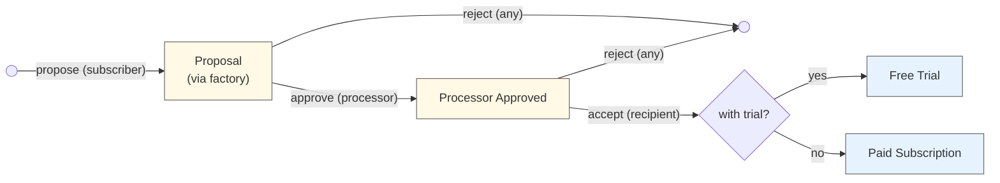
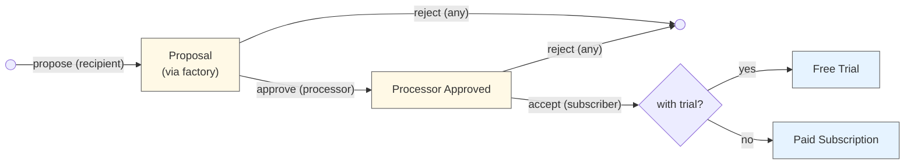
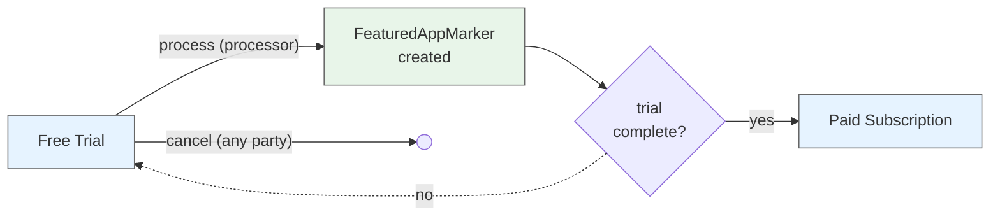
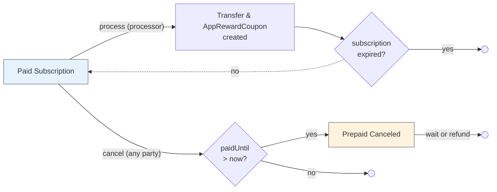

# Subscriptions

A general-purpose DAML package for recurring payment subscriptions using Splice Amulet.

## Overview

Three-party subscription system with flexible payment processing:
- **Subscriber**: Pays for the subscription (funds are automatically withdrawn each period)
- **Recipient**: Receives subscription payments
- **Processor**: Executes transfers each period, optionally for a fee

**Key Features:**
- Daily billing rates in Amulet or USD
- Free trials that convert to paid subscriptions
- Pay-as-you-go (no lockup)
- Prepay buffer prevents service interruption (refundable)

## Subscription Terms

When a subscriber and recipient agree to a subscription, they commit to a set of terms defined in the `SubscriptionConfig`:

**Payment Terms:**
- **`recipientPaymentPerDay`**: The daily rate the subscriber pays to the recipient (in Amulet or USD)
  - Can be increased by the subscriber and decreased by the recipient
- **`processorPaymentPerDay`**: The daily rate the subscriber pays to the processor for handling payments (in Amulet or USD)
  - Can be increased by the subscriber and decreased by the processor

Pro-rated billing ensures subscribers only pay for the exact time period used

**Service Continuity:**
- **`prepayWindow`**: How far ahead payments can advance beyond the current time (e.g., 7 days)
  - Provides a buffer period for subscribers to top up their balance before service interruption
  - Larger windows provide more service stability; smaller windows reduce capital requirements
  - Zero prepay window means payments only advance up to recent history instead of prepaying for future usage, so services must honor a grace period before terminating
    - Similarly, small prepay windows (less than or equal to the processor's period) will result in `paidUntil` often being in the recent past rather than the future
  - Can be increased by the subscriber and decreased by the recipient

**Duration:**
- **`expiresAt`**: When the subscription terminates (can be far in the future for ongoing subscriptions)
  - Can only be changed by the subscriber (to any time)
- **Free trial**: Optional trial period (specified at proposal creation) where no payment is required
  - Managed by `FreeTrialSubscription` template with `trialEndsAt` field
  - Can be extended by the recipient or reduced by the subscriber
  - Recipients can convert a paid subscription back to a free trial anytime
  - Automatically converts to `PaidSubscription` when trial ends

**Other:**
- **`reason`**: Optional human-readable description of the subscription purpose (e.g., "Premium membership", "Premium tier - app_id:123")
  - Changes require both subscriber and recipient approval via reason update proposal contracts

**Key Principles:**
- Terms are agreed upon during the proposal/acceptance flow
- Any party can cancel at any time
- Terms can only be changed by the party negatively impacted (e.g., subscriber increases payments, recipient decreases their payment)
- On-chain proposals exist for changes requiring both parties' approval (e.g., reason updates)

## Architecture

**Three-Party Flow:** Either subscriber-initiated or recipient-initiated:
- **Subscriber-initiated:** Subscriber proposes terms → Processor approves → Recipient accepts
- **Recipient-initiated:** Recipient proposes terms → Processor approves → Subscriber accepts

**Billing Model:** Configured as a rate per day but charged pro-rated for any processing period used:
```
amountForPeriod = (amountPerDay × periodDuration) / 1 day
```

It's pay-as-you-go where transfer fees are paid by the recipient and processor, not the subscriber. This means consistent and predictable costs for end-users regardless of the processing period used.

**Processor Payments:**
The processor can use any period length, so long as it does not exceed the prepay window (when the window is 0, payments may only advance up until `now`).

- **Standard mode** (`processorPaymentPerDay > 0`): Processor and recipient each receive a separate payment and AppRewardCoupon (issued to their respective providers)
- **Zero-fee mode** (`processorPaymentPerDay = 0`): Recipient receives normal payment and AppRewardCoupon. Processor receives a FeaturedAppActivityMarker (no payment) to offset traffic costs.

**Prepay Window:** Controls how far ahead `paidUntil` can extend beyond current time:
- **Large window (e.g., 7 days):** Creates buffer before service interruption; `paidUntil` stays ahead of now
- **Zero window:** Payments only cover past usage (`paidUntil ≤ now`); recipient manages grace period
- **Small window (≤ processing period):** `paidUntil` may trail current time since processing must wait until period elapses
- **Limits:** `paidUntil` capped at `min(now + prepayWindow, expiresAt)`

## Contract Templates

The subscription system uses separate templates for each lifecycle state:

**Proposal Flow:**
- `SubscriptionFactory` - Creates proposals with processor/DSO context
- `SubscriberSubscriptionProposal` - Subscriber initiates, awaits processor approval
- `RecipientSubscriptionProposal` - Recipient initiates, awaits processor approval  
- `ProcessorApprovedSubscriptionProposal` - Awaits recipient acceptance
- `ProcessorApprovedRecipientInitiatedSubscriptionProposal` - Awaits subscriber acceptance

**Active Subscriptions:**
- `FreeTrialSubscription` - Active trial period (no payments, creates activity markers)
- `PaidSubscription` - Active paid subscription (processes payments)
- `PrepaidCanceledSubscription` - Canceled with remaining prepaid time

**Configuration Updates:**
- `ReasonUpdateProposal` - Update reason field (requires both parties, works for either subscription type)
- `PaymentChangeProposal` - Recipient proposes payment increases (requires subscriber acceptance)
- `ExpirationExtensionProposal` - Recipient proposes extending subscription (requires subscriber acceptance)

## Flow Diagrams

**Lifecycle Overview:**

1. **Proposal:** Subscriber or recipient proposes terms via `SubscriptionFactory`
2. **Approval:** Processor validates and approves (e.g., confirms fee structure)
3. **Acceptance:** Other party accepts, creating either `FreeTrialSubscription` or `PaidSubscription`
4. **Processing:**
   - Free trial: Processor advances `paidUntil` and creates activity markers (no payments)
   - Paid: Processor executes transfers from subscriber to recipient and processor (with app rewards)
5. **Lifecycle:** Continues until expiration or cancellation by any party
6. **Transitions:** Trial converts to paid when `trialEndsAt` reached; paid subscription can convert back to trial

**Cancellation:** Any party can cancel anytime. Paid subscriptions with `paidUntil > now` create `PrepaidCanceledSubscription`.

## Contract Lifecycle Diagrams

### Subscriber-Initiated Flow



### Recipient-Initiated Flow



### Free Trial Lifecycle



### Paid Subscription Lifecycle



## Usage Example

```haskell
-- 1. Create proposal (subscriber initiates)
proposalCid <- submit subscriber do
  exerciseCmd factoryCid SubscriptionFactory_CreateSubscriberProposal with
    config = SubscriptionConfig with
      subscriber, recipient
      recipientPaymentPerDay = AmuletAmount 10.0
      processorPaymentPerDay = AmuletAmount 1.0
      prepayWindow = days 7
      expiresAt = farFutureTime
      reason = Some "Premium membership"
    freeTrialEndsAt = Some trialEndTime  -- Separate parameter, not part of config

-- 2. Processor approves
approvedCid <- submit processor do
  exerciseCmd proposalCid SubscriberSubscriptionProposal_ProcessorApprove

-- 3. Recipient accepts (providing their provider)
acceptResult <- submit recipient do
  exerciseCmd approvedCid ProcessorApprovedSubscriptionProposal_RecipientAccept with
    recipientProvider = recipient

-- Result is Either: Left FreeTrialSubscription | Right PaidSubscription
-- For this example, we have a trial so it's Left freeTrialCid

-- 4. Process trial period (creates activity markers, no payments)
trialResult <- submit processor do
  exerciseCmd freeTrialCid FreeTrialSubscription_Process with
    processingPeriod = days 1
    processorProvider = processor
    recipientFeaturedAppRight = Some recipientFARCid
    processorFeaturedAppRight = Some processorFARCid

-- When trial ends, trialResult.result is Right paidSubscriptionCid

-- 5. Process payments periodically (after trial ends)
-- Standard mode with processor fees:
paymentResult <- submit processor do
  exerciseCmd paidSubscriptionCid PaidSubscription_ProcessPayment with
    processingPeriod = days 1
    paymentCtx = PaymentContext with
      amuletInputs = subscriberAmuletCids
      amuletRulesCid, openMiningRoundCid
    processorProvider = processor
    recipientFeaturedAppRight = Some recipientFARCid
    processorFeaturedAppRight = Some processorFARCid
    processorActivityMarkerFAR = None  -- Only used in zero-fee mode

```

## Appendix

### Cancellation with Prepaid Time

When any party cancels a `PaidSubscription` with `paidUntil > now`, a `PrepaidCanceledSubscription` contract is created, tracking who canceled and when. The recipient then chooses:

**Option 1: Honor Prepaid Period**
- Subscriber retains access until `paidUntil`
- Any party archives once `paidUntil` passes
- Common for content services (e.g., streaming platforms)

**Option 2: Refund and Archive Immediately**  
- Recipient calls `PrepaidCanceledSubscription_RecipientRefundAndArchive`
- Refund: `(paidUntil - now) × (recipientPaymentPerDay + processorPaymentPerDay)`
- Contract archives after refund transfer
- Common for usage-based services (e.g., insurance, utilities)

The choice depends on the recipient's business model and customer relationship.

### Tradeoff: LockedAmulets

**Decision:** This implementation uses **pay-as-you-go with optional prepayment**—funds are pulled from the subscriber's account during each payment processing cycle, with the `prepayWindow` parameter controlling how far ahead payments can advance.

**The prepayWindow provides security without LockedAmulets:**

The `prepayWindow` parameter allows payments to advance up to a specified duration ahead of the current time (e.g., 7 days, 1 hour). This creates a prepaid buffer that effectively accomplishes the security that using `LockedAmulet` would offer, without the complexity:

- **With prepayWindow > 0**: Payments advance ahead of current time, giving recipients revenue certainty
- **With prepayWindow = 0**: Payments only advance up to current time, covering past usage with no prepayment

**Why not use LockedAmulets?**

We don't need full `LockedAmulet` security because that would only guarantee subscription funds can always be refunded on cancellation. However, the current implementation makes refunds discretionary—the recipient chooses whether to refund prepaid amounts. Since refunds aren't guaranteed, there's no need to lock funds.

**Pros:**
- Easy to start—no large upfront deposit or locked funds required
- Flexible security—`prepayWindow` can be adjusted by subscriber (increase) or recipient (decrease)
- Simple for subscribers—just maintain account balance
- Recipients get configurable revenue certainty via prepayWindow
- Natural expiration—subscriptions lapse if funds run out
- No complex refund guarantees to manage

**Cons:**
- Payments can still fail if insufficient funds
- Refunds after cancellation are discretionary, not automatic
- Subscribers might unintentionally let subscriptions lapse

**Recommendation:** Use a reasonable `prepayWindow` (e.g., 7 days, 12 hours) to balance subscriber capital requirements with recipient revenue certainty. Recipients should notify subscribers when payments fail and design systems to handle payment failures gracefully.

#### Canton Network Polling Alignment

**Benefit:** This pay-as-you-go approach is particularly well-suited for Canton Network's frequent polling mechanism.

With each process transaction, we're securing additional funds and advancing the `paidUntil` timestamp. This transactional approach makes sense because:
- **Incremental fund capture**: Each polling cycle can capture newly available funds from the subscriber's account, minimizing their initial obligation.

The transactional approach trades some efficiency for better UX and works naturally with Canton's polling-based processing model.

#### Open Question: Should Prepaid Window Use LockedAmulets?

**Context:** Currently, the prepaid window amount is paid from the subscriber's regular account balance during each processing cycle. This provides flexibility but no guarantees.

**Alternative Approach:** Lock the prepaid window amount (e.g., `prepayWindow × (recipientPaymentPerDay + processorPaymentPerDay)`) in a `LockedAmulet` at subscription start or when the prepaid buffer needs replenishment.

**Potential Benefits:**

1. **Guaranteed Refunds on Cancellation:**
   - Locked funds could be automatically returned to the subscriber after cancellation
   - Provides stronger consumer protection
   - Could be an opt-in feature in subscription terms
   - Removes recipient discretion from refund decisions

2. **Guaranteed Service Payment on Delinquency:**
   - If subscriber runs out of regular funds, service continues for the prepaid period
   - After non-payment threshold (e.g., 2 weeks), subscription auto-closes and locked funds transfer to recipient
   - Provides revenue certainty for recipients
   - Creates clear delinquency handling

**Tradeoffs:**

- **Pro:** Stronger guarantees for both parties (refunds for subscribers, payment for recipients)
- **Pro:** Could reduce disputes and simplify cancellation logic
- **Pro:** Aligns prepaid window concept with actual pre-locked funds
- **Con:** Requires larger upfront deposit from subscribers
- **Con:** Adds complexity to subscription initialization and replenishment
- **Con:** May reduce subscriber conversion rates due to higher barrier to entry
- **Con:** LockedAmulet contracts add overhead to the system

**Questions to Resolve:**

- Should this be the default behavior, or an optional feature controlled by subscription terms?
- How should locked funds be replenished when they run low?
- Should both refund and payment guarantees be paired, or offered independently?
- Does the guaranteed refund model conflict with business models that rely on prepaid non-refundable revenue?

### Change Proposal Contracts

The subscription system includes proposal contracts for changes that require negotiation between subscriber and recipient:

#### ReasonUpdateProposal

Allows either party to propose changes to the `reason` field on any subscription type:

```daml
-- Either subscriber or recipient can propose
proposalCid <- submit proposer do
  createCmd ReasonUpdateProposal with
    subscriber, recipient, proposer
    newReason = Some "Updated subscription purpose"
    subscriptionCid = Left paidSubscriptionCid  -- or Right for FreeTrialSubscription

-- Other party accepts
updatedSubscriptionCid <- submit subscriber, recipient do
  exerciseCmd proposalCid ReasonUpdateProposal_AcceptForPaidSubscription with
    paidSubscriptionCid
```

#### PaymentChangeProposal

Recipient proposes payment increases (requires subscriber acceptance):

```daml
-- Recipient proposes payment increase
proposalCid <- submit recipient do
  createCmd PaymentChangeProposal with
    subscriber, recipient
    newRecipientPaymentPerDay = AmuletAmount 15.0
    newProcessorPaymentPerDay = AmuletAmount 1.5
    effectiveDate = Some futureTime
    reason = Some "Annual price adjustment"
    subscriptionCid = Left paidSubscriptionCid

-- Subscriber accepts or rejects
updatedSubscriptionCid <- submit subscriber, recipient do
  exerciseCmd proposalCid PaymentChangeProposal_AcceptForPaidSubscription with
    paidSubscriptionCid
```

#### ExpirationExtensionProposal

Recipient proposes extending subscription beyond current expiration:

```daml
-- Recipient proposes extending subscription
proposalCid <- submit recipient do
  createCmd ExpirationExtensionProposal with
    subscriber, recipient
    newExpiresAt = farFutureTime
    incentive = Some "Lock in current rate for 2 years"
    subscriptionCid = Left paidSubscriptionCid

-- Subscriber accepts or rejects
updatedSubscriptionCid <- submit subscriber, recipient do
  exerciseCmd proposalCid ExpirationExtensionProposal_AcceptForPaidSubscription with
    paidSubscriptionCid
```

**Benefits:**
- On-chain audit trail of all change requests
- Async negotiation without real-time communication
- Clear intent signaling through contract state
- Works with both `PaidSubscription` and `FreeTrialSubscription`

**Single-Party Changes (No Proposal Required):**
- Subscriber: increase payments, extend expiration, increase prepay window
- Recipient: decrease their payment, start free trial, decrease prepay window
- Processor: decrease their payment
