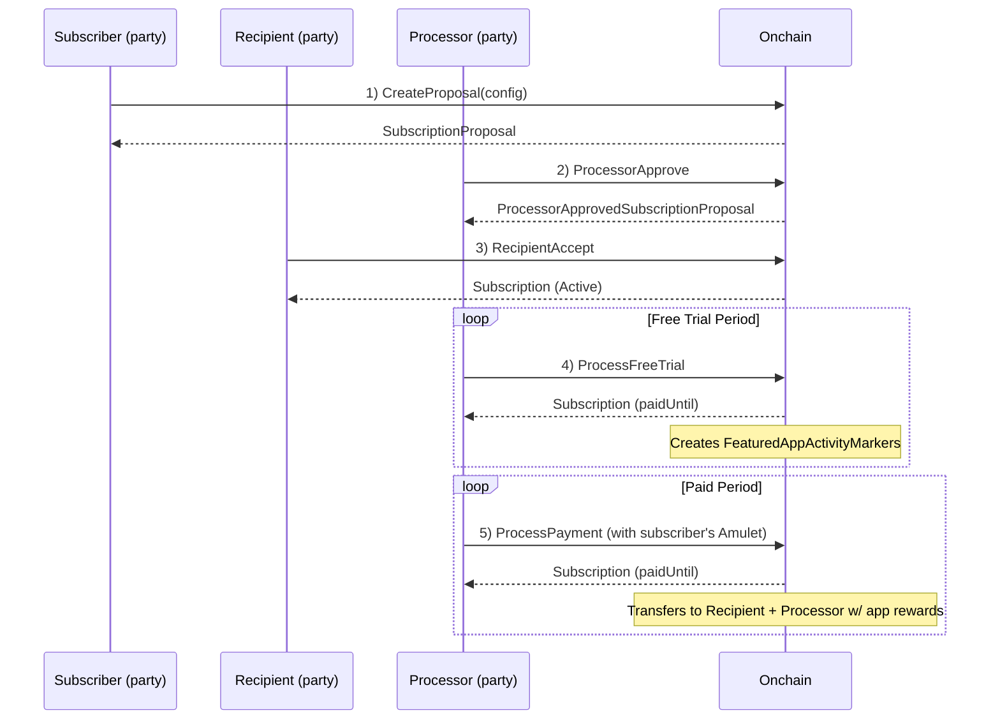

# Subscriptions-v01

A general-purpose DAML package for recurring payment subscriptions using Splice Amulet.

## Overview

Three-party subscription system with flexible payment processing:
- **Subscriber**: Pays for the subscription (provides Amulet each period)
- **Recipient**: Receives subscription payments (service provider)
- **Processor**: Executes payment transfers each period

**Key Features:**
- Per-day billing with automatic pro-rata calculation for any processing interval
- Free trial support with FeaturedAppRight rewards
- Pay-as-you-go (no upfront collateral required)
- Dynamic payment and expiration updates
- No DSO signatures required for core operations
- Supports both Amulet and USD denominations

## Architecture

**Three-Party Flow:** Subscriber proposes → Processor approves → Recipient accepts → Processor executes periodic payments

**Billing Model:** Per-day rates (`amountPerDay`) automatically pro-rated for any processing period:
```
amountForPeriod = (amountPerDay × periodDuration) / 1 day
```

**Payment Model:** Pay-as-you-go where subscriber provides Amulet inputs each period (not locked upfront). Receivers pay transfer fees for predictable subscriber billing.

## Flow Diagram



## Contracts

**SubscriptionFactory** → Creates proposals with consistent processor/DSO assignment

**SubscriptionProposal** → Subscriber's proposal awaiting processor approval

**ProcessorApprovedSubscriptionProposal** → Processor-approved proposal awaiting recipient acceptance

**SubscriptionConfig** → Configuration data (parties, payments, expiration, free trial)

**Subscription** → Active subscription with these key operations:
- `ProcessPayment`: Executes Amulet transfers (recipient + processor fee)
- `ProcessFreeTrial`: Advances free trial, creates FeaturedAppActivityMarkers
- Dynamic updates: Increase/decrease payments, extend/decrease expiration, update FeaturedAppRights
- Cancellation: Any party can cancel unilaterally

## Usage Example

```daml
-- 1. Create proposal
proposalCid <- submit subscriber do
  exerciseCmd factoryCid SubscriptionFactory_CreateProposal with
    config = SubscriptionConfig with
      subscriber, recipient
      recipientPayment = PaymentConfig with
        amountPerDay = AmuletAmount 10.0
        featuredAppRight = None
      processorPayment = PaymentConfig with
        amountPerDay = AmuletAmount 1.0
        featuredAppRight = None
      expiresAt = farFutureTime
      freeTrialEndsAt = Some trialEndTime
      reason = Some "Premium membership"

-- 2. Processor approves
approvedCid <- submit processor do
  exerciseCmd proposalCid SubscriptionProposal_ProcessorApprove

-- 3. Recipient accepts
subscriptionCid <- submit recipient do
  exerciseCmd approvedCid ProcessorApprovedSubscriptionProposal_RecipientAccept

-- 4. Process payments periodically
result <- submit processor do
  exerciseCmd subscriptionCid Subscription_ProcessPayment with
    processingPeriod = days 1
    paymentCtx = PaymentContext with ..

-- 5. Cancel anytime
() <- submit subscriber do
  exerciseCmd subscriptionCid Subscription_CancelBySubscriber
```

## Dependencies

- `splice-amulet` - Payment transfers via AmuletRules
- `splice-api-featured-app-v1` - FeaturedAppRight integration for rewards during free trials
