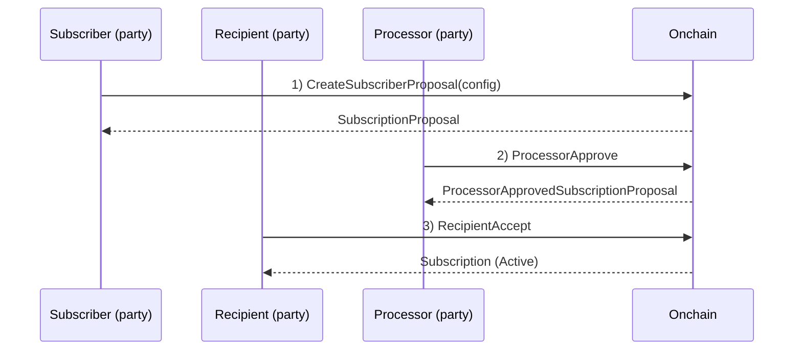
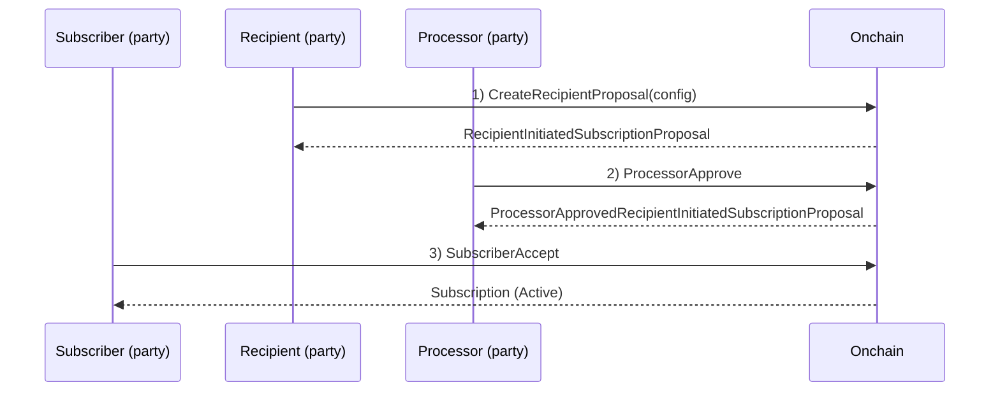
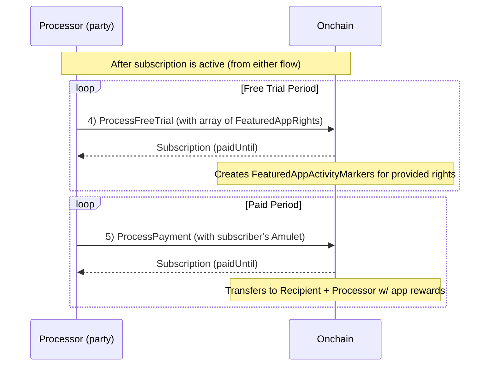
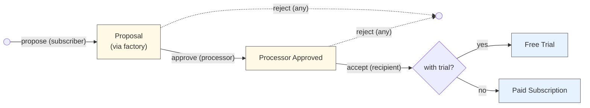
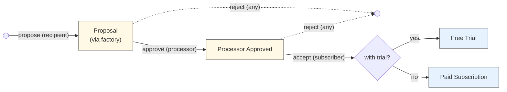
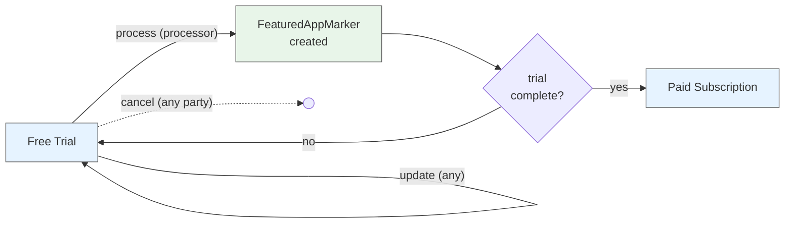
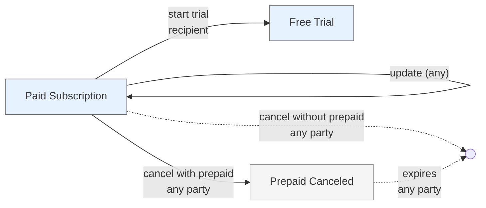

# Subscriptions

A general-purpose DAML package for recurring payment subscriptions using Splice Amulet.

## Overview

Three-party subscription system with flexible payment processing:
- **Subscriber**: Pays for the subscription (funds are automatically withdrawn each period)
- **Recipient**: Receives subscription payments
- **Processor**: Executes transfers each period, optionally for a fee

**Key Features:**
- Daily billing rates in Amulet or USD
- Free trials that convert to paid subscriptions
- Pay-as-you-go (no lockup)
- Prepay buffer prevents service interruption (refundable)

## Subscription Terms

When a subscriber and recipient agree to a subscription, they commit to a set of terms defined in the `SubscriptionConfig`:

**Payment Terms:**
- **`recipientPaymentPerDay`**: The daily rate the subscriber pays to the recipient (in Amulet or USD)
- **`processorPaymentPerDay`**: The daily rate the subscriber pays to the processor for handling payments (in Amulet or USD)

Pro-rated billing ensures subscribers only pay for the exact time period used

**Service Continuity:**
- **`prepayWindow`**: How far ahead payments can advance beyond the current time (e.g., 7 days)
  - Provides a buffer period for subscribers to top up their balance before service interruption
  - Larger windows provide more service stability; smaller windows reduce capital requirements
  - Zero prepay window means payments only advance up to recent history instead of prepaying for future usage, so services must honor a grace period before terminating

**Duration:**
- **`expiresAt`**: When the subscription terminates (can be far in the future for ongoing subscriptions)
  - Subscriber can set any future expiration time (since they can cancel at any time anyway)
- **`freeTrialEndsAt`**: Optional trial period where no payment is required
  - The recipient can extend trial duration or start a new trial, the subscriber can reduce it

**Other:**
- **`reason`**: Optional human-readable description of what the subscription is for. Can include both a user-friendly description and an app-specific identifier (e.g., "Premium membership", "Premium tier access - app_id:123"). The app ID allows systems to connect subscriptions programmatically while maintaining human readability.

**Key Principles:**
- Terms are agreed upon during the proposal/acceptance flow
- Most terms can be modified after activation (with appropriate party authorization)
- Subscribers can increase payment amounts unilaterally (good for tipping/upgrading)
- Recipients/processors can only decrease their own payment amounts (prevents forced price increases)
- Any party can cancel at any time

## Architecture

**Three-Party Flow:** Either subscriber-initiated or recipient-initiated:
- **Subscriber-initiated:** Subscriber proposes terms → Processor approves → Recipient accepts
- **Recipient-initiated:** Recipient proposes terms → Processor approves → Subscriber accepts

**Billing Model:** Configured as a rate per day but charged pro-rated for any processing period used:
```
amountForPeriod = (amountPerDay × periodDuration) / 1 day
```

Pay-as-you-go where transfer fees are paid by the recipient and processor, not the subscriber. This means consistent and predictable costs for end-users regardless of the processing period used.

**Processor Payment Modes:**
The processor can use any period length, so long as it does not exceed the prepay window (when the window is 0, payments may only advance up until `now`).

- **Standard mode** (`processorPaymentPerDay > 0`): The processor receives a separate payment and a (featured) AppRewardCoupon issued to their provider. Recipient receives payment and a (featured) AppRewardCoupon issued to their provider.
- **Zero-fee mode** (`processorPaymentPerDay = 0`): The processor receives a (featured) AppRewardCoupon for the recipient payment by speciying their provider (no separate processor payment). The `recipientFeaturedAppRight` must be None in this mode to avoid confusion since they cannot receive rewards.

**Prepay Window:** Determines how far ahead payments can extend `paidUntil` beyond the current time, providing zero-downtime insurance:
- **Purpose:** Gives subscribers a buffer period to top up their balance before service actually lapses, ensuring continuous service
- **Alternative (0 prepay window):** Payments only advance to `now`, and recipients set their own tolerance buffer before canceling service for non-payment
- **Cancellation with prepaid time:** When canceling a subscription with remaining prepaid time, recipients can either (1) refund the overpayment immediately, or (2) allow service to continue until the end of the paid period
- **Limits:** `paidUntil` is always capped to the earliest of: `(now + prepayWindow)`, `expiresAt`, or `freeTrialEndsAt`

## Flow Diagrams

**Process Overview:**

1. Subscription terms are proposed by the subscriber or recipient
2. The processor (Fairmint) approves the terms (confirming things like our fee is sufficient)
3. The other party accepts to activate the subscription
4. If in a free trial, process & create a FeaturedAppActivityMarker. Loop
5. If not expired, use subscriber funds to pay the recipient and processor (w/ app rewards). Loop

**Note:** Any of the 3 parties can cancel at any time.

### Subscriber-Initiated Setup (Steps 1-3)



### Recipient-Initiated Setup (Steps 1-3)



### Payment & Trial Processing (Steps 4-5)



## Contract Lifecycle Diagrams

### Subscriber-Initiated Flow



### Recipient-Initiated Flow



### Free Trial Lifecycle



**Update choices:**
- `FreeTrialSubscription_RecipientExtendTrial` (recipient extends trial duration)
- `FreeTrialSubscription_SubscriberReduceTrial` (subscriber reduces trial duration)
- `FreeTrialSubscription_SubscriberUpdateExpiration` (subscriber updates expiration to any future time)
- `FreeTrialSubscription_SubscriberIncreasePayments` (subscriber increases payment amounts)
- `FreeTrialSubscription_RecipientDecreasePayment` (recipient decreases their payment)
- `FreeTrialSubscription_ProcessorDecreasePayment` (processor decreases their payment)
- `FreeTrialSubscription_RecipientUpdateProvider` (recipient updates their provider)

### Paid Subscription Lifecycle



**Update choices:**
- `PaidSubscription_SubscriberUpdateExpiration` (subscriber updates expiration to any future time)
- `PaidSubscription_SubscriberIncreasePayments` (subscriber increases payment amounts)
- `PaidSubscription_RecipientDecreasePayment` (recipient decreases their payment)
- `PaidSubscription_ProcessorDecreasePayment` (processor decreases their payment)
- `PaidSubscription_RecipientUpdateProvider` (recipient updates their provider)

## Contracts

**SubscriptionFactory** → Creates proposals with consistent processor/DSO assignment (supports both flows)

### Subscriber-Initiated Flow

**SubscriberSubscriptionProposal** → Subscriber's proposal awaiting processor approval

**ProcessorApprovedSubscriptionProposal** → Processor-approved proposal awaiting recipient acceptance

### Recipient-Initiated Flow

**RecipientSubscriptionProposal** → Recipient's proposal awaiting processor approval

**ProcessorApprovedRecipientInitiatedSubscriptionProposal** → Processor-approved proposal awaiting subscriber acceptance

### Shared

**SubscriptionConfig** → Configuration data (parties, payment amounts, prepayWindow, expiration)

**FreeTrialSubscription** → Active subscription during free trial period with key operations:
- `Process`: Advances free trial, creates FeaturedAppActivityMarkers for an array of (Party, FeaturedAppRight) pairs (can be empty)
- Transitions to PaidSubscription when trial ends
- Dynamic updates: payment amounts, trial duration, expiration
- Cancellation: Any party can cancel instantly (no prepaid amount during trial)

**PaidSubscription** → Active paid subscription with key operations:
- `ProcessPayment`: Executes Amulet transfers (recipient + processor fee) with optional AppRewardCoupons via FeaturedAppRights
- Can transition to FreeTrialSubscription when recipient starts a trial
- Dynamic updates: Increase/decrease payments, subscriber can set any future expiration
- Cancellation: Any party can cancel unilaterally. Recipients can optionally refund prepaid amounts when canceling

**PrepaidCanceledSubscription** → Canceled subscription with remaining prepaid time:
- Created when a subscription is canceled but has future paid time remaining
- Remains active until `paidUntil` time passes
- Any party can archive once the prepaid period expires

## Usage Examples

### Subscriber-Initiated Flow

```daml
-- 1. Create proposal (subscriber initiates)
proposalCid <- submit subscriber do
  exerciseCmd factoryCid SubscriptionFactory_CreateSubscriberProposal with
    config = SubscriptionConfig with
      subscriber, recipient
      recipientPaymentPerDay = AmuletAmount 10.0
      processorPaymentPerDay = AmuletAmount 1.0
      prepayWindow = days 7
      expiresAt = farFutureTime
      freeTrialEndsAt = Some trialEndTime
      reason = Some "Premium membership"

-- 2. Processor approves
approvedCid <- submit processor do
  exerciseCmd proposalCid SubscriptionProposal_ProcessorApprove

-- 3. Recipient accepts (providing their provider)
subscriptionCid <- submit recipient do
  exerciseCmd approvedCid ProcessorApprovedSubscriptionProposal_RecipientAccept with
    recipientProvider = recipient

-- 4. Process payments periodically (standard mode - both parties get AppRewardCoupons)
result <- submit processor do
  exerciseCmd subscriptionCid Subscription_ProcessPayment with
    processingPeriod = days 1
    paymentCtx = PaymentContext with
      amuletInputs = subscriberAmuletCids
      amuletRulesCid, openMiningRoundCid
    processorProvider = processor  -- Processor passes their own provider
    recipientFeaturedAppRight = Some recipientFARCid
    processorFeaturedAppRight = Some processorFARCid

-- 4b. Process payments with zero processor fee (processor provides AppRewardCoupon for recipient)
resultZeroFee <- submit processor do
  exerciseCmd subscriptionCid Subscription_ProcessPayment with
    processingPeriod = days 1
    paymentCtx = PaymentContext with
      amuletInputs = subscriberAmuletCids
      amuletRulesCid, openMiningRoundCid
    processorProvider = processor  -- Processor passes their own provider
    recipientFeaturedAppRight = None  -- Must be None when processorPaymentPerDay is 0
    processorFeaturedAppRight = Some processorFARCid

-- 5. Recipient updates provider (optional - can be done anytime)
updatedSubscriptionCid <- submit recipient do
  exerciseCmd subscriptionCid PaidSubscription_RecipientUpdateProvider with
    newRecipientProvider = newProviderParty

-- 6. Cancel anytime (creates PrepaidCanceledSubscription if prepaid time remains)
maybePrepaidCid <- submit subscriber do
  exerciseCmd subscriptionCid PaidSubscription_CancelBySubscriber

-- 6b. If prepaid time remains and recipient wants to refund immediately
case maybePrepaidCid of
  Some prepaidCid -> do
    refundResult <- submit recipient do
      exerciseCmd prepaidCid PrepaidCanceledSubscription_RecipientRefundAndArchive with
        paymentContext = PaymentContext with
          amuletInputs = recipientAmuletCids
          amuletRulesCid, openMiningRoundCid
  None -> pure ()  -- No prepaid time, already archived
```

### Recipient-Initiated Flow

```daml
-- 1. Create proposal (recipient initiates)
proposalCid <- submit recipient do
  exerciseCmd factoryCid SubscriptionFactory_CreateRecipientProposal with
    config = SubscriptionConfig with
      subscriber, recipient
      recipientPaymentPerDay = AmuletAmount 10.0
      processorPaymentPerDay = AmuletAmount 1.0
      prepayWindow = days 7
      expiresAt = farFutureTime
      freeTrialEndsAt = Some trialEndTime
      reason = Some "Premium membership"

-- 2. Processor approves
approvedCid <- submit processor do
  exerciseCmd proposalCid RecipientInitiatedSubscriptionProposal_ProcessorApprove

-- 3. Subscriber accepts (recipient's provider can be set here or during proposal)
subscriptionCid <- submit subscriber do
  exerciseCmd approvedCid ProcessorApprovedRecipientInitiatedSubscriptionProposal_SubscriberAccept with
    recipientProvider = recipient

-- 4. Process payments periodically (standard mode - same as subscriber-initiated)
result <- submit processor do
  exerciseCmd subscriptionCid Subscription_ProcessPayment with
    processingPeriod = days 1
    paymentCtx = PaymentContext with
      amuletInputs = subscriberAmuletCids
      amuletRulesCid, openMiningRoundCid
    recipientFeaturedAppRight = Some recipientFARCid
    processorFeaturedAppRight = Some processorFARCid

-- 4b. Or with zero processor fee (processor provides AppRewardCoupon for recipient)
resultZeroFee <- submit processor do
  exerciseCmd subscriptionCid Subscription_ProcessPayment with
    processingPeriod = days 1
    paymentCtx = PaymentContext with
      amuletInputs = subscriberAmuletCids
      amuletRulesCid, openMiningRoundCid
    recipientFeaturedAppRight = None  -- Must be None when processorPaymentPerDay is 0
    processorFeaturedAppRight = Some processorFARCid

-- 5. Cancel anytime (creates PrepaidCanceledSubscription if prepaid time remains)
maybePrepaidCid <- submit recipient do
  exerciseCmd subscriptionCid PaidSubscription_CancelByRecipient

-- 5b. If prepaid time remains, recipient can optionally refund immediately
case maybePrepaidCid of
  Some prepaidCid -> do
    -- Option A: Let prepaid period expire naturally (subscriber keeps access)
    -- Any party can archive once paidUntil passes
    
    -- Option B: Refund and archive immediately
    refundResult <- submit recipient do
      exerciseCmd prepaidCid PrepaidCanceledSubscription_RecipientRefundAndArchive with
        paymentContext = PaymentContext with
          amuletInputs = recipientAmuletCids
          amuletRulesCid, openMiningRoundCid
  None -> pure ()  -- No prepaid time, already archived
```

## Dependencies

- `splice-amulet` - Payment transfers via AmuletRules
- `splice-api-featured-app-v1` - FeaturedAppRight integration for rewards
- `Shared-v01` - Shared helpers for FeaturedAppActivityMarker creation

## Cancellation with Prepaid Time

When any party cancels a subscription that has prepaid time remaining (`paidUntil > now`), a `PrepaidCanceledSubscription` contract is created. The recipient then has two options:

### Option 1: Let Prepaid Period Expire
- Subscription remains in `PrepaidCanceledSubscription` state until `paidUntil` has passed
- Subscriber keeps access for the time they've already paid for
- Any party can archive the contract once `paidUntil` is reached

### Option 2: Issue Refund and Archive Immediately
- Recipient can call `PrepaidCanceledSubscription_RecipientRefundAndArchive`
- Recipient provides Amulet inputs to refund the unused prepaid amount
- Refund amount calculated as: `(paidUntil - now) × recipientPaymentPerDay`
- Subscription is archived immediately after refund transfer
- Provides good subscriber experience and maintains trust

**Note:** Subscriber and processor cancellations always create `PrepaidCanceledSubscription` (no refund option). Only recipients have the refund option since they're best positioned to provide customer service.

## Tradeoffs Discussion

### No LockedAmulet: Debit Card vs. Prepaid Gift Card

**Decision:** This implementation works like a **debit card** that's charged monthly—funds are pulled from the subscriber's account when each payment is due.

**Why not other approaches?**
- **Credit card model**: Would let subscribers run up debt, creating unpaid balance risk for recipients
- **Prepaid gift card model**: Would lock up subscriber funds upfront (using `LockedAmulet`), requiring a large deposit

**Current approach (Debit Card):**

The subscriber can pause or cancel (intentionally or not) simply by having insufficient funds when payment processing occurs. No funds are locked in advance.

**Pros:**
- Easy to start—no large upfront deposit required
- Simple for subscribers—just maintain account balance
- Natural expiration—subscriptions lapse if funds run out
- No refund complexity when canceling

**Cons:**
- Payments can fail if insufficient funds
- Recipients have less revenue certainty
- Subscribers might unintentionally let subscriptions lapse

**Recommendation:** The debit card model provides the best subscriber experience with the lowest friction. Recipients should notify subscribers when payments fail and design systems to handle payment failures gracefully.

### Canton Network Polling Alignment

**Benefit:** This pay-as-you-go approach is particularly well-suited for Canton Network's frequent polling mechanism.

With each process transaction, we're securing additional funds and advancing the `paidUntil` timestamp. This transactional approach makes sense because:
- **Incremental fund capture**: Each polling cycle can capture newly available funds from the subscriber's account
- **Real-time balance tracking**: Processing transactions ensure we always work with current account balances
- **Natural failure handling**: If funds aren't available, the transaction simply doesn't advance the payment period

**Alternative (if funds were pre-locked):** If we used `LockedAmulet` to secure funds upfront, we wouldn't need transactions to advance the payment period—we could simply rely on timestamp comparisons since the funds would already be committed. However, this would sacrifice the low-friction user experience and require larger upfront deposits.

The transactional approach trades some efficiency for better UX and works naturally with Canton's polling-based processing model.

## Future Improvements

### Change Proposal Contracts

**Current State:** Subscription changes can only be initiated by the party with authorization for that change:
- Subscriber can increase payments (both recipient and processor)
- Recipient can decrease their own payment amount
- Processor can decrease their own payment amount
- Subscriber can set any future expiration date

**Limitation:** If the recipient wants to increase their payment (e.g., price increase), they must communicate this off-chain and wait for the subscriber to take action.

**Future Enhancement:** Introduce change proposal contracts that allow one party to propose a change and the other party to accept or reject it on-chain.

**Example Flow:**
```daml
-- Recipient proposes payment increase
proposalCid <- submit recipient do
  createCmd SubscriptionChangeProposal with
    subscriptionCid = activeSubscriptionCid
    proposer = recipient
    newRecipientPaymentPerDay = AmuletAmount 15.0  -- up from 10.0
    reason = Some "Annual price adjustment"

-- Subscriber reviews and accepts
updatedSubscriptionCid <- submit subscriber do
  exerciseCmd proposalCid SubscriptionChangeProposal_SubscriberAccept

-- Or subscriber rejects
() <- submit subscriber do
  exerciseCmd proposalCid SubscriptionChangeProposal_SubscriberReject
```

**Benefits:**
- Provides on-chain record of change requests and responses
- Enables async negotiation without real-time communication
- Creates audit trail of price changes and other modifications
- Allows parties to communicate intent clearly through contract state
- Supports workflows where one party proposes and another approves

**Implementation Considerations:**
- Each change type (payment increase, expiration extension, etc.) may need its own proposal contract
- Proposals should have expiration times to prevent stale proposals
- Need to handle the case where the underlying subscription is modified or canceled while proposal is pending
- Consider allowing counter-proposals for negotiation scenarios
