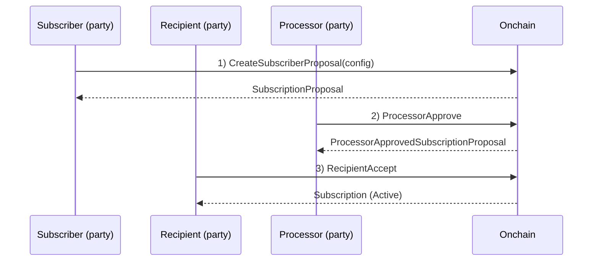
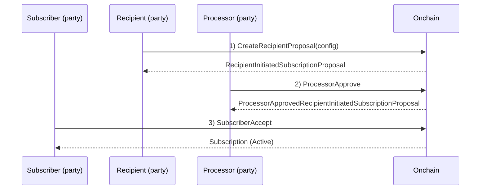
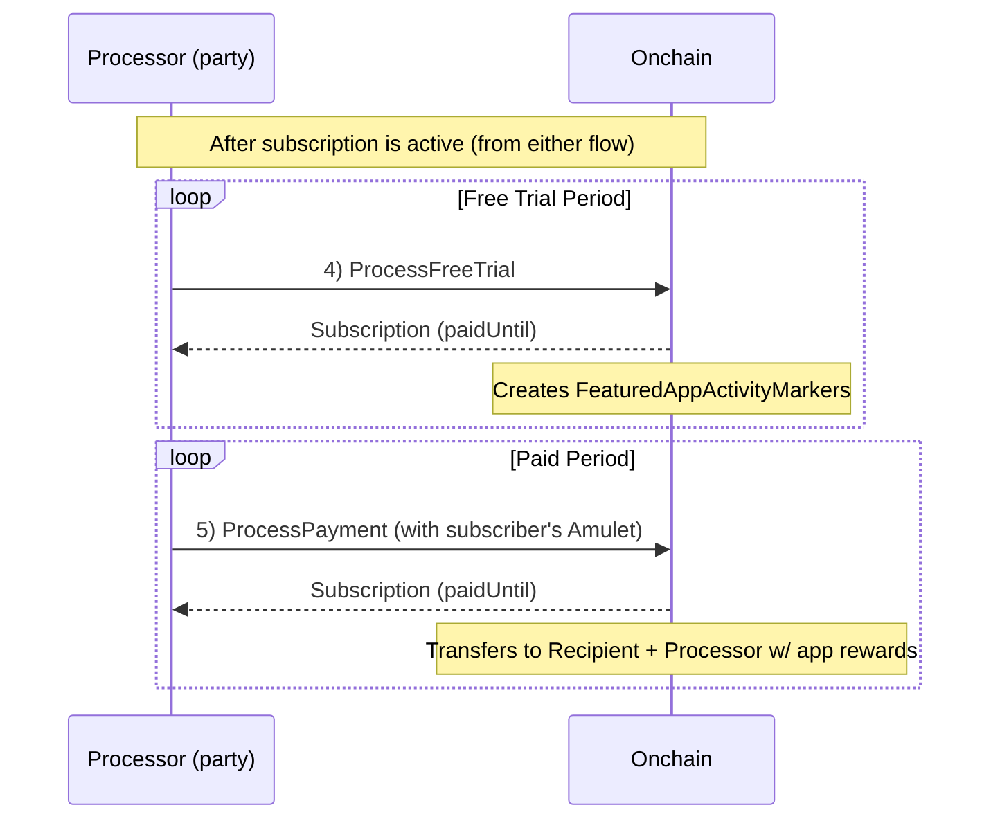
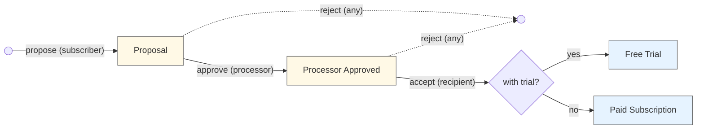
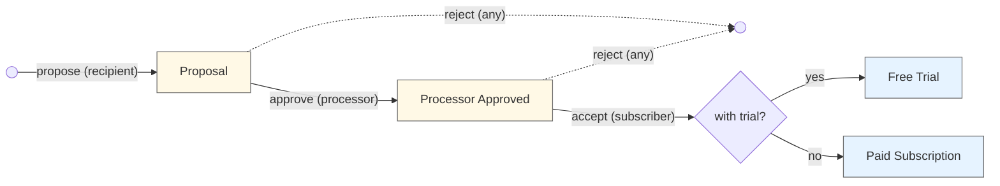
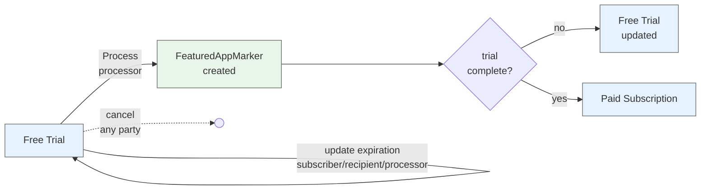
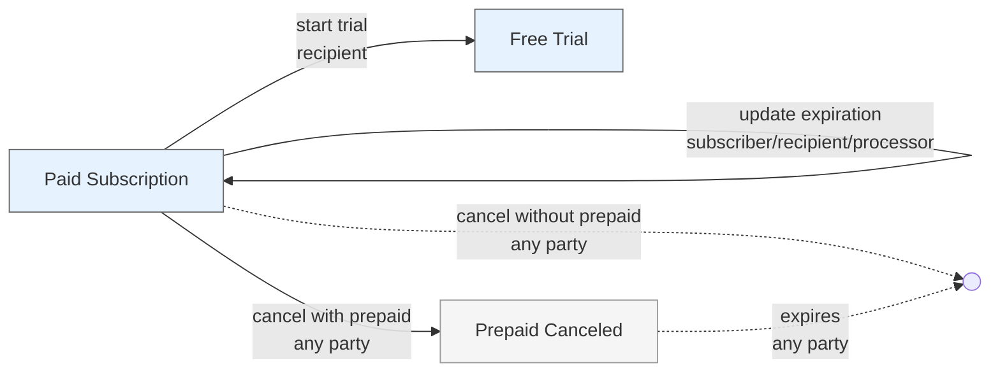

# Subscriptions-v01

A general-purpose DAML package for recurring payment subscriptions using Splice Amulet.

## Overview

Three-party subscription system with flexible payment processing:
- **Subscriber**: Pays for the subscription (funds automatically withdrawn each period)
- **Recipient**: Receives subscription payments (service provider)
- **Processor**: Executes payment transfers each period (Fairmint)

**Key Features:**
- Daily billing rates that automatically scale to any period
- Free trials that generate FeaturedAppMarkers (for the processor and the recipient if they have a FeaturedAppRight)
- Pay-as-you-go (no upfront collateral required)
- Prepay window limits future payment extension
- Dynamic payment and expiration updates
- Supports both Amulet and USD denominations

## Architecture

**Three-Party Flow:** Supports both subscriber-initiated and recipient-initiated flows:
- **Subscriber-initiated:** Subscriber proposes → Processor approves → Recipient accepts → Processor executes periodic payments
- **Recipient-initiated:** Recipient proposes → Processor approves → Subscriber accepts → Processor executes periodic payments

**Billing Model:** Per-day rates (`amountPerDay`) automatically pro-rated for any processing period:
```
amountForPeriod = (amountPerDay × periodDuration) / 1 day
```

**Payment Model:** Pay-as-you-go where subscriber provides Amulet inputs each period (not locked upfront). Receivers pay transfer fees for predictable subscriber billing.

**Prepay Window:** Limits how far into the future `paidUntil` can be extended. If 0, payments only advance to `now`. Capped to earliest of: (now + prepayWindow), expiresAt, or freeTrialEndsAt.

## Flow Diagrams

**Process Overview:**

1. Subscription terms are proposed by the subscriber or recipient
2. The processor (Fairmint) approves the terms (confirming things like our fee is sufficient)
3. The other party accepts to activate the subscription
4. If in a free trial, process & create a FeaturedAppActivityMarker. Loop
5. If not expired, use subscriber funds to pay the recipient and processor (w/ app rewards). Loop

**Note:** Any of the 3 parties can cancel at any time.

### Subscriber-Initiated Setup (Steps 1-3)



### Recipient-Initiated Setup (Steps 1-3)



### Payment & Trial Processing (Steps 4-5)



## Contract Lifecycle Diagrams

### Subscriber-Initiated Flow



### Recipient-Initiated Flow



### Free Trial Lifecycle



**Additional choices not shown in diagram:**
- `UpdateRecipientFeaturedAppRight` (recipient updates their own FeaturedAppRight)
- `UpdateProcessorFeaturedAppRight` (processor updates their own FeaturedAppRight)
- `ProcessorSetRecipientFeaturedAppRight` (processor sets recipient's FeaturedAppRight)

### Paid Subscription Lifecycle



**Additional choices not shown in diagram:**
- `UpdateRecipientFeaturedAppRight` (recipient updates their own FeaturedAppRight)
- `UpdateProcessorFeaturedAppRight` (processor updates their own FeaturedAppRight)
- `ProcessorSetRecipientFeaturedAppRight` (processor sets recipient's FeaturedAppRight)

## Contracts

**SubscriptionFactory** → Creates proposals with consistent processor/DSO assignment (supports both flows)

### Subscriber-Initiated Flow

**SubscriberSubscriptionProposal** → Subscriber's proposal awaiting processor approval

**ProcessorApprovedSubscriptionProposal** → Processor-approved proposal awaiting recipient acceptance

### Recipient-Initiated Flow

**RecipientSubscriptionProposal** → Recipient's proposal awaiting processor approval

**ProcessorApprovedRecipientInitiatedSubscriptionProposal** → Processor-approved proposal awaiting subscriber acceptance

### Shared

**SubscriptionConfig** → Configuration data (parties, payments, prepayWindow, expiration, free trial)

**FreeTrialSubscription** → Active subscription during free trial period with key operations:
- `Process`: Advances free trial, creates FeaturedAppActivityMarkers
- Transitions to PaidSubscription when trial ends
- Dynamic updates: payment amounts, trial duration, expiration, FeaturedAppRights
- Cancellation: Any party can cancel instantly (no prepaid amount during trial)

**PaidSubscription** → Active paid subscription with key operations:
- `ProcessPayment`: Executes Amulet transfers (recipient + processor fee), respects prepayWindow
- Can transition to FreeTrialSubscription when recipient starts a trial
- Dynamic updates: Increase/decrease payments, extend/decrease expiration, update FeaturedAppRights
- Cancellation: Any party can cancel unilaterally. Recipients can optionally refund prepaid amounts when canceling

**PrepaidCanceledSubscription** → Canceled subscription with remaining prepaid time:
- Created when a subscription is canceled but has future paid time remaining
- Remains active until `paidUntil` time passes
- Any party can archive once the prepaid period expires

## Usage Examples

### Subscriber-Initiated Flow

```daml
-- 1. Create proposal (subscriber initiates)
proposalCid <- submit subscriber do
  exerciseCmd factoryCid SubscriptionFactory_CreateSubscriberProposal with
    config = SubscriptionConfig with
      subscriber, recipient
      recipientPayment = PaymentConfig with
        amountPerDay = AmuletAmount 10.0
        featuredAppRight = None
      processorPayment = PaymentConfig with
        amountPerDay = AmuletAmount 1.0
        featuredAppRight = None
      prepayWindow = days 7
      expiresAt = farFutureTime
      freeTrialEndsAt = Some trialEndTime
      reason = Some "Premium membership"

-- 2. Processor approves
approvedCid <- submit processor do
  exerciseCmd proposalCid SubscriptionProposal_ProcessorApprove

-- 3. Recipient accepts
subscriptionCid <- submit recipient do
  exerciseCmd approvedCid ProcessorApprovedSubscriptionProposal_RecipientAccept

-- 4. Process payments periodically
result <- submit processor do
  exerciseCmd subscriptionCid Subscription_ProcessPayment with
    processingPeriod = days 1
    paymentCtx = PaymentContext with
      amuletInputs = subscriberAmuletCids
      amuletRulesCid, openMiningRoundCid

-- 5. Cancel anytime
() <- submit subscriber do
  exerciseCmd subscriptionCid PaidSubscription_CancelBySubscriber
```

### Recipient-Initiated Flow

```daml
-- 1. Create proposal (recipient initiates)
proposalCid <- submit recipient do
  exerciseCmd factoryCid SubscriptionFactory_CreateRecipientProposal with
    config = SubscriptionConfig with
      subscriber, recipient
      recipientPayment = PaymentConfig with
        amountPerDay = AmuletAmount 10.0
        featuredAppRight = None
      processorPayment = PaymentConfig with
        amountPerDay = AmuletAmount 1.0
        featuredAppRight = None
      prepayWindow = days 7
      expiresAt = farFutureTime
      freeTrialEndsAt = Some trialEndTime
      reason = Some "Premium membership"

-- 2. Processor approves
approvedCid <- submit processor do
  exerciseCmd proposalCid RecipientInitiatedSubscriptionProposal_ProcessorApprove

-- 3. Subscriber accepts
subscriptionCid <- submit subscriber do
  exerciseCmd approvedCid ProcessorApprovedRecipientInitiatedSubscriptionProposal_SubscriberAccept

-- 4. Process payments periodically (same as subscriber-initiated)
result <- submit processor do
  exerciseCmd subscriptionCid Subscription_ProcessPayment with
    processingPeriod = days 1
    paymentCtx = PaymentContext with
      amuletInputs = subscriberAmuletCids
      amuletRulesCid, openMiningRoundCid

-- 5. Cancel anytime
-- Recipient can choose to refund prepaid amount when canceling
result <- submit recipient do
  exerciseCmd subscriptionCid PaidSubscription_CancelByRecipient with
    refund = True  -- Refund prepaid amount to subscriber
    refundPaymentCtx = Some PaymentContext with
      amuletInputs = recipientAmuletCids
      amuletRulesCid, openMiningRoundCid
```

## Dependencies

- `splice-amulet` - Payment transfers via AmuletRules
- `splice-api-featured-app-v1` - FeaturedAppRight integration for rewards
- `Shared-v01` - Shared helpers for FeaturedAppActivityMarker creation

## Recipient Cancellation with Optional Refund

When a recipient cancels a subscription that has prepaid time remaining (`paidUntil > now`), they have two options:

### Option 1: Cancel with Refund (`refund = True`)
- Recipient provides Amulet inputs to refund the unused prepaid amount
- Refund amount calculated as: `(paidUntil - now) × amountPerDay`
- Subscription is archived immediately after refund transfer
- Provides good subscriber experience and maintains trust

### Option 2: Cancel without Refund (`refund = False`)
- Creates a `PrepaidCanceledSubscription` contract
- Subscription remains active until `paidUntil` has passed
- Any party can then archive the contract
- Subscriber keeps access for the time they've already paid for

**Note:** Subscriber and processor cancellations always create `PrepaidCanceledSubscription` (no refund option). Only recipients have the refund option since they're best positioned to provide customer service.

## Tradeoffs Discussion

### No LockedAmulet: Debit Card vs. Prepaid Gift Card

**Decision:** This implementation works like a **debit card** that's charged monthly—funds are pulled from the subscriber's account when each payment is due.

**Why not other approaches?**
- **Credit card model**: Would let subscribers run up debt, creating unpaid balance risk for recipients
- **Prepaid gift card model**: Would lock up subscriber funds upfront (using `LockedAmulet`), requiring a large deposit

**Current approach (Debit Card):**

The subscriber can pause or cancel (intentionally or not) simply by having insufficient funds when payment processing occurs. No funds are locked in advance.

**Pros:**
- Easy to start—no large upfront deposit required
- Simple for subscribers—just maintain account balance
- Natural expiration—subscriptions lapse if funds run out
- No refund complexity when canceling

**Cons:**
- Payments can fail if insufficient funds
- Recipients have less revenue certainty
- Subscribers might unintentionally let subscriptions lapse

**Recommendation:** The debit card model provides the best subscriber experience with the lowest friction. Recipients should notify subscribers when payments fail and design systems to handle payment failures gracefully.
