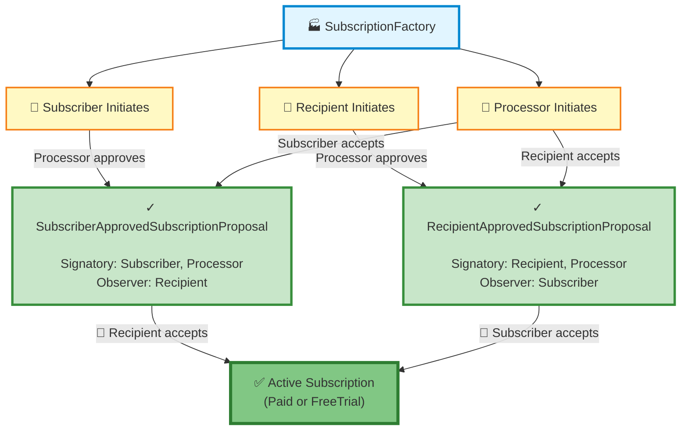

# Subscription Creation Architecture

## Simplified Model

All subscription creation flows converge to just **two intermediate states** before becoming an active subscription:

1. **SubscriberApprovedSubscriptionProposal** - Subscriber & Processor have approved, waiting for Recipient
2. **RecipientApprovedSubscriptionProposal** - Recipient & Processor have approved, waiting for Subscriber

## Key Insight

**It doesn't matter HOW we got to the approved state, only WHO has approved:**

| How We Got There | Resulting State |
|------------------|-----------------|
| Subscriber proposes → Processor approves | SubscriberApprovedSubscriptionProposal |
| Processor proposes → Subscriber accepts | SubscriberApprovedSubscriptionProposal |
| Recipient proposes → Processor approves | RecipientApprovedSubscriptionProposal |
| Processor proposes → Recipient accepts | RecipientApprovedSubscriptionProposal |

Then:
- **SubscriberApprovedSubscriptionProposal** → Recipient accepts → ✅ Active Subscription
- **RecipientApprovedSubscriptionProposal** → Subscriber accepts → ✅ Active Subscription

---

## Three Parties

- **👤 Subscriber**: Pays for the subscription (provides Amulet each payment period)
- **👤 Recipient**: Receives subscription payments (e.g., company treasury)
- **🤖 Processor**: Executes payment transfers each period (automated service)

---

## Contract Templates (Proposed Refactoring)

### Initial Proposals (3 templates)

1. **SubscriberSubscriptionProposal**
   - Signatory: Subscriber
   - Observer: Recipient, Processor
   - Choices: Processor approves/rejects, Subscriber withdraws, Recipient rejects

2. **RecipientSubscriptionProposal**
   - Signatory: Recipient
   - Observer: Subscriber, Processor
   - Choices: Processor approves/rejects, Recipient withdraws, Subscriber rejects

3. **ProcessorSubscriptionProposal**
   - Signatory: Processor
   - Observer: Subscriber, Recipient
   - Choices: Subscriber accepts, Recipient accepts, Processor withdraws, either party rejects

### Intermediate Approved States (2 templates)

4. **SubscriberApprovedSubscriptionProposal** ← Subscriber & Processor approved, awaiting Recipient
   - Signatory: Subscriber, Processor
   - Observer: Recipient
   - **Choices**: Recipient accepts (→ Subscription), any signatory withdraws, Recipient rejects
   - **Created by**:
     - `SubscriberSubscriptionProposal_ProcessorApprove`
     - `ProcessorSubscriptionProposal_SubscriberAccept`

5. **RecipientApprovedSubscriptionProposal** ← Recipient & Processor approved, awaiting Subscriber
   - Signatory: Recipient, Processor
   - Observer: Subscriber
   - **Choices**: Subscriber accepts (→ Subscription), any signatory withdraws, Subscriber rejects
   - **Created by**:
     - `RecipientSubscriptionProposal_ProcessorApprove`
     - `ProcessorSubscriptionProposal_RecipientAccept`

### Final Active Subscriptions (out of scope)

6. **FreeTrialSubscription** - Created when `freeTrialExpiration` is provided
7. **PaidSubscription** - Created when no free trial specified

---

## Benefits of This Simplified Model

1. ✅ **Clearer naming**: Contracts named for WHO has approved, not HOW we got there
2. ✅ **Less code duplication**: Both intermediate states have identical structure
3. ✅ **Simpler mental model**: Only 2 intermediate states instead of 3
4. ✅ **Symmetric logic**: Same pattern regardless of initiation path

---

## Current Implementation vs. Proposed Refactoring

| Current Template Name | Should Be Renamed To |
|----------------------|----------------------|
| `ProcessorApprovedSubscriptionProposal` | `SubscriberApprovedSubscriptionProposal` |
| `ProcessorApprovedRecipientInitiatedSubscriptionProposal` | `RecipientApprovedSubscriptionProposal` |
| `OnePartyApprovedProcessorSubscriptionProposal` | *Eliminate - use both above* |

The current implementation works correctly but uses names that describe the initiation path rather than the approval state.

