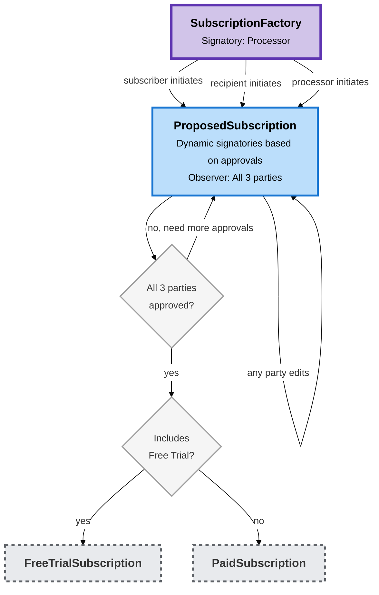

# Subscription Creation Architecture

## Overview

The Creation folder contains all contracts and logic for **proposing and approving subscriptions** before they become active. This is a three-party approval process requiring the subscriber, recipient, and processor to all approve.

**Key simplification:** Instead of separate templates for each workflow path (5 templates in the old design), we now use a **single `ProposedSubscription` template** that tracks approval state dynamically.

## Core Concepts

### Unified Proposal Template

The `ProposedSubscription` template:
- Tracks which parties have approved via `ApprovalState` (boolean flags)
- Proposer starts with their approval already granted
- Signatories are added dynamically as parties approve (contract ID changes with each approval)
- All three parties must approve before the subscription can be created

### Intelligent Edit Support

Any party can propose edits to the subscription terms at any time via the `ProposedSubscription_Edit` choice:
- The editor specifies which fields they want to change via `ProposalEdits`
- System intelligently determines which parties are impacted by the changes
- Approvals are automatically revoked for impacted parties (except the editor keeps their approval)
- Examples:
  - Changing `recipientPaymentPerDay` → revokes subscriber & recipient approvals
  - Changing `processorPaymentPerDay` → revokes subscriber & processor approvals
  - Changing `expiresAt` → revokes all approvals
  - Changing `description` or `metadata` → no approvals revoked (informational only)

### Creation Paths

Any party can initiate a proposal via the `SubscriptionFactory` using the single `SubscriptionFactory_CreateProposal` choice:
- Pass the `proposal` (SubscriptionProposal) and `proposer` (Party)
- Proposer must be subscriber, recipient, or processor
- Proposer's approval is granted immediately
- Other two parties must approve before subscription can be created

## Lifecycle

## Choices

### Approval Choices

- `ProposedSubscription_SubscriberApprove` - Subscriber grants approval
- `ProposedSubscription_RecipientApprove` - Recipient grants approval
- `ProposedSubscription_ProcessorApprove` - Processor grants approval

Each approval choice creates a new contract with updated `ApprovalState` and adds the approving party as a signatory.

### Edit Choice

- `ProposedSubscription_Edit` - Any party can edit the proposal
  - Takes `editor` (Party) and `edits` (ProposalEdits)
  - Editor retains their approval
  - Other parties' approvals are revoked only if they're impacted by the changes
  - Creates new contract with updated proposal and adjusted approval state

### Creation Choice

- `ProposedSubscription_CreateSubscription` - Creates the active subscription
  - Requires all 3 parties' approval
  - Controller: all 3 parties (subscriber, recipient, processor)
  - Takes `recipientProvider` as parameter (set at creation time, not in proposal)
  - Returns `SubscriptionCreationResult` with either `FreeTrialSubscription` or `PaidSubscription`

### Withdrawal

- `ProposedSubscription_Withdraw` - Any party can withdraw, archiving the proposal
  - Takes `withdrawer` (Party) and optional `reason` (Optional Text)
  - Withdrawer must be a party to the subscription

## Fields that Can be Edited

Via the `ProposalEdits` data type, parties can propose changes to:
- `recipientPaymentPerDay` - Changes payment to recipient
- `processorPaymentPerDay` - Changes payment to processor
- `expiresAt` - Changes expiration time
- `prepayWindow` - Changes prepayment flexibility
- `freeTrialExpiration` - Changes free trial terms
- `description` - Changes description (informational)
- `metadata` - Changes metadata (informational)

## Benefits of Unified Design

1. **Simpler codebase** - 1 template instead of 5
2. **Clearer state** - Boolean flags are easier to reason about than template types
3. **Flexible editing** - Any party can propose changes at any time
4. **Intelligent approval management** - System automatically determines which approvals to revoke
5. **Easier to extend** - Adding new editable fields or approval logic is straightforward