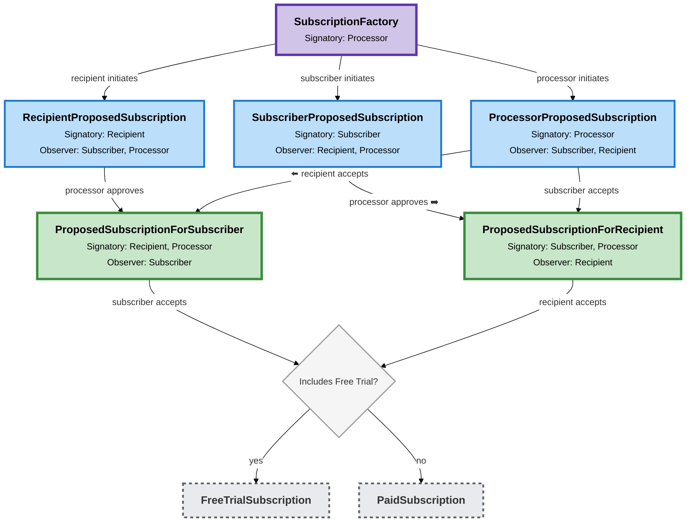

# Subscription Creation Architecture

## Overview

The Creation folder contains all contracts and logic for **proposing and approving subscriptions** before they become active. This is a three-step approval process requiring the subscriber, recipient and processor to approve.

## Lifecycle

### Processor Approval

The processor is never the last party to approve a subscription. This is because the processor will be an automated service that can respond quickly, and it offers a better user experience by having the subscription activate as soon as the someone accepts.

### Reject or Withdraw

Any party (the subscriber, recipient or processor) can reject or withdraw a proposal at any stage in the lifecycle. When this occurs, they may optionally provide a `reason` (Text).