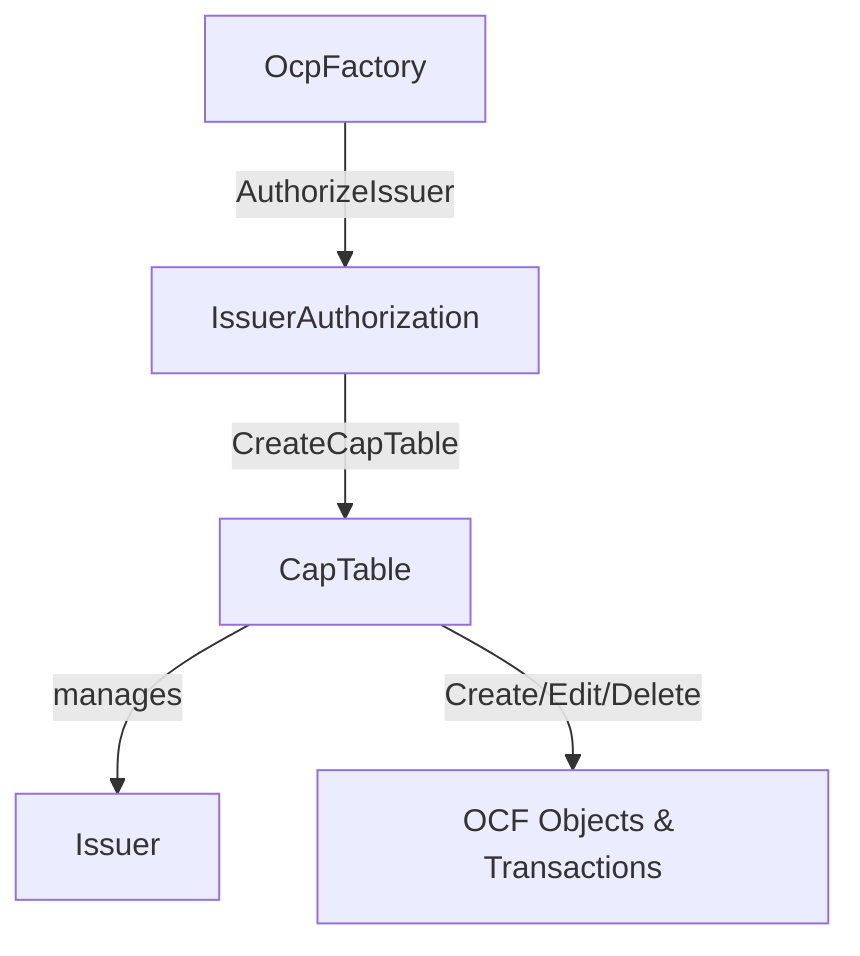
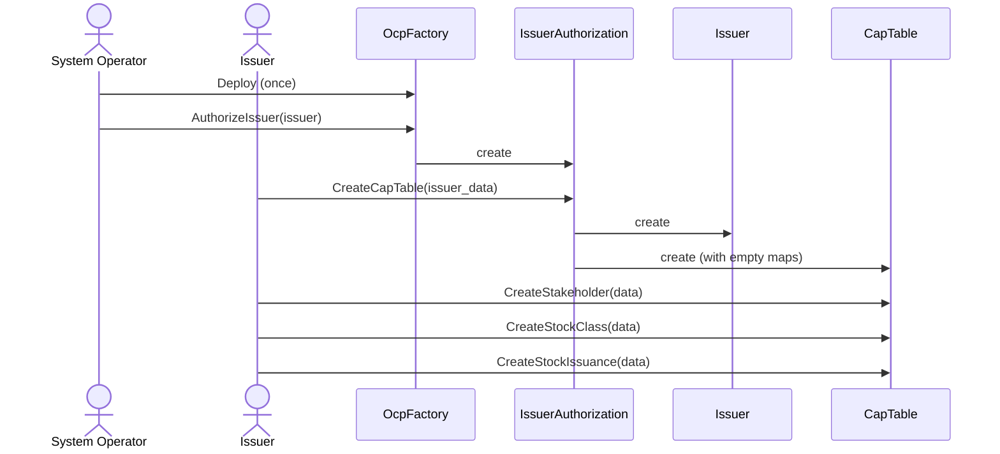

# OCP Contract Architecture

## Contract Hierarchy



**CapTable manages all OCF contracts via Maps (id → ContractId) for O(1) lookup.**

## Contract Flow



## Key Design Patterns

| Pattern | Description |
|---------|-------------|
| **Dual Signatories** | All contracts require both `issuer` and `system_operator` |
| **Factory Chain** | OcpFactory → IssuerAuthorization → CapTable |
| **State Management** | CapTable maintains `Map Text (ContractId T)` for O(1) lookup |
| **Reference Validation** | CapTable validates referenced objects exist before creating (e.g., stakeholder must exist before stock issuance) |
| **Archive + Recreate** | Edit = archive old contract + create new + update map |
| **Issuer is Special** | Exactly one per CapTable, can only be edited (no delete) |

## File Structure

```
OpenCapTable-v25/daml/Fairmint/OpenCapTable/
├── OcpFactory.daml          # Factory contract
├── IssuerAuthorization.daml # Authorization contract  
├── CapTable.daml            # State management (GENERATED)
├── Types.daml               # Shared types & enums
├── Helpers.daml             # Helper functions
└── OCF/                     # 47 OCF object contracts
    ├── Issuer.daml
    ├── Stakeholder.daml
    ├── StockClass.daml
    ├── StockIssuance.daml
    └── ...
```

## References

- [ADR-002: Stateful Cap Table](./adr/002-stateful-issuer-with-position-tracking.md)
- [OCF Schema](https://github.com/Open-Cap-Table-Coalition/Open-Cap-Format-OCF)
