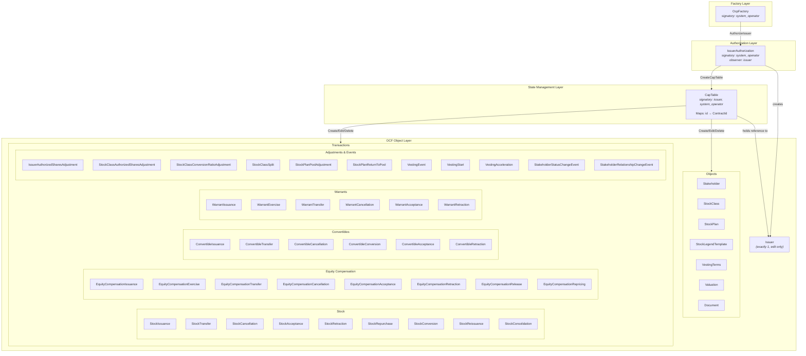
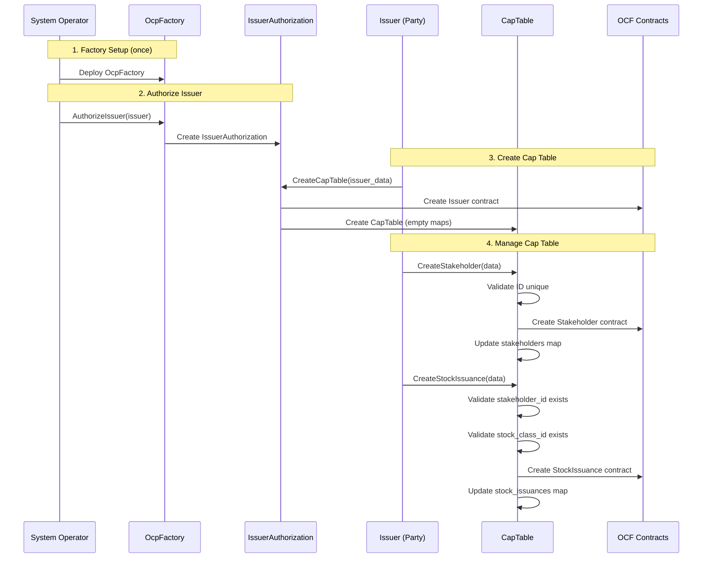
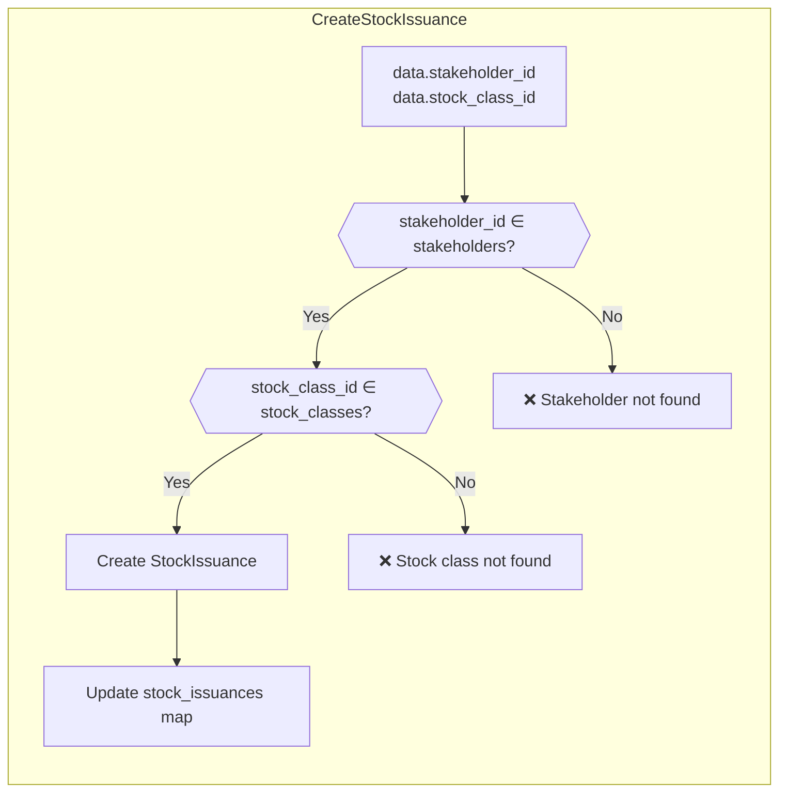
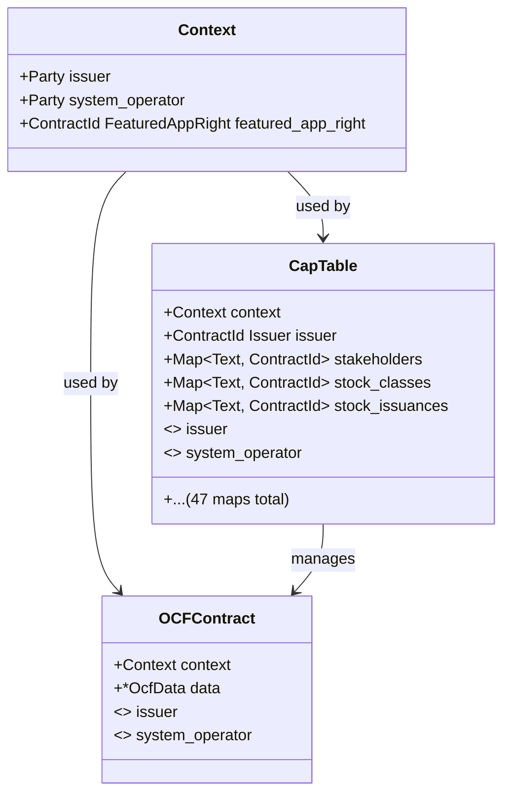

# OCP Contract Architecture Diagram

> **Maintenance Note**: Update this diagram when changes are made to the contract design or relationships. See [Maintenance](#maintenance) below.

## Contract Hierarchy



## Contract Flow Diagram



## Reference Validation



## Context & Signatories



## Key Design Patterns

| Pattern | Description |
|---------|-------------|
| **Dual Signatories** | All contracts require both `issuer` and `system_operator` signatures |
| **Factory Pattern** | OcpFactory → IssuerAuthorization → CapTable chain |
| **State Management** | CapTable maintains `Map Text (ContractId T)` for O(1) lookup |
| **Reference Validation** | CapTable validates references exist before creating transactions |
| **Archive + Recreate** | Edit = archive old contract + create new + update map |
| **Issuer is Immutable** | Issuer contract can only be edited, never deleted |

## File Structure

```
OpenCapTable-v25/daml/Fairmint/OpenCapTable/
├── OcpFactory.daml          # Factory contract
├── IssuerAuthorization.daml # Authorization contract
├── CapTable.daml           # State management (GENERATED)
├── Types.daml              # Shared types & enums
├── Helpers.daml            # Helper functions
└── OCF/                    # OCF object contracts
    ├── Issuer.daml
    ├── Stakeholder.daml
    ├── StockClass.daml
    ├── StockIssuance.daml
    ├── ... (47 OCF contracts)
```

## Maintenance

**Update this diagram when:**
- Adding new OCF object types or transactions
- Changing the contract hierarchy or relationships
- Modifying validation patterns
- Updating signatories or observers

**Diagram locations:**
1. This file: `docs/OCP_CONTRACT_DIAGRAM.md` (full documentation)
2. ADR-002: `docs/adr/002-stateful-issuer-with-position-tracking.md` (architecture decision context)

**Related files to update together:**
- `OpenCapTable-v25/README.md` - Package-specific documentation
- `scripts/codegen/captable-config.yaml` - Reference validation config
- `llms.txt` - AI context file

## References

- [ADR-002: Stateful Cap Table](./adr/002-stateful-issuer-with-position-tracking.md)
- [OCF Schema](https://github.com/Open-Cap-Table-Coalition/Open-Cap-Format-OCF)
- [Canton Network Documentation](https://docs.canton.network/)
