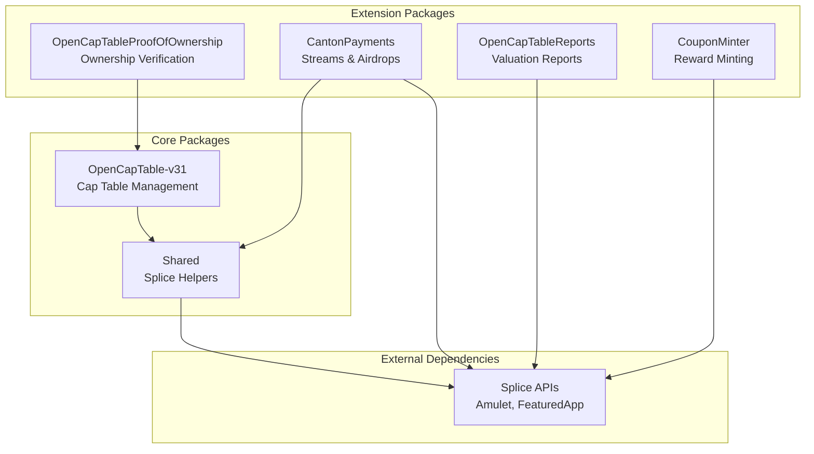
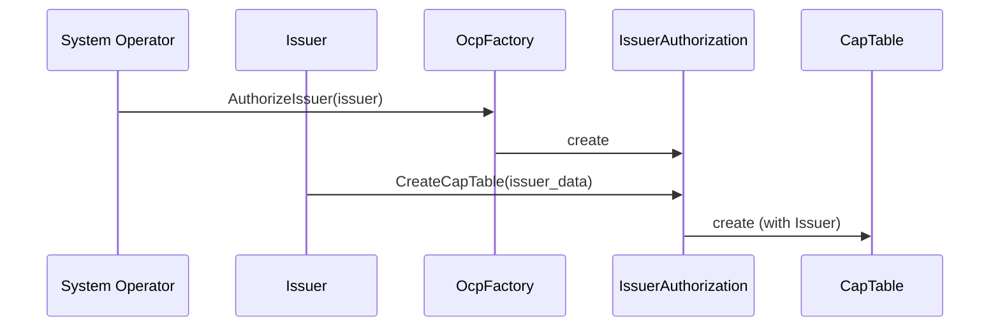

# ADR-001: OCP Protocol Overview

## Status

**Implemented** | 2026-02-03

---

## TL;DR

The Open Cap Table Protocol (OCP) implements OCF-compliant cap table management on Canton Network via DAML smart contracts. Six packages provide: core cap table operations, payment streams, airdrops, reporting, ownership proofs, and reward minting.

---

## Package Architecture

---

## Package Summary

| Package | Version | Purpose |
|---------|---------|---------|
| **OpenCapTable-v31** | 0.0.1 | Core OCF implementation: 47 object types, CapTable state management |
| **CantonPayments** | 0.0.33 | Recurring payment streams, bulk airdrops, escrow |
| **OpenCapTableReports** | 0.0.2 | Anonymous valuation reporting for dashboards |
| **OpenCapTableProofOfOwnership** | 0.0.1 | Public ownership verification (POC - not production ready) |
| **CouponMinter** | 0.0.1 | Rate-limited Featured App reward minting |
| **Shared** | 0.0.5 | Splice API helpers (Amulet transfers, activity markers) |

---

## Core Design Decisions

### 1. Stateful CapTable over Event Sourcing

**Choice:** Single `CapTable` contract with `Map Text ContractId` for all OCF objects.

**Why:** O(1) lookup by business ID, reference validation on create, atomic batch operations. Event sourcing required replaying all events to compute current state.

See [ADR-002](./002-stateful-issuer-with-position-tracking.md).

### 2. Dual Signatories Everywhere

**Choice:** All contracts require both `issuer` and `system_operator` as signatories.

**Why:** Enables system operator to enforce compliance while issuer maintains control. CapTable can archive any OCF contract directly (shared signatories).

### 3. Factory Chain for Onboarding

**Why:** Separates authorization (operator grants access) from creation (issuer acts). IssuerAuthorization is a one-time-use ticket.

### 4. Batch API with Tiered Processing

**Choice:** Single `UpdateCapTable` choice handles all creates/edits/deletes with dependency ordering.

**Why:** N operations = 1 CapTable update (not N). Intra-batch dependencies supported via processing tiers (stakeholder in tier 1, stock issuance referencing it in tier 3).

### 5. Code Generation for CapTable

**Choice:** `CapTable.daml` is auto-generated from OCF type discovery.

**Why:** 47 object types would be error-prone to maintain manually. Generator ensures consistency, correct sum types, and tier ordering.

---

## OCF Object Types (47 total)

### Objects (8)
Issuer, Stakeholder, StockClass, StockPlan, StockLegendTemplate, VestingTerms, Valuation, Document

### Stock Transactions (10)
StockIssuance, StockTransfer, StockCancellation, StockAcceptance, StockRetraction, StockConversion, StockReissuance, StockRepurchase, StockConsolidation

### Convertible Transactions (6)
ConvertibleIssuance, ConvertibleTransfer, ConvertibleCancellation, ConvertibleAcceptance, ConvertibleRetraction, ConvertibleConversion

### Warrant Transactions (6)
WarrantIssuance, WarrantTransfer, WarrantCancellation, WarrantAcceptance, WarrantRetraction, WarrantExercise

### Equity Compensation Transactions (8)
EquityCompensationIssuance, EquityCompensationTransfer, EquityCompensationCancellation, EquityCompensationAcceptance, EquityCompensationRetraction, EquityCompensationExercise, EquityCompensationRelease, EquityCompensationRepricing

### Vesting (3)
VestingStart, VestingEvent, VestingAcceleration

### Corporate Actions (6)
IssuerAuthorizedSharesAdjustment, StockClassAuthorizedSharesAdjustment, StockClassConversionRatioAdjustment, StockClassSplit, StockPlanPoolAdjustment, StockPlanReturnToPool

### Stakeholder Events (2)
StakeholderRelationshipChangeEvent, StakeholderStatusChangeEvent

---

## Canton Network Integration

### Splice APIs Used

| API | Usage |
|-----|-------|
| **Amulet** | Payment streams (LockedAmulet escrow), airdrops (transfers) |
| **FeaturedAppRight** | Activity markers for rewards, app registration |
| **TransferPreapproval** | Efficient bulk transfers without recipient signatures |

### Reward System

Financial transactions (issuances + transfers) earn Featured App rewards:
- 1 coupon per $100 of transaction value
- Rate-limited via CouponMinter contract
- See [ADR-003](./003-featured-app-markers-for-ocp-transactions.md) and [ADR-004](./004-couponminter-contract.md)

---

## Related ADRs

| ADR | Scope | Status |
|-----|-------|--------|
| [ADR-002](./002-stateful-issuer-with-position-tracking.md) | CapTable architecture, batch API | Implemented |
| [ADR-003](./003-featured-app-markers-for-ocp-transactions.md) | Coupon calculation logic | Implemented |
| [ADR-004](./004-couponminter-contract.md) | CouponMinter contract design | Implemented |
| [ADR-005](./005-canton-payments.md) | Payment streams and airdrops | Implemented |
| [ADR-006](./006-reports.md) | Valuation reporting | Implemented |
| [ADR-007](./007-proof-of-ownership.md) | Ownership verification | Proposed |

---

## References

- [OCF Schema](https://github.com/Open-Cap-Table-Coalition/Open-Cap-Format-OCF)
- [Canton Network](https://www.canton.network/)
- [Splice Documentation](https://github.com/digital-asset/decentralized-canton-sync)
