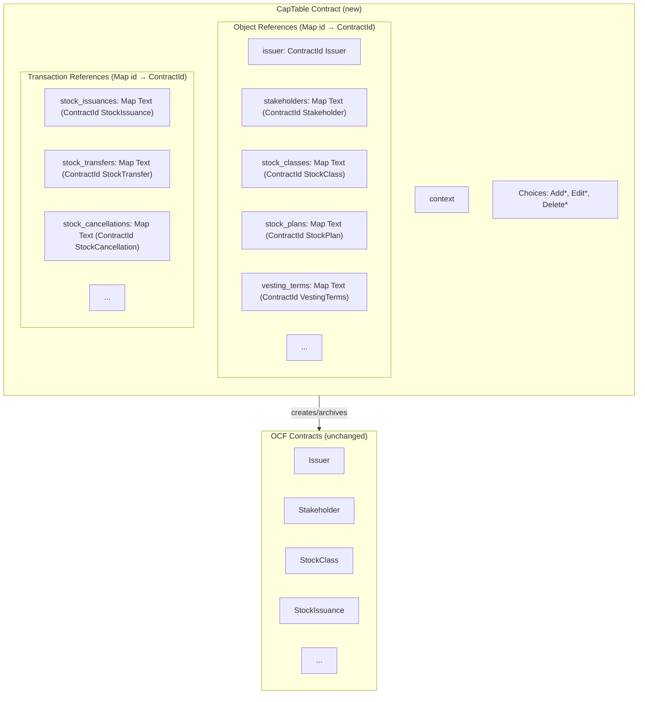

# ADR-002: Stateful Cap Table with OCF Object References

## Status

**Proposed** | 2026-01-02

---

## TL;DR

Introduce a new **CapTable** contract that:
- Maintains `Map Text ContractId` for all OCF objects (O(1) lookup by business ID)
- Acts as the sole authority for create/edit/delete operations
- Validates that referenced objects exist before creating transactions (e.g., can't issue stock to a non-existent stakeholder)

---

## Context

### Current Design Problems

The existing implementation uses an event-sourcing pattern where the `Issuer` contract acts as a factory with ~40+ nonconsuming choices. This creates several problems:

| Problem | Impact |
|---------|--------|
| **No current state visibility** | Must replay all events off-chain to determine ownership |
| **No reference validation** | Can issue stock to non-existent stakeholders or invalid stock classes |
| **Scattered data** | Cap table spread across many independent contracts |

---

## Decision

Introduce a new **CapTable** contract (separate from the OCF `Issuer` object):

1. Single `CapTable` contract per cap table maintains **Maps of id → ContractId** for all OCF objects
2. The `Issuer` remains a simple OCF object (just data, no factory methods)
3. All create/edit/delete operations go through `CapTable`
4. `CapTable` validates references exist before allowing transactions (O(1) map lookup)
5. Edit = archive old + create new + update ContractId in map
6. Delete = archive contract + remove from map

---

## Architecture



### Key Points

- **CapTable is a new custom contract** — not an OCF object
- **Issuer is now just data** — simple OCF object, no factory methods
- **All OCF contracts remain unchanged** — just remove `ArchiveByIssuer` choice
- **Same signatories** — CapTable can directly archive OCF contracts
- **Maps for O(1) lookup** — instant validation by business ID

---

## Lifecycle Operations

### Add (Create)

```haskell
choice AddStakeholder(data):
    -- Validate ID uniqueness (O(1) map lookup)
    assert data.id not in stakeholders

    -- Create OCF contract
    new_cid <- create Stakeholder(context, data)

    -- Update state (archive old CapTable, create new with updated map)
    create this with { stakeholders = Map.insert data.id new_cid stakeholders }
```

### Edit (Correct)

```haskell
choice EditStakeholder(id, new_data):
    -- Lookup by ID (O(1))
    old_cid <- lookup id stakeholders
    assert (isSome old_cid)
    assert id == new_data.id  -- Can't change ID via edit

    -- Replace contract
    archive (fromSome old_cid)
    new_cid <- create Stakeholder(context, new_data)

    -- Update state (archive old CapTable, create new with updated map)
    create this with { stakeholders = Map.insert id new_cid stakeholders }
```

### Delete (Archive + Remove)

> ⚠️ **Warning**: Deleting an object may leave broken references. For example, deleting a stakeholder won't automatically clean up stock issuances that reference it. 
> 
> **Operational policy**: Deletions should be restricted to admin workflows that first verify or migrate dependent contracts. Most risky operations include:
> - Deleting stakeholders (may be referenced by issuances, transfers)
> - Deleting stock classes (may be referenced by issuances, plans)
> - Deleting stock plans (may be referenced by equity compensation)
> 
> We validate references on Add, but comprehensive validation on Delete would require fetching potentially hundreds of contracts to check for reverse references.

```haskell
choice DeleteStakeholder(id):
    -- Lookup by ID (O(1))
    cid <- lookup id stakeholders
    assert (isSome cid)

    -- Archive and remove from map
    archive (fromSome cid)
    create this with { stakeholders = Map.delete id stakeholders }
```

### Future: Recovery Operations

> 💡 **Note**: If contracts are ever archived outside of CapTable (e.g., via direct ledger operations), we may need to add `Remove*` choices that delete entries from the map without attempting to archive the contract. Not implementing this initially—will add if needed.

---

## Validation Example: Stock Issuance

Shows how references are validated before creating transactions:

```haskell
choice AddStockIssuance(data):
    -- Validate stakeholder exists (O(1) map lookup)
    assert (isSome $ Map.lookup data.stakeholder_id stakeholders)

    -- Validate stock class exists (O(1))
    assert (isSome $ Map.lookup data.stock_class_id stock_classes)

    -- Validate security ID unique (O(1))
    assert (isNone $ Map.lookup data.security_id stock_issuances)

    -- Create OCF contract
    new_cid <- create StockIssuance(context, data)
    
    -- Update state
    create this with {
        stock_issuances = Map.insert data.security_id new_cid stock_issuances
    }
```

---

## Template Changes

### Issuer: Remove Factory Methods

**Before:**
```haskell
template Issuer:
    signatory: issuer, system_operator

    -- ~40+ factory choices
    choice CreateStakeholder(data): ...
    choice CreateStockIssuance(data): ...
```

**After:**
```haskell
template Issuer:
    signatory: issuer, system_operator
```

### OCF Objects: Remove ArchiveByIssuer

**Before:**
```haskell
template Stakeholder:
    signatory: issuer, system_operator

    choice ArchiveByIssuer:
        controller: issuer
        return ()
```

**After:**
```haskell
template Stakeholder:
    signatory: issuer, system_operator
```

Since `CapTable` shares the same signatories, it can directly `archive` any OCF contract.

---

## Implementation Plan

### Phase 1: Create CapTable
- Create `CapTable.daml` with all `Map Text ContractId` fields
- Implement `Add*`, `Edit*`, `Delete*` choices with validation
- Write comprehensive tests

### Phase 2: Update Templates
- Remove factory methods from `Issuer`
- Remove `ArchiveByIssuer` from all OCF templates
- Update `OcpFactory` to create `CapTable` (which creates the `Issuer`)
- Update SDK to use new contract

### Phase 3: Migration
- Create migration script to consolidate existing contracts
- Collect all existing OCF contracts for an issuer
- Create new `CapTable` with Maps
- Archive old `Issuer` contract (with factory methods)

---

## Consequences

### Positive

| Benefit | Description |
|---------|-------------|
| Reference validation | Validate that IDs exist before operations (O(1)) |
| Clean separation | CapTable is our custom logic; OCF objects stay standard |
| Queryable state | Maps show what exists by ID |
| Atomic operations | Multi-step operations in single transaction |
| OCF compliance | Issuer and all objects remain in standard OCF format |

### Negative

| Concern | Mitigation |
|---------|------------|
| Stale references | **Accepted trade-off for now.** Operational policy forbids deleting objects that are known to be referenced by other OCF objects; deletions are restricted to admin workflows that first migrate or archive dependents. Full graph validation on every delete is deferred because it would require fetching too many contracts at current scale. |

**Future work / acceptance criteria:** When (a) a stale-reference incident is detected in production **or** (b) typical cap tables exceed an agreed threshold (e.g., >10k OCF contracts per issuer), we will introduce stronger guarantees (e.g., a reverse-reference index, periodic batch validator, or off-chain integrity checker) and update this ADR accordingly.

---

## References

- [OCF Schema](https://github.com/Open-Cap-Table-Coalition/Open-Cap-Format-OCF)
- [ADR-001: OCF Cap Table on Canton](https://github.com/fairmint/canton/blob/main/docs/developer/adr/001-ocf-captable-on-canton.md)
- [Canton Network Documentation](https://docs.canton.network/)
