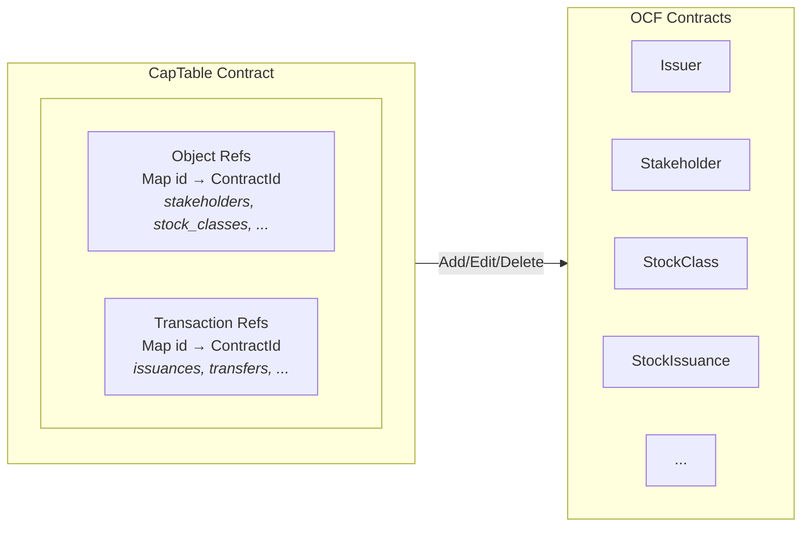

# ADR-002: Stateful Cap Table with OCF Object References

## Status

**Proposed** | 2026-01-02

---

## TL;DR

Introduce a new **CapTable** contract that:
- Maintains `Map Text ContractId` for all OCF objects (O(1) lookup by business ID)
- Acts as the sole authority for create/edit/delete operations
- Validates references on **create** (can't issue stock to non-existent stakeholder)

---

## Context

### Current Design Problems

The existing implementation uses an event-sourcing pattern where the `Issuer` contract acts as a factory with ~40+ nonconsuming choices. This creates several problems:

| Problem | Impact |
|---------|--------|
| **No current state visibility** | Must replay all events off-chain to determine ownership |
| **No reference validation** | Can issue stock to non-existent stakeholders or invalid stock classes |
| **Scattered data** | Cap table spread across many independent contracts |

---

## Decision

Introduce a new **CapTable** contract (separate from the OCF `Issuer` object):

1. Single `CapTable` contract per cap table maintains **Maps of id → ContractId** for all OCF objects
2. The `Issuer` remains a simple OCF object (just data, no factory methods)
3. All create/edit/delete operations go through `CapTable`
4. `CapTable` validates references exist before allowing transactions (O(1) map lookup)
5. Edit = archive old + create new + update ContractId in map
6. Delete = archive contract + remove from map

---

## Architecture



### Key Points

- **CapTable is a new custom contract** — not an OCF object
- **Issuer is now just data** — simple OCF object, no factory methods
- **All OCF contracts remain unchanged** — just remove `ArchiveByIssuer` choice
- **Same signatories** — CapTable can directly archive OCF contracts
- **Maps for O(1) lookup** — instant validation by business ID

---

## Lifecycle Operations

### Add (Create)

```haskell
choice AddStakeholder(data):
    -- Validate ID uniqueness (O(1) map lookup)
    assert data.id not in stakeholders

    -- Create OCF contract
    new_cid <- create Stakeholder(context, data)

    -- Update state (archive old CapTable, create new with updated map)
    create this with { stakeholders = Map.insert data.id new_cid stakeholders }
```

### Edit (Correct)

```haskell
choice EditStakeholder(id, new_data):
    -- Lookup by ID (O(1))
    old_cid <- lookup id stakeholders
    assert (isSome old_cid) "Stakeholder not found"
    assert id == new_data.id  -- Can't change ID via edit

    -- Replace contract
    archive (fromSome old_cid)
    new_cid <- create Stakeholder(context, new_data)

    -- Update state
    create this with { stakeholders = Map.insert id new_cid stakeholders }
```

### Delete (Archive + Remove)

```haskell
choice DeleteStakeholder(id):
    -- Lookup by ID (O(1))
    cid <- lookup id stakeholders
    assert (isSome cid) "Stakeholder not found"

    -- Archive and remove from map
    archive (fromSome cid)
    create this with { stakeholders = Map.delete id stakeholders }
```

> ⚠️ **Note**: Delete does not validate reverse references. Deleting a stakeholder that is referenced by transactions will leave dangling references. Operational policy should ensure dependents are cleaned up first.

---

## Validation Example: Stock Issuance

Shows how references are validated when creating transactions:

```haskell
choice AddStockIssuance(data):
    -- Validate stakeholder exists (O(1) map lookup)
    assert (isSome $ Map.lookup data.stakeholder_id stakeholders)
        "Stakeholder not found"

    -- Validate stock class exists (O(1))
    assert (isSome $ Map.lookup data.stock_class_id stock_classes)
        "Stock class not found"

    -- Validate security ID unique (O(1))
    assert (isNone $ Map.lookup data.security_id stock_issuances)
        "Security ID already exists"

    -- Create OCF contract
    new_cid <- create StockIssuance(context, data)

    -- Update state
    create this with {
        stock_issuances = Map.insert data.security_id new_cid stock_issuances
    }
```

---

## Template Changes

### Issuer: Remove Factory Methods

**Before:**
```haskell
template Issuer:
    signatory: issuer, system_operator

    -- ~40+ factory choices
    choice CreateStakeholder(data): ...
    choice CreateStockIssuance(data): ...
```

**After:**
```haskell
template Issuer:
    signatory: issuer, system_operator
```

### OCF Objects: Remove ArchiveByIssuer

**Before:**
```haskell
template Stakeholder:
    signatory: issuer, system_operator

    choice ArchiveByIssuer:
        controller: issuer
        return ()
```

**After:**
```haskell
template Stakeholder:
    signatory: issuer, system_operator
```

Since `CapTable` shares the same signatories, it can directly `archive` any OCF contract.

---

## Consequences

- **Reference validation on create** — O(1) validation that referenced objects exist
- **Clean separation** — CapTable is custom logic; OCF objects stay standard
- **Queryable state** — Maps show what exists by ID
- **Atomic operations** — Multi-step operations in single transaction
- **OCF compliance** — Issuer and all objects remain in standard OCF format

---

## Future Considerations

**Delete validation via reverse-reference indexes**: To prevent deleting objects that are still referenced, we could maintain `Map Text (Set Text)` indexes that track what references each object. This would enable O(1) delete validation but adds complexity—every add/edit/delete must maintain the reverse indexes, creating risk of inconsistency. Not planned for initial implementation.

---

## References

- [OCF Schema](https://github.com/Open-Cap-Table-Coalition/Open-Cap-Format-OCF)
- [ADR-001: OCF Cap Table on Canton](https://github.com/fairmint/canton/blob/main/docs/developer/adr/001-ocf-captable-on-canton.md)
- [Canton Network Documentation](https://docs.canton.network/)
