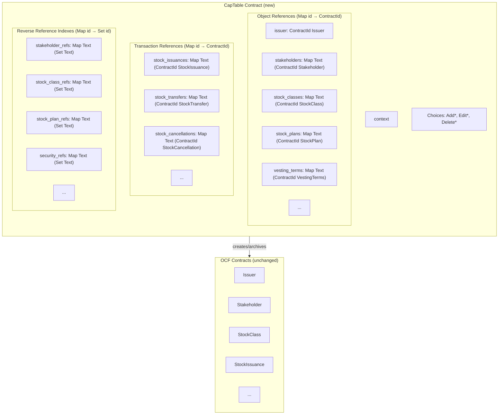

# ADR-002: Stateful Cap Table with OCF Object References

## Status

**Proposed** | 2026-01-02

---

## TL;DR

Introduce a new **CapTable** contract that:
- Maintains `Map Text ContractId` for all OCF objects (O(1) lookup by business ID)
- Maintains reverse-reference indexes to track what objects reference each ID
- Acts as the sole authority for create/edit/delete operations
- Validates references on **create** (can't issue stock to non-existent stakeholder)
- Validates reverse-references on **delete** (can't delete stakeholder with outstanding issuances)

---

## Context

### Current Design Problems

The existing implementation uses an event-sourcing pattern where the `Issuer` contract acts as a factory with ~40+ nonconsuming choices. This creates several problems:

| Problem | Impact |
|---------|--------|
| **No current state visibility** | Must replay all events off-chain to determine ownership |
| **No reference validation** | Can issue stock to non-existent stakeholders or invalid stock classes |
| **Scattered data** | Cap table spread across many independent contracts |

---

## Decision

Introduce a new **CapTable** contract (separate from the OCF `Issuer` object):

1. Single `CapTable` contract per cap table maintains **Maps of id → ContractId** for all OCF objects
2. The `Issuer` remains a simple OCF object (just data, no factory methods)
3. All create/edit/delete operations go through `CapTable`
4. `CapTable` validates references exist before allowing transactions (O(1) map lookup)
5. Edit = archive old + create new + update ContractId in map
6. Delete = archive contract + remove from map

---

## Architecture



### Key Points

- **CapTable is a new custom contract** — not an OCF object
- **Issuer is now just data** — simple OCF object, no factory methods
- **All OCF contracts remain unchanged** — just remove `ArchiveByIssuer` choice
- **Same signatories** — CapTable can directly archive OCF contracts
- **Maps for O(1) lookup** — instant validation by business ID
- **Reverse reference indexes** — track what references each object for safe deletion

---

## Reverse Reference Indexes

To enable O(1) delete validation, we maintain **reverse reference indexes** that track which objects reference a given ID. When creating a transaction, we register its ID in the reverse-ref set for each object it references. On delete, we check that this set is empty.

| Object Type | Reverse Index | Tracks |
|-------------|---------------|--------|
| Stakeholder | `stakeholder_refs` | Security IDs (issuances, transfers, cancellations) referencing this stakeholder |
| Stock Class | `stock_class_refs` | Security IDs and stock plan IDs referencing this class |
| Stock Plan | `stock_plan_refs` | Equity compensation security IDs referencing this plan |
| Vesting Terms | `vesting_terms_refs` | Stock plan IDs and security IDs using these terms |
| Security | `security_refs` | Transaction IDs (transfers, cancellations, exercises) referencing this security |

### Trade-offs

| Aspect | Impact |
|--------|--------|
| **Storage** | Additional `Map Text (Set Text)` per referenceable object type. Negligible for typical cap tables. |
| **Add complexity** | O(1) to add ID to each referenced object's set |
| **Delete safety** | O(1) check that reverse-ref set is empty before allowing delete |
| **Edit complexity** | Must update reverse-refs if references change (remove from old, add to new) |

---

## Lifecycle Operations

### Add (Create)

```haskell
choice AddStakeholder(data):
    -- Validate ID uniqueness (O(1) map lookup)
    assert data.id not in stakeholders

    -- Create OCF contract
    new_cid <- create Stakeholder(context, data)

    -- Update state (archive old CapTable, create new with updated map)
    create this with { stakeholders = Map.insert data.id new_cid stakeholders }
```

### Edit (Correct)

For objects without references (like Stakeholder), edit is straightforward:

```haskell
choice EditStakeholder(id, new_data):
    -- Lookup by ID (O(1))
    old_cid <- lookup id stakeholders
    assert (isSome old_cid) "Stakeholder not found"
    assert id == new_data.id  -- Can't change ID via edit

    -- Replace contract
    archive (fromSome old_cid)
    new_cid <- create Stakeholder(context, new_data)

    -- Update state (archive old CapTable, create new with updated map)
    create this with { stakeholders = Map.insert id new_cid stakeholders }
```

For transactions that hold references, edit must update reverse-refs if references change:

```haskell
choice EditStockIssuance(security_id, new_data):
    -- Lookup and validate
    old_cid <- lookup security_id stock_issuances
    assert (isSome old_cid) "Stock issuance not found"
    assert security_id == new_data.security_id  -- Can't change security ID

    -- Validate new references exist
    assert (isSome $ Map.lookup new_data.stakeholder_id stakeholders)
    assert (isSome $ Map.lookup new_data.stock_class_id stock_classes)

    -- Fetch old contract to compare references
    old_issuance <- fetch (fromSome old_cid)

    -- Replace contract
    archive (fromSome old_cid)
    new_cid <- create StockIssuance(context, new_data)

    -- Update state, migrating reverse-refs if references changed
    create this with {
        stock_issuances = Map.insert security_id new_cid stock_issuances,

        -- Update stakeholder reverse-refs if changed
        stakeholder_refs =
            if old_issuance.stakeholder_id == new_data.stakeholder_id
            then stakeholder_refs
            else removeFromRefSet old_issuance.stakeholder_id security_id $
                 addToRefSet new_data.stakeholder_id security_id stakeholder_refs,

        -- Update stock class reverse-refs if changed
        stock_class_refs =
            if old_issuance.stock_class_id == new_data.stock_class_id
            then stock_class_refs
            else removeFromRefSet old_issuance.stock_class_id security_id $
                 addToRefSet new_data.stock_class_id security_id stock_class_refs
    }
```

### Delete (Archive + Remove)

Delete validates that no other objects reference the target using reverse-reference indexes:

```haskell
choice DeleteStakeholder(id):
    -- Lookup by ID (O(1))
    cid <- lookup id stakeholders
    assert (isSome cid) "Stakeholder not found"

    -- Validate no references exist (O(1) - check if set is empty)
    let refs = Map.findWithDefault Set.empty id stakeholder_refs
    assert (Set.null refs) $
        "Cannot delete stakeholder: referenced by " <> show (Set.toList refs)

    -- Archive and remove from map
    archive (fromSome cid)
    create this with {
        stakeholders = Map.delete id stakeholders,
        stakeholder_refs = Map.delete id stakeholder_refs
    }
```

> 💡 **Note**: The error message includes the IDs of referencing objects, making it easy to identify what needs to be deleted/migrated first.

### Force Delete (Admin Override)

For exceptional cases where an object must be deleted despite having references (e.g., data correction, legal requirements), we provide admin-only force delete choices:

```haskell
choice ForceDeleteStakeholder(id):
    -- Admin-only: bypass reference check
    controller: system_operator

    cid <- lookup id stakeholders
    assert (isSome cid) "Stakeholder not found"

    -- Archive without checking reverse-refs
    archive (fromSome cid)

    -- Clean up all state (forward ref + reverse ref index)
    -- Note: This leaves dangling references in transactions!
    create this with {
        stakeholders = Map.delete id stakeholders,
        stakeholder_refs = Map.delete id stakeholder_refs
    }
```

> ⚠️ **Warning**: Force delete creates dangling references. The `stakeholder_id` in affected transactions will point to nothing. Use only when the alternative (deleting all referencing transactions first) is not feasible.

### Recovery Operations

If contracts are ever archived outside of CapTable (e.g., via direct ledger operations), we provide recovery choices:

```haskell
choice RemoveStaleEntry(object_type, id):
    -- Remove map entry without archiving (contract already gone)
    controller: system_operator

    -- Verify the contract is actually missing
    case object_type of
        "stakeholder" -> do
            cid <- lookup id stakeholders
            whenSome cid $ \c -> do
                result <- tryFetch c
                assert (isNone result) "Contract still exists"
            create this with {
                stakeholders = Map.delete id stakeholders,
                stakeholder_refs = Map.delete id stakeholder_refs
            }
        -- ... other object types
```

---

## Validation Example: Stock Issuance

Shows how references are validated and reverse-refs are registered when creating transactions:

```haskell
choice AddStockIssuance(data):
    -- Validate stakeholder exists (O(1) map lookup)
    assert (isSome $ Map.lookup data.stakeholder_id stakeholders)
        "Stakeholder not found"

    -- Validate stock class exists (O(1))
    assert (isSome $ Map.lookup data.stock_class_id stock_classes)
        "Stock class not found"

    -- Validate security ID unique (O(1))
    assert (isNone $ Map.lookup data.security_id stock_issuances)
        "Security ID already exists"

    -- Create OCF contract
    new_cid <- create StockIssuance(context, data)

    -- Update state with forward refs AND reverse refs
    create this with {
        stock_issuances = Map.insert data.security_id new_cid stock_issuances,

        -- Register reverse references (security_id → referenced objects)
        stakeholder_refs = addToRefSet data.stakeholder_id data.security_id stakeholder_refs,
        stock_class_refs = addToRefSet data.stock_class_id data.security_id stock_class_refs
    }

-- Helper: Add an ID to a reverse-reference set
addToRefSet : Text -> Text -> Map Text (Set Text) -> Map Text (Set Text)
addToRefSet targetId refId refs =
    Map.alter (\case
        None -> Some (Set.singleton refId)
        Some s -> Some (Set.insert refId s)
    ) targetId refs
```

### Deleting a Stock Issuance

When deleting a transaction, we must also clean up its reverse references:

```haskell
choice DeleteStockIssuance(security_id):
    -- Lookup and validate exists
    cid <- lookup security_id stock_issuances
    assert (isSome cid) "Stock issuance not found"

    -- Check no other transactions reference this security
    let refs = Map.findWithDefault Set.empty security_id security_refs
    assert (Set.null refs) $
        "Cannot delete: security referenced by " <> show (Set.toList refs)

    -- Fetch the contract to get referenced IDs for cleanup
    issuance <- fetch (fromSome cid)

    -- Archive and update state
    archive (fromSome cid)
    create this with {
        stock_issuances = Map.delete security_id stock_issuances,
        security_refs = Map.delete security_id security_refs,

        -- Remove this security from the reverse-ref sets of objects it referenced
        stakeholder_refs = removeFromRefSet issuance.stakeholder_id security_id stakeholder_refs,
        stock_class_refs = removeFromRefSet issuance.stock_class_id security_id stock_class_refs
    }

-- Helper: Remove an ID from a reverse-reference set
removeFromRefSet : Text -> Text -> Map Text (Set Text) -> Map Text (Set Text)
removeFromRefSet targetId refId refs =
    Map.alter (\case
        None -> None
        Some s ->
            let s' = Set.delete refId s
            in if Set.null s' then None else Some s'
    ) targetId refs
```

---

## Template Changes

### Issuer: Remove Factory Methods

**Before:**
```haskell
template Issuer:
    signatory: issuer, system_operator

    -- ~40+ factory choices
    choice CreateStakeholder(data): ...
    choice CreateStockIssuance(data): ...
```

**After:**
```haskell
template Issuer:
    signatory: issuer, system_operator
```

### OCF Objects: Remove ArchiveByIssuer

**Before:**
```haskell
template Stakeholder:
    signatory: issuer, system_operator

    choice ArchiveByIssuer:
        controller: issuer
        return ()
```

**After:**
```haskell
template Stakeholder:
    signatory: issuer, system_operator
```

Since `CapTable` shares the same signatories, it can directly `archive` any OCF contract.

---

## Consequences

- **Referential integrity** — O(1) validation on both create and delete
- **Clean separation** — CapTable is custom logic; OCF objects stay standard
- **Queryable state** — Maps show what exists by ID
- **Atomic operations** — Multi-step operations in single transaction
- **OCF compliance** — Issuer and all objects remain in standard OCF format

---

## References

- [OCF Schema](https://github.com/Open-Cap-Table-Coalition/Open-Cap-Format-OCF)
- [ADR-001: OCF Cap Table on Canton](https://github.com/fairmint/canton/blob/main/docs/developer/adr/001-ocf-captable-on-canton.md)
- [Canton Network Documentation](https://docs.canton.network/)
