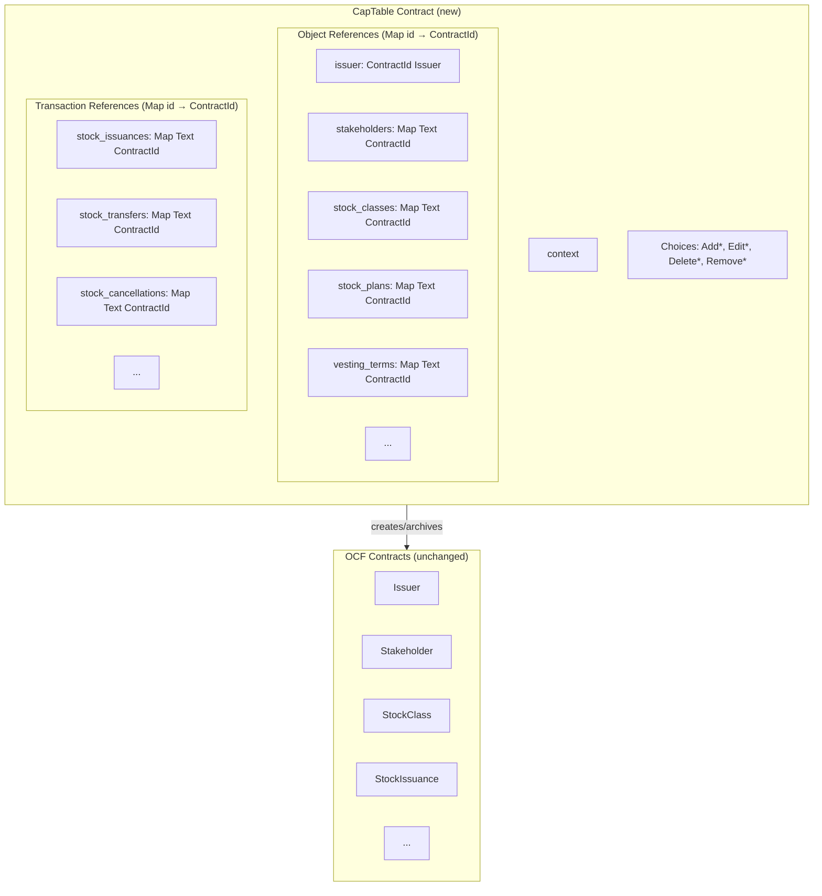

# ADR-002: Stateful Cap Table with OCF Object References

## Status

**Proposed** | 2026-01-02

---

## TL;DR

Introduce a new **CapTable** contract that:
- Maintains `Map<id, ContractId>` for all OCF objects (O(1) lookup by business ID)
- Acts as the sole authority for create/edit/delete operations
- Validates that referenced objects exist before creating transactions (e.g., can't issue stock to a non-existent stakeholder)

---

## Context

### Current Design Problems

The existing implementation uses an event-sourcing pattern where the `Issuer` contract acts as a factory with ~40+ nonconsuming choices. This creates several problems:

| Problem | Impact |
|---------|--------|
| **No current state visibility** | Must replay all events off-chain to determine ownership |
| **No reference validation** | Can issue stock to non-existent stakeholders or invalid stock classes |
| **Scattered data** | Cap table spread across many independent contracts |

---

## Decision

Introduce a new **CapTable** contract (separate from the OCF `Issuer` object):

1. Single `CapTable` contract per cap table maintains **Maps of id → ContractId** for all OCF objects
2. The `Issuer` remains a simple OCF object (just data, no factory methods)
3. All create/edit/delete operations go through `CapTable`
4. `CapTable` validates references exist before allowing transactions (O(1) map lookup)
5. Edit = archive old + create new + update ContractId in map
6. Delete = archive contract + remove from map

---

## Architecture



### Key Points

- **CapTable is a new custom contract** — not an OCF object
- **Issuer is now just data** — simple OCF object, no factory methods
- **All OCF contracts remain unchanged** — just remove `ArchiveByIssuer` choice
- **Same signatories** — CapTable can directly archive OCF contracts
- **Maps for O(1) lookup** — instant validation by business ID

---

## Lifecycle Operations

### Add (Create)

```
choice AddStakeholder(data):
    // Validate ID uniqueness (O(1) map lookup)
    assert data.id not in stakeholders

    // Create OCF contract
    new_cid = create Stakeholder(context, data)

    // Update state
    return create this with { stakeholders: insert(data.id, new_cid, stakeholders) }
```

### Edit (Correct)

```
choice EditStakeholder(id, new_data):
    // Lookup by ID (O(1))
    old_cid = stakeholders[id]
    assert old_cid exists
    assert id == new_data.id  // Can't change ID via edit

    // Replace contract
    archive old_cid
    new_cid = create Stakeholder(context, new_data)

    // Update state
    return create this with { stakeholders: insert(id, new_cid, stakeholders) }
```

### Delete (Archive + Remove)

> ⚠️ **Warning**: Deleting an object may leave broken references. For example, deleting a stakeholder won't automatically clean up stock issuances that reference it. We validate references on Add, but cannot prevent references from becoming stale after deletion.

```
choice DeleteStakeholder(id):
    // Lookup by ID (O(1))
    cid = stakeholders[id]
    assert cid exists

    // Archive and remove
    archive cid
    return create this with { stakeholders: delete(id, stakeholders) }
```

### Remove (Cleanup without Archive)

Use when a contract was archived externally and needs to be removed from the map.

```
choice RemoveStakeholder(id):
    // Just remove from map — don't try to archive
    assert id in stakeholders
    return create this with { stakeholders: delete(id, stakeholders) }
```

---

## Validation Example: Stock Issuance

Shows how references are validated before creating transactions:

```
choice AddStockIssuance(data):
    // Validate stakeholder exists (O(1) map lookup)
    assert data.stakeholder_id in stakeholders

    // Validate stock class exists (O(1))
    assert data.stock_class_id in stock_classes

    // Validate security ID unique (O(1))
    assert data.security_id not in stock_issuances

    // Create
    new_cid = create StockIssuance(context, data)
    return create this with {
        stock_issuances: insert(data.security_id, new_cid, stock_issuances)
    }
```

---

## Template Changes

### Issuer: Remove Factory Methods

**Before:**
```
template Issuer:
    signatory: issuer, system_operator

    // ~40+ factory choices
    choice CreateStakeholder(data): ...
    choice CreateStockIssuance(data): ...
    // etc.
```

**After:**
```
template Issuer:
    signatory: issuer, system_operator
```

### OCF Objects: Remove ArchiveByIssuer

**Before:**
```
template Stakeholder:
    signatory: issuer, system_operator

    choice ArchiveByIssuer:
        controller: issuer
        return ()
```

**After:**
```
template Stakeholder:
    signatory: issuer, system_operator
```

Since `CapTable` shares the same signatories, it can directly `archive` any OCF contract.

---

## Implementation Plan

### Phase 1: Create CapTable
- Create `CapTable.daml` with all `Map Text ContractId` fields
- Implement `Add*`, `Edit*`, `Delete*`, `Remove*` choices with validation
- Write comprehensive tests

### Phase 2: Update Templates
- Remove factory methods from `Issuer`
- Remove `ArchiveByIssuer` from all OCF templates
- Update `OcpFactory` to create `CapTable` (which creates the `Issuer`)
- Update SDK to use new contract

### Phase 3: Migration
- Create migration script to consolidate existing contracts
- Collect all existing OCF contracts for an issuer
- Create new `CapTable` with Maps
- Archive old `Issuer` contract (with factory methods)

---

## Consequences

### Positive

| Benefit | Description |
|---------|-------------|
| Reference validation | Validate that IDs exist before operations (O(1)) |
| Clean separation | CapTable is our custom logic; OCF objects stay standard |
| Queryable state | Maps show what exists by ID |
| Atomic operations | Multi-step operations in single transaction |
| OCF compliance | Issuer and all objects remain in standard OCF format |
| Recovery path | Remove* choices handle externally-archived contracts |

### Negative

| Concern | Mitigation |
|---------|------------|
| Stale references | Delete can leave broken refs; validate on Add only |
| Breaking change | Provide migration path |

---

## References

- [OCF Schema](https://github.com/Open-Cap-Table-Coalition/Open-Cap-Format-OCF)
- [ADR-001: OCF Cap Table on Canton](https://github.com/fairmint/canton/blob/main/docs/developer/adr/001-ocf-captable-on-canton.md)
- [Canton Network Documentation](https://docs.canton.network/)
