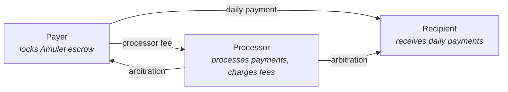
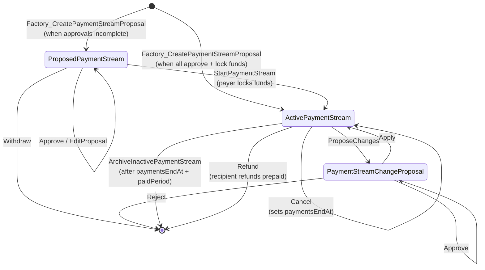
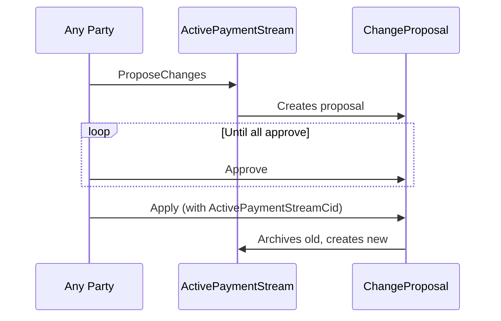
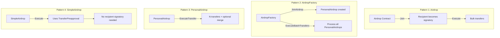

# ADR-005: CantonPayments - Payment Streams and Airdrops

## Status

**Implemented** | 2026-02-03

---

## TL;DR

CantonPayments provides two payment primitives on Canton:

1. **Payment Streams** — Recurring payments with locked escrow, three-party approval model, free trials, and USD/Amulet billing
2. **Airdrops** — Bulk Amulet distribution with multiple patterns for different trust/signatory requirements

---

## Payment Streams

### Three-Party Model



| Party | Role |
|-------|------|
| **Payer** | Locks Amulet in escrow, funds the payment stream |
| **Recipient** | Receives payments for services provided |
| **Processor** | Neutral arbitrator; processes payments, charges optional fees |

**Design decision:** The processor acts as a trusted intermediary. Both payer and recipient must approve the processor. The processor can process payments unilaterally but cannot steal funds—escrow is locked to both recipient and processor as unlock holders.

### State Machine



### Escrow via LockedAmulet

Payer's funds are locked in a `LockedAmulet` contract with dual unlock holders:

```haskell
lock = TimeLock with
  holders = [recipient, processor]  -- Both needed to unlock
  expiresAt = ...
  optContext = ...
```

**Why dual holders?** Prevents unilateral fund withdrawal. The processor processes payments by unlocking, paying recipient/processor, and re-locking the remainder. Neither party can steal the escrowed funds.

### Billing Model

```haskell
data PaymentStreamAmount
  = AmuletAmount Decimal  -- Daily rate in Amulet (CC)
  | USDAmount Decimal     -- Daily rate in USD (converted at processing time)
```

| Feature | Description |
|---------|-------------|
| **Daily rates** | `recipientPaymentPerDay` and `processorPaymentPerDay` |
| **USD billing** | Converted to Amulet at processing time using `amuletPrice` from `OpenMiningRound` |
| **Pro-rata processing** | Processor specifies `processingPeriod`; amount calculated proportionally |
| **Prepay window** | Maximum time beyond `now` that can be prepaid |

### Free Trials

```haskell
data PaymentStream = PaymentStream with
  ...
  freeTrialExpiration : Optional Time
    -- ^ None if no trial or trial ended; Some if trial is active/future
```

During free trial:
- `ProcessFreeTrial` choice advances `processedAndPaidUntil` without transferring Amulet
- `ProcessPayment` is blocked until trial ends
- Trial clears (`freeTrialExpiration = None`) after processing through trial end

### Key Choices

| Choice | Controller | Purpose |
|--------|------------|---------|
| `ProcessFreeTrial` | Processor | Advance time during trial (no payment) |
| `ProcessPayment` | Processor | Process payment period, transfer to recipient |
| `AddFunds` | Any party | Add more Amulet to escrow |
| `WithdrawFunds` | Payer | Withdraw excess (keeps `amountToKeepLocked`) |
| `Cancel` | Any party | Set `paymentsEndAt` to end stream |
| `Refund` | Recipient | Refund prepaid period back to payer |
| `ArchiveInactivePaymentStream` | Any party | Clean up after stream ends |

### Change Proposals

Active streams cannot be edited directly. Changes require multi-party approval:



**Stale detection:** `Apply` verifies the `ActivePaymentStream` hasn't changed since proposal creation. If it has, the proposal is stale and must be rejected/recreated.

### Party Migration

`PartyMigrationProposal` enables changing payer, recipient, or processor identity:

```haskell
template PartyMigrationProposal with
  partyType : PartyRole  -- Payer | Recipient | Processor
  oldParty : Party
  newParty : Party
  oldPartyApproved : Bool
  newPartyApproved : Bool
```

For recipient/processor changes (lock holders), migration unlocks and re-locks escrow with the new party.

---

## Airdrops

Four airdrop patterns for different trust and signatory requirements:

### Pattern Comparison

| Pattern | Recipients as Signatories | Featured App Rewards | Use Case |
|---------|---------------------------|---------------------|----------|
| `Airdrop` | Yes (via join) | Yes | Recipients opt-in first |
| `AirdropFactory` | Yes (creates PersonalAirdrop) | Yes | Factory creates per-recipient contracts |
| `PersonalAirdrop` | Yes | Yes | Pre-established sender-recipient relationship |
| `SimpleAirdrop` | No | Via TransferPreapproval | Bulk distribution without recipient setup |

### Airdrop Patterns Flow



### PersonalAirdrop Design

```haskell
template PersonalAirdrop with
  dso : Party
  sender : Party
  provider : Party
  featuredAppRight : ContractId Amulet.FeaturedAppRight
  amuletRulesCid : ContractId AmuletRules
  appRewardBeneficiaries : [AppRewardBeneficiary]
  recipient : Party
where
  signatory sender, recipient  -- Both parties sign
```

**Why dual signatories?** Enables featured app rewards (requires recipient authorization). The `PersonalAirdrop_ExecuteTransfer` choice supports:

- Multiple sequential transfers (for reward accumulation)
- Optional merge of recipient's existing amulets (UTXO consolidation)
- Amulet rules override (for upgrades)

### AirdropFactory: Batch Execution with LockedAmulet

The factory pattern supports locked escrow for airdrops:

```haskell
choice Factory_ExecuteBatchTransfers
  with
    personalAirdropCids : [ContractId PersonalAirdrop]
    amuletInputs : [ContractId Amulet.Amulet]
    lockedAmuletCid : Optional (ContractId Amulet.LockedAmulet)  -- If provided, unlock → use → re-lock
    ...
```

When `lockedAmuletCid` is provided:
1. Fetch and preserve lock details (holders, expiresAt, context)
2. Unlock the amulet
3. Execute all transfers
4. Re-lock the change with preserved lock details

**Use case:** Automated reward distribution from a locked treasury.

### SimpleAirdrop: TransferPreapproval Pattern

For recipients who have TransferPreapproval contracts (e.g., validator operators):

```haskell
nonconsuming choice SimpleAirdrop_Execute
  with
    recipientSpecs : [RecipientSpec]  -- Each has transferPreapprovalCid
    ...
  controller config.sender
```

**No recipient signatory needed.** The TransferPreapproval contract already authorizes the sender to transfer to the recipient.

---

## Key Design Decisions

| Decision | Choice | Rationale |
|----------|--------|-----------|
| Three-party model | Processor as arbitrator | Neutral party can process payments without trust issues |
| Dual lock holders | Recipient + Processor | Prevents unilateral fund withdrawal |
| USD billing option | Convert at processing time | Protects recipients from Amulet volatility |
| Change proposals | Separate contract | Stale detection, atomic apply |
| Multiple airdrop patterns | 4 patterns | Different trust/authorization requirements |
| PersonalAirdrop dual signature | Sender + Recipient | Required for featured app rewards |

---

## Contract Summary

### Payment Stream Contracts

| Contract | Signatories | Purpose |
|----------|-------------|---------|
| `PaymentStreamFactory` | Processor | Creates proposals/streams |
| `ProposedPaymentStream` | Approved parties + Processor | Awaiting full approval |
| `ActivePaymentStream` | Payer, Recipient, Processor | Active stream with escrow |
| `PaymentStreamChangeProposal` | Payer, Recipient, Processor | Change proposal |
| `PartyMigrationProposal` | Approved parties | Party identity migration |

### Airdrop Contracts

| Contract | Signatories | Purpose |
|----------|-------------|---------|
| `Airdrop` | Sender + joined parties | Bulk transfers with join pattern |
| `AirdropFactory` | Sender | Creates PersonalAirdrop contracts |
| `PersonalAirdrop` | Sender, Recipient | Per-recipient airdrop execution |
| `SimpleAirdrop` | Sender | Uses TransferPreapproval pattern |

---

## References

- [Splice Amulet Documentation](https://docs.splice.org/amulet/)
- [Canton Network Documentation](https://docs.canton.network/)
