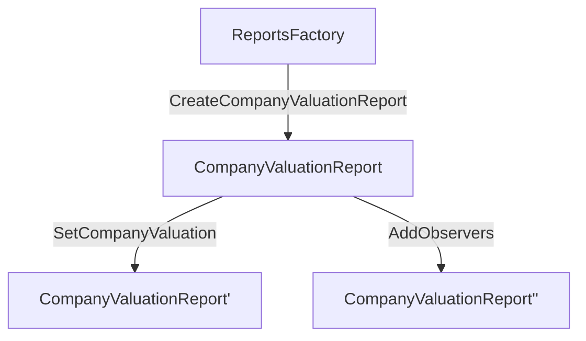

# ADR-006: OpenCapTableReports Package

## Status

**Implemented** | 2026-02-03

---

## TL;DR

The `OpenCapTableReports` package provides contracts for **anonymous dashboard reporting**. A `ReportsFactory` creates `CompanyValuationReport` contracts that store company valuations using opaque identifiers, enabling aggregate analytics without exposing cap table details.

---

## Context

Fairmint needs to display aggregate valuation data on public dashboards without revealing which companies are on the platform or their cap table details. The reports package decouples analytics from the core OCP contracts.

**Requirements:**

1. Anonymous company identifiers (no linkage to issuer contracts)
2. Read-only access sharing with specific parties
3. Valuation can be unverified (None) or verified (Some Decimal)
4. System operator has sole control over report creation and updates

---

## Decision

### Contracts



### ReportsFactory

Factory contract for creating report contracts. Non-consuming choice allows creating multiple reports from a single factory.

```daml
template ReportsFactory
  with
    system_operator : Party
    featured_app_right: ContractId FeaturedAppRight
  where
    signatory system_operator

    nonconsuming choice CreateCompanyValuationReport : ContractId CompanyValuationReport
```

### CompanyValuationReport

Stores valuation data for a single company.

| Field | Type | Description |
|-------|------|-------------|
| `company_id` | `Text` | Anonymous identifier (non-empty) |
| `company_valuation` | `Optional Decimal` | `None` = unverified, `Some v` = verified (v ≥ 0) |
| `last_update_at` | `Time` | Timestamp of last update |
| `system_operator` | `Party` | Sole signatory |
| `featured_app_right` | `ContractId FeaturedAppRight` | Featured app reference |
| `observers` | `[Party]` | Read-only access parties |

**Choices:**

| Choice | Type | Description |
|--------|------|-------------|
| `SetCompanyValuation` | Consuming | Updates valuation and refreshes timestamp |
| `AddObservers` | Consuming | Adds parties to observer list (deduped) |

---

## Design Decisions

### Anonymous Company IDs

Company identifiers are opaque text strings with no on-chain linkage to issuer contracts. The mapping from company to `company_id` exists only in the backend database, never on the ledger.

**Why:** Privacy. Dashboard viewers see aggregate valuations without knowing which issuers they represent.

### Observer Pattern for Read Access

Observers can read the contract but cannot modify it. The `AddObservers` choice allows incrementally sharing access.

**Why:** Enables selective disclosure to dashboard services or partners without granting write access.

### Optional Valuation

`company_valuation: Optional Decimal` distinguishes between:
- `None` — Valuation not yet verified (e.g., self-reported, pending 409A)
- `Some 0.0` — Verified valuation of zero (unlikely but valid)
- `Some v` — Verified valuation

**Why:** Dashboards can filter or flag unverified valuations differently than verified ones.

### System Operator as Sole Signatory

Unlike core OCP contracts (dual signatory: issuer + system_operator), reports use single signatory. The issuer has no visibility or control over report contracts.

**Why:** Reports are a Fairmint operational concern, not an issuer asset. Issuers don't know their anonymous ID and shouldn't be able to manipulate dashboard data.

### Separate Package

Reports are in their own DAML package (`OpenCapTableReports-v01`), not embedded in `OpenCapTable`.

**Why:**
1. Different versioning cadence — dashboard features evolve independently of cap table logic
2. Isolation — changes to reports don't trigger OCP contract upgrades
3. Clear separation of concerns — analytics vs. cap table management

---

## Consequences

### Benefits

- **Privacy preserved**: No on-chain link between company and issuer
- **Selective disclosure**: Observer pattern enables controlled read access
- **Independent evolution**: Package can add report types without touching OCP contracts

### Tradeoffs

- **Backend dependency**: Mapping from company to `company_id` must be maintained off-chain
- **No issuer visibility**: Issuers cannot see or verify their own report data

---

## Future Considerations

- Add `valuation_currency` field (currently implicit USD)
- Additional report types (e.g., `OwnershipSummaryReport`)
- Issuer opt-in visibility mechanism

---

_Last updated: 2026-02-03_
