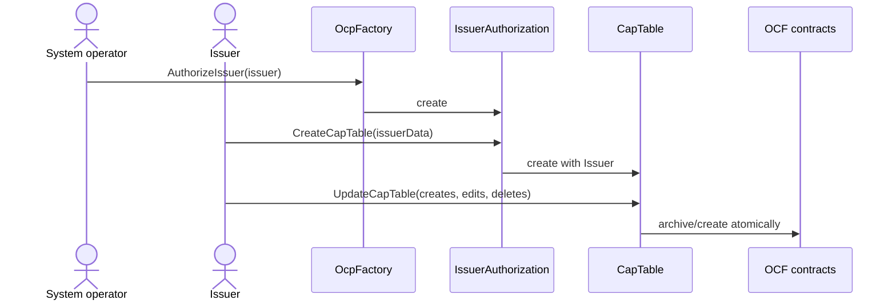

# Contract architecture

The OpenCapTable package maps the Open Cap Format into a stateful Canton aggregate. This page gives
the stable mental model; follow the links into DAML and generator source for exact fields and
choices.

## Lifecycle

The implementing entry points are
[`OcpFactory.daml`](../OpenCapTable-v34/daml/Fairmint/OpenCapTable/OcpFactory.daml) and
[`IssuerAuthorization.daml`](../OpenCapTable-v34/daml/Fairmint/OpenCapTable/IssuerAuthorization.daml).
The factory is signed by the system operator. An authorization observes the issuer, and its
`CreateCapTable` choice is controlled by that issuer. This preserves explicit role separation while
letting both parties become signatories on the resulting OCF contracts.

## CapTable is the aggregate authority

The generated `CapTable` stores the current `ContractId` for each OCF object ID. Most types use an
ID-to-contract map; issuances also have security-ID indexes so later transactions can validate that
they refer to the correct security type. `Issuer` is special: there is exactly one issuer contract
per table, and it is edit-only through the aggregate.

`UpdateCapTable` applies batches in dependency order. Creates can therefore introduce base objects
before issuances that reference them, while edits archive and recreate the affected object inside
the same transaction. The aggregate itself is recreated with the new maps, so callers must use the
returned `CapTable` contract ID.

Do not edit `CapTable.daml` directly. It is generated by
[`generate-captable.ts`](../scripts/codegen/generate-captable.ts) from the OCF modules,
[`captable-config.yaml`](../scripts/codegen/captable-config.yaml), and templates under
[`scripts/codegen/templates/`](../scripts/codegen/templates/). The configuration is the concise
source of truth for batch tiers and cross-object reference checks.

## OCF modules

Individual OCF objects and transactions live under
[`OpenCapTable-v34/daml/Fairmint/OpenCapTable/OCF/`](../OpenCapTable-v34/daml/Fairmint/OpenCapTable/OCF/).
Each template carries the shared issuer/system-operator context and validates its OCF-shaped data in
the template `ensure` clause. Shared schema types and reusable validators live under
[`Types/`](../OpenCapTable-v34/daml/Fairmint/OpenCapTable/Types/).

The directory name is part of DAML package upgrade lineage, not a timeless version statement.
Always read the active package entry in [`multi-package.yaml`](../multi-package.yaml) and its
`daml.yaml` when exact package metadata matters.
