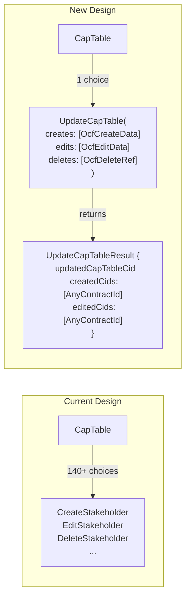

# Task: Batch CapTable Redesign

**Date**: 2026-01-08
**Status**: In Progress 🚧
**Target Repo**: `open-captable-protocol-daml`

## Goal

Redesign the CapTable contract to use a single batch `UpdateCapTable` choice instead of individual Create/Edit/Delete choices per type. This enables efficient bulk operations (e.g., 20 creates = 1 new CapTable) with ordered processing to support intra-batch dependencies.

## References

- [ADR-002: Stateful Cap Table](https://github.com/Fairmint/open-captable-protocol-daml/blob/main/docs/adr/002-stateful-issuer-with-position-tracking.md)
- [Current CapTable Implementation](https://github.com/Fairmint/open-captable-protocol-daml/blob/main/OpenCapTable-v25/daml/Fairmint/OpenCapTable/CapTable.daml)

## Key Changes

| Before | After |
|--------|-------|
| ~140 individual choices (Create/Edit/Delete per type) | Single `UpdateCapTable` batch choice |
| 1 create = 1 new CapTable contract | N creates = 1 new CapTable contract |
| Return `ContractId CapTable` only | Return `UpdateCapTableResult` with created/edited `AnyContractId` lists |
| No intra-batch dependencies | Ordered processing enables dependencies within a batch |

## Architecture



## Processing Order (for intra-batch dependencies)

Creates are processed in dependency order so a batch can create a Stakeholder and a StockIssuance referencing it:

| Tier | Types | Rationale |
|------|-------|-----------|
| 1 | Stakeholder, StockClass, StockPlan, VestingTerms, StockLegendTemplate, Document | Base objects with no OCF dependencies |
| 2 | Valuation, StakeholderRelationshipChangeEvent, StakeholderStatusChangeEvent | Depend on Tier 1 objects |
| 3 | StockIssuance, EquityCompensationIssuance, ConvertibleIssuance, WarrantIssuance | Issuances referencing stakeholders/classes |
| 4 | All other transactions (Transfers, Cancellations, Exercises, etc.) | Depend on issuances |

Edits and deletes process after all creates, in the same tier order.

## Implementation Plan

### Phase 1: Update Config ⬜
- [ ] Add tier/order metadata to `scripts/codegen/captable-config.yaml`

### Phase 2: Update Code Generator ⬜
- [ ] Generate `AnyContract` interface and `AnyContractId` type
- [ ] Generate `OcfCreateData` sum type (all 47 create variants)
- [ ] Generate `OcfEditData` sum type (id + data pairs)
- [ ] Generate `OcfDeleteRef` sum type (typed deletion references)
- [ ] Generate `UpdateCapTableResult` record type
- [ ] Generate single `UpdateCapTable` choice with ordered processing
- [ ] Remove individual Create/Edit/Delete choice generation

### Phase 3: Regenerate and Verify ⬜
- [ ] Run `npm run codegen` to regenerate `CapTable.daml`
- [ ] Run `npm run build` to verify compilation

### Phase 4: Update ADR ⬜
- [ ] Document batch design in ADR-002

### Phase 5: Update Tests 🚧
- [x] Update TestStakeholder.daml with batch API examples
- [x] Update TestHelpers.daml with batch API helpers
- [ ] Update remaining 44 test files to use batch API (tracked separately)
- [x] Add tests for batch operations with intra-batch dependencies

### Phase 6: Documentation ⬜
- [ ] Update `llms.txt` with any best practices/learnings

### Phase 7: PR ⬜
- [ ] Run `npm run build && npm run test` locally
- [ ] Create PR
- [ ] Monitor CI

## Generated Code Structure

```daml
-- Sum types for batch input
data OcfCreateData
  = CreateStakeholder StakeholderOcfData
  | CreateStockClass StockClassOcfData
  | CreateStockIssuance StockIssuanceOcfData
  -- ... all 47 types

data OcfEditData
  = EditStakeholder Text StakeholderOcfData  -- (id, new_data)
  | EditStockClass Text StockClassOcfData
  -- ... all types

data OcfDeleteRef
  = DeleteStakeholder Text
  | DeleteStockClass Text
  -- ... all types

-- Result type
data UpdateCapTableResult = UpdateCapTableResult with
  updatedCapTableCid: ContractId CapTable
  createdCids: [AnyContractId]
  editedCids: [AnyContractId]

-- Single batch choice
choice UpdateCapTable : UpdateCapTableResult
  with
    creates: [OcfCreateData]
    edits: [OcfEditData]
    deletes: [OcfDeleteRef]
  controller context.issuer
  do
    -- Process creates in tier order, building up maps
    -- Process edits
    -- Process deletes
    -- Return result with AnyContractIds
```

## Files to Modify

### Config
- `scripts/codegen/captable-config.yaml` - Add tier/order metadata

### Code Generator
- `scripts/codegen/generate-captable.ts` - Complete rewrite for batch structure

### Documentation
- `docs/adr/002-stateful-issuer-with-position-tracking.md` - Add batch design section

### Generated (regenerate, don't edit directly)
- `OpenCapTable-v25/daml/Fairmint/OpenCapTable/CapTable.daml`

### Tests
- `Test/daml/Test*.daml` - Update to use batch API

## Risk Considerations

- **Large pattern matches**: ~47 cases per operation type. Codegen handles this.
- **Validation complexity**: Must track newly-created objects for intra-batch reference validation.
- **Breaking change**: Downstream SDK (`ocp-canton-sdk`) will need updates to use new API.

## Validation Commands

```bash
npm run build      # Build all DAML packages
npm run test       # Run all tests
npm run codegen    # Regenerate CapTable.daml
```

## Success Criteria

- [ ] Single `UpdateCapTable` choice replaces all individual choices
- [ ] Batch creates processed in dependency order
- [ ] `AnyContractId` lists returned for created/edited objects
- [ ] All tests passing
- [ ] Build succeeds
- [ ] ADR updated

---

## Changelog

| Date       | Change                                                | PR |
|------------|-------------------------------------------------------|-----|
| 2026-01-08 | Created task file, starting implementation            | — |

---

_Last updated: 2026-01-08_
